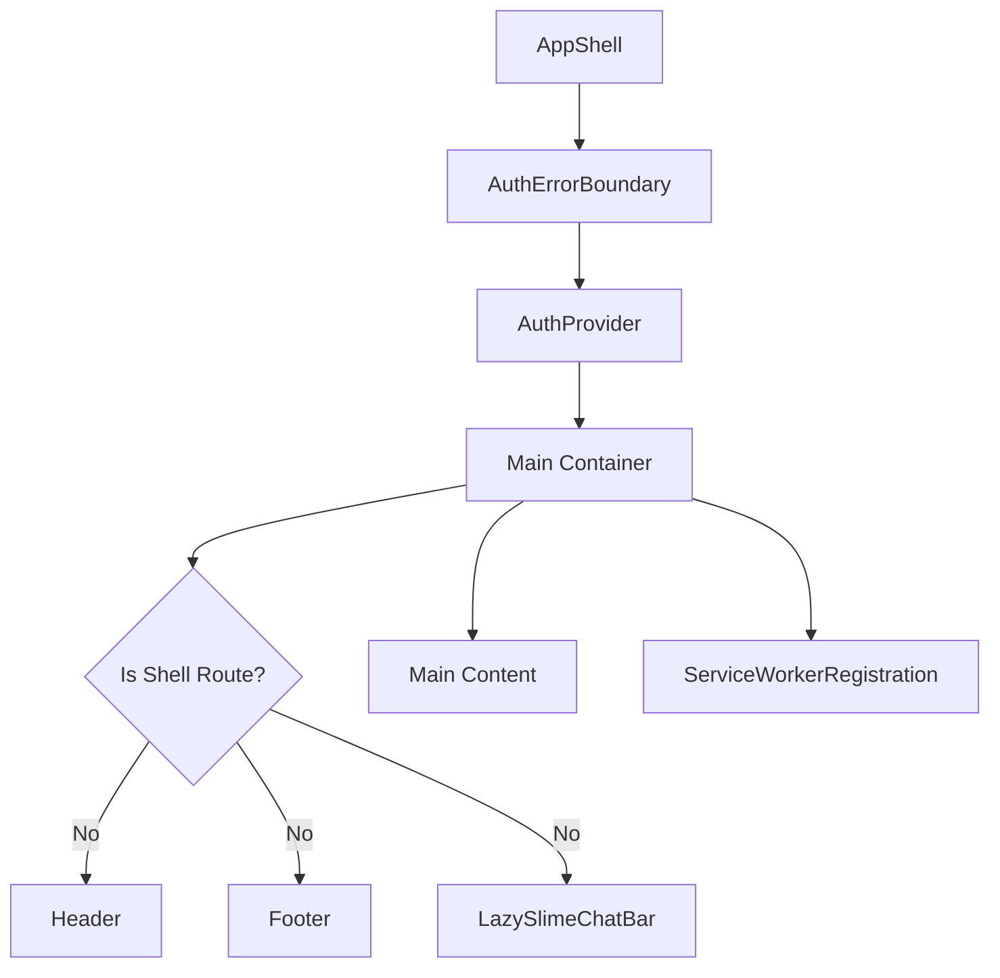
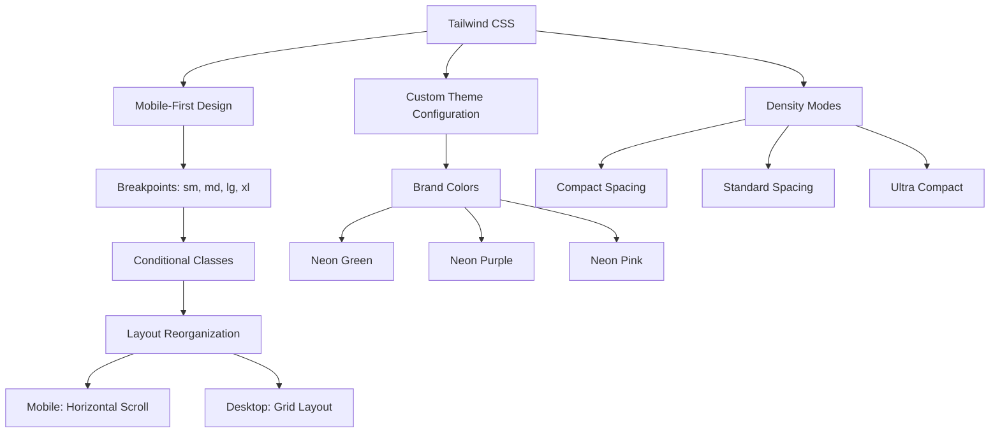
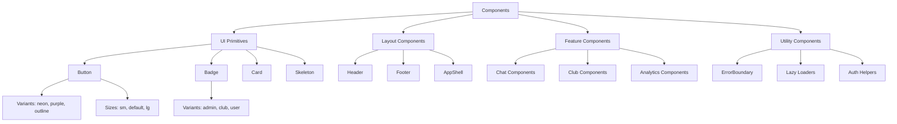
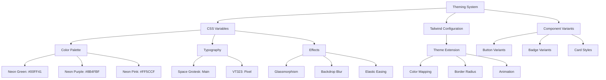

# UI Architecture

<cite>
**Referenced Files in This Document**   
- [app-shell.tsx](file://apps/web/components/layout/app-shell.tsx)
- [header.tsx](file://apps/web/components/layout/header.tsx)
- [footer.tsx](file://apps/web/components/layout/footer.tsx)
- [layout.tsx](file://apps/web/app/layout.tsx)
- [globals.css](file://apps/web/app/globals.css)
- [tailwind.config.ts](file://apps/web/tailwind.config.ts)
- [index.ts](file://apps/web/components/lazy/index.ts)
- [lazy.tsx](file://apps/web/lib/lazy.tsx)
- [button.tsx](file://apps/web/components/ui/button.tsx)
- [badge.tsx](file://apps/web/components/ui/badge.tsx)
</cite>

## Table of Contents
1. [Introduction](#introduction)
2. [AppShell Component](#appshell-component)
3. [Layout System](#layout-system)
4. [Responsive Design Implementation](#responsive-design-implementation)
5. [UI Component Library](#ui-component-library)
6. [Theming System](#theming-system)
7. [Conclusion](#conclusion)

## Introduction
This document details the UI architecture of the slimy.ai web application, focusing on the component organization, layout system, responsive design implementation, and theming approach. The application uses Next.js with React components organized in a modular structure, leveraging Tailwind CSS for styling and a custom theming system for visual consistency.

## AppShell Component

The AppShell component provides the authenticated application chrome that wraps the main content and conditionally renders header, footer, and chat bar elements based on the current route. It serves as the primary layout container for authenticated users, managing authentication context and global UI elements.

The component checks if the current pathname starts with specific shell routes (`/dashboard`, `/analytics`, `/club`, `/snail`) and only renders the header, footer, and SlimeChat bar when the user is on non-shell routes. This creates a clean, minimal interface for dashboard-style pages while maintaining full navigation on marketing and feature pages.

AppShell wraps its children with authentication providers and error boundaries, ensuring that all authenticated content has access to user session data and is protected against authentication-related errors. It also includes the ServiceWorkerRegistration component for offline functionality.



**Diagram sources**
- [app-shell.tsx](file://apps/web/components/layout/app-shell.tsx#L1-L34)

**Section sources**
- [app-shell.tsx](file://apps/web/components/layout/app-shell.tsx#L1-L34)

## Layout System

The application implements a hierarchical layout system with a global layout defined in `layout.tsx` that wraps all pages with the AppShell component. This creates a consistent structure across the entire application while allowing for section-specific layouts when needed.

The global layout sets the HTML document structure with dark mode enabled by default and applies the main font families. It imports global CSS styles and establishes the root component hierarchy. All page content flows through this layout, ensuring consistent typography, spacing, and theming.

Section-specific layouts can be implemented by creating layout components within feature directories (e.g., `club/layout.tsx`). These layouts wrap specific sections of the application with additional context providers or specialized UI elements while still inheriting the global layout structure.

The layout system separates concerns by:
- Global structure and document metadata (handled by `app/layout.tsx`)
- Authentication chrome and conditional UI (handled by `AppShell`)
- Feature-specific organization (handled by section layouts)
- Component-level presentation (handled by individual components)

```mermaid
graph TD
A[Root Layout] --> B[AppShell]
B --> C[Header]
B --> D[Main Content Area]
B --> E[Footer]
B --> F[Chat Bar]
D --> G[Page-Specific Content]
G --> H[Section Layout (Optional)]
H --> I[Feature Components]
```

**Diagram sources**
- [layout.tsx](file://apps/web/app/layout.tsx#L1-L23)
- [app-shell.tsx](file://apps/web/components/layout/app-shell.tsx#L1-L34)

**Section sources**
- [layout.tsx](file://apps/web/app/layout.tsx#L1-L23)

## Responsive Design Implementation

The application implements responsive design using Tailwind CSS utility classes with a mobile-first approach. The design adapts to different screen sizes through conditional class application and layout reorganization.

Tailwind CSS is configured with a custom theme that extends default colors with brand-specific values like `neon-green`, `neon-purple`, and `neon-pink`. The configuration uses CSS variables for theming, allowing dynamic theme switching while maintaining accessibility.

The responsive implementation includes:
- Mobile navigation that collapses into a hamburger menu on small screens
- Grid layouts that reflow from multi-column to single-column on mobile
- Conditional rendering of UI elements based on screen size
- Touch-friendly interactive elements with appropriate spacing
- Font size scaling across breakpoints

Density modes are implemented through CSS classes that adjust spacing and element sizing. The application supports different density modes that can be toggled by users, with compact modes reducing padding and margin values for more information-dense interfaces.



**Diagram sources**
- [tailwind.config.ts](file://apps/web/tailwind.config.ts#L1-L70)
- [globals.css](file://apps/web/app/globals.css#L1-L518)

**Section sources**
- [tailwind.config.ts](file://apps/web/tailwind.config.ts#L1-L70)
- [globals.css](file://apps/web/app/globals.css#L1-L518)

## UI Component Library

The UI component library is organized in the `components` directory with a structured hierarchy that separates different types of components. The library follows atomic design principles with foundational UI elements in the `ui` subdirectory and higher-level composite components organized by feature area.

The component structure includes:
- **UI primitives**: Foundational components like Button, Badge, Card, and Skeleton in the `ui` directory
- **Layout components**: Structural elements like Header, Footer, and AppShell in the `layout` directory
- **Feature components**: Domain-specific components organized by functionality (chat, club, analytics)
- **Utility components**: Cross-cutting concerns like ErrorBoundary, Lazy loaders, and authentication helpers

Reusable components are designed with composition in mind, using the `asChild` prop pattern to allow wrapper components to inherit styles while maintaining semantic HTML. The Button component, for example, supports multiple variants (default, destructive, outline, secondary, ghost, link, neon, purple) and sizes (default, sm, lg, icon).

Lazy loading is implemented for heavy components through the `lazy` directory, which exports dynamically imported components with appropriate loading states. This improves initial page load performance by code-splitting and only loading components when needed.



**Diagram sources**
- [button.tsx](file://apps/web/components/ui/button.tsx#L1-L59)
- [badge.tsx](file://apps/web/components/ui/badge.tsx#L1-L41)
- [index.ts](file://apps/web/components/lazy/index.ts#L1-L35)

**Section sources**
- [components/](file://apps/web/components/)
- [button.tsx](file://apps/web/components/ui/button.tsx#L1-L59)
- [badge.tsx](file://apps/web/components/ui/badge.tsx#L1-L41)
- [index.ts](file://apps/web/components/lazy/index.ts#L1-L35)

## Theming System

The theming system combines CSS variables with Tailwind CSS configuration to create a flexible and maintainable visual design. The system is defined in `globals.css` with custom properties that establish the application's color palette, typography, and motion design.

The root CSS variables define the core brand colors:
- `--neon-green`: Primary brand color for interactive elements
- `--neon-purple`: Secondary brand color for accents
- `--neon-pink`: Tertiary color for highlights
- `--bg-deep` and `--bg-panel`: Background shades for depth
- `--font-main` and `--font-pixel`: Typography hierarchy

These CSS variables are mapped to Tailwind's theme configuration in `tailwind.config.ts`, allowing them to be used through utility classes while maintaining a single source of truth. The configuration uses `hsl(var(--color))` syntax to preserve the ability to dynamically modify themes.

The theming system supports dark mode by default, with the HTML element set to `dark` in the root layout. Component-specific theming is achieved through variant configurations in the `cva` (Class Variance Authority) functions, which provide type-safe utility for creating component variants.

Custom scrollbar styles are implemented to match the application's aesthetic, with neon purple and pink colors for the thumb that change on hover. Glassmorphism effects are applied to panels and cards using backdrop filters and semi-transparent backgrounds.



**Diagram sources**
- [globals.css](file://apps/web/app/globals.css#L1-L518)
- [tailwind.config.ts](file://apps/web/tailwind.config.ts#L1-L70)

**Section sources**
- [globals.css](file://apps/web/app/globals.css#L1-L518)
- [tailwind.config.ts](file://apps/web/tailwind.config.ts#L1-L70)

## Conclusion
The UI architecture of the slimy.ai application demonstrates a well-organized component structure with clear separation of concerns. The AppShell component effectively manages the authenticated application chrome with conditional rendering of UI elements based on route context. The layout system provides a consistent foundation while allowing for feature-specific customization.

The responsive design implementation leverages Tailwind CSS effectively with a mobile-first approach and thoughtful breakpoint management. The component library follows established design principles with reusable, composable elements that maintain visual consistency across the application.

The theming system successfully integrates CSS variables with Tailwind configuration, creating a flexible and maintainable approach to visual design. The use of neon colors and glassmorphism effects establishes a distinctive brand identity that aligns with the application's personality.

Overall, the architecture supports scalability and maintainability, with clear patterns for component organization, styling, and responsive behavior that can be extended as the application grows.