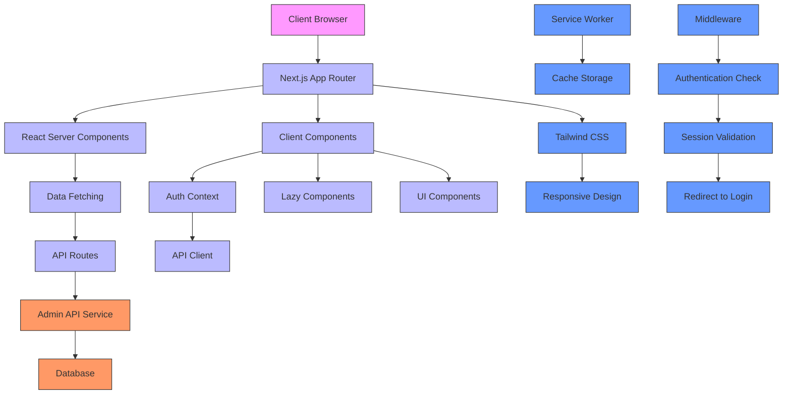
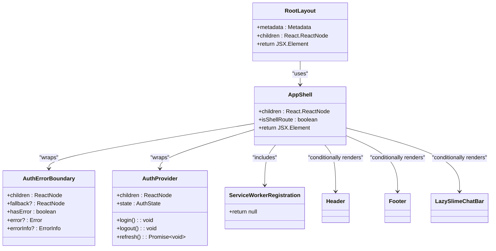
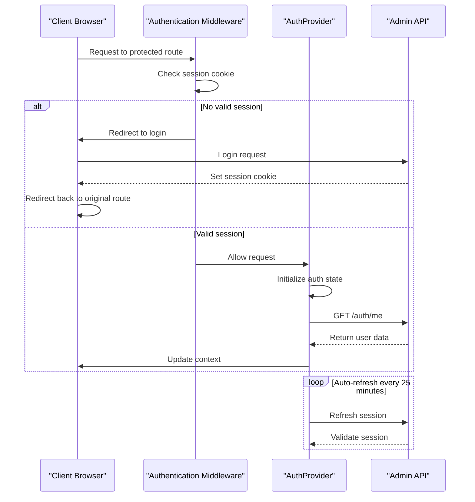
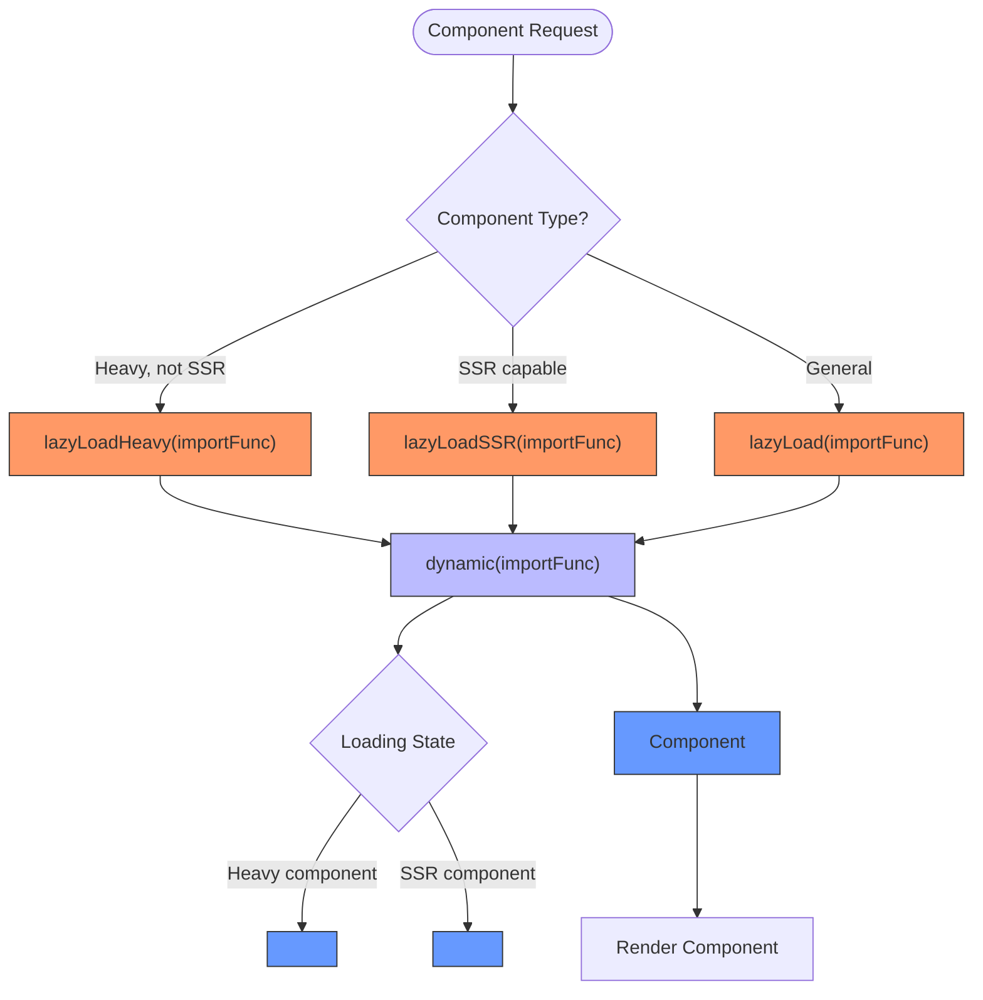
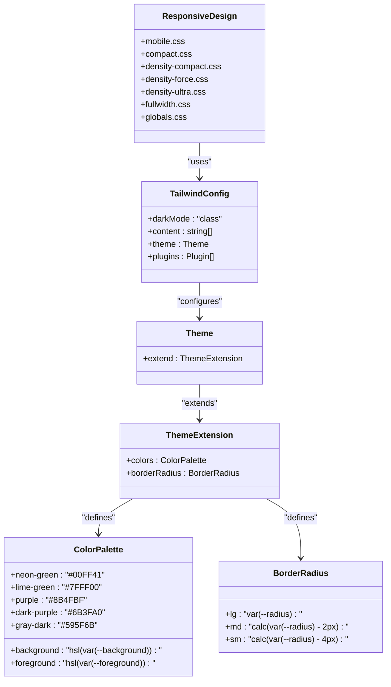
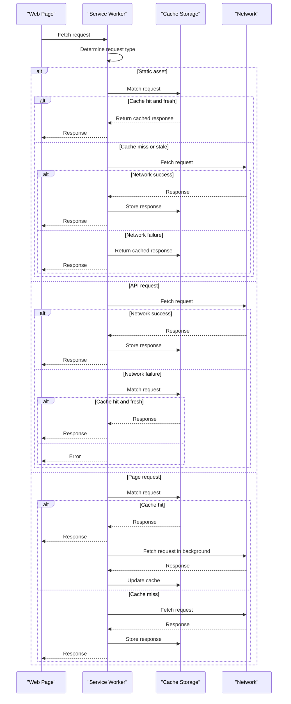
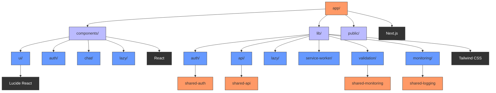

# Web Application

<cite>
**Referenced Files in This Document**   
- [app/layout.tsx](file://apps/web/app/layout.tsx)
- [components/layout/app-shell.tsx](file://apps/web/components/layout/app-shell.tsx)
- [lib/auth/context.tsx](file://apps/web/lib/auth/context.tsx)
- [components/auth/error-boundary.tsx](file://apps/web/components/auth/error-boundary.tsx)
- [lib/lazy.tsx](file://apps/web/lib/lazy.tsx)
- [components/lazy/index.ts](file://apps/web/components/lazy/index.ts)
- [components/service-worker-registration.tsx](file://apps/web/components/service-worker-registration.tsx)
- [lib/service-worker.ts](file://apps/web/lib/service-worker.ts)
- [public/sw.js](file://apps/web/public/sw.js)
- [middleware.ts](file://apps/web/middleware.ts)
- [tailwind.config.ts](file://apps/web/tailwind.config.ts)
- [next.config.ts](file://apps/web/next.config.ts)
- [app/dashboard/page.tsx](file://apps/web/app/dashboard/page.tsx)
- [app/guilds/page.tsx](file://apps/web/app/guilds/page.tsx)
- [app/chat/page.tsx](file://apps/web/app/chat/page.tsx)
</cite>

## Table of Contents
1. [Introduction](#introduction)
2. [Project Structure](#project-structure)
3. [Core Components](#core-components)
4. [Architecture Overview](#architecture-overview)
5. [Detailed Component Analysis](#detailed-component-analysis)
6. [Dependency Analysis](#dependency-analysis)
7. [Performance Considerations](#performance-considerations)
8. [Troubleshooting Guide](#troubleshooting-guide)
9. [Conclusion](#conclusion)

## Introduction
This document provides comprehensive architectural documentation for the public web application built on Next.js 16. The application serves as an AI-powered Discord bot interface with features for Super Snail and other gaming communities. The architecture leverages modern Next.js features including the App Router, React Server Components, and advanced optimization techniques. The system is designed with a focus on performance, security, and user experience, implementing sophisticated authentication flows, lazy loading strategies, and offline capabilities through service workers.

## Project Structure
The web application follows a standard Next.js 16 App Router structure with a clear separation of concerns. The application is organized into several key directories: app/ contains the main application routes and layout components, components/ houses reusable UI components, lib/ contains utility functions and business logic, and public/ stores static assets. The app directory implements the App Router architecture with React Server Components, while the components directory is organized by feature and type. The configuration files (next.config.ts, tailwind.config.ts, middleware.ts) are located in the root directory, following Next.js conventions.

```mermaid
graph TD
A[Root Directory] --> B[app/]
A --> C[components/]
A --> D[lib/]
A --> E[public/]
A --> F[styles/]
A --> G[.github/]
B --> H[(marketing)/]
B --> I[admin/]
B --> J[analytics/]
B --> K[api/]
B --> L[chat/]
B --> M[club/]
B --> N[dashboard/]
B --> O[docs/]
B --> P[features/]
B --> Q[guilds/]
B --> R[snail/]
B --> S[status/]
B --> T[usage/]
C --> U[layout/]
C --> V[auth/]
C --> W[chat/]
C --> X[club/]
C --> Y[lazy/]
C --> Z[ui/]
D --> AA[auth/]
D --> AB[api/]
D --> AC[lazy/]
D --> AD[service-worker/]
E --> AE[sw.js]
```

**Diagram sources**
- [app/layout.tsx](file://apps/web/app/layout.tsx)
- [components/layout/app-shell.tsx](file://apps/web/components/layout/app-shell.tsx)

**Section sources**
- [app/layout.tsx](file://apps/web/app/layout.tsx)
- [components/layout/app-shell.tsx](file://apps/web/components/layout/app-shell.tsx)

## Core Components
The application's core components include the RootLayout, AppShell, AuthProvider, AuthErrorBoundary, and various lazy loading utilities. The RootLayout component serves as the top-level layout for the entire application, providing metadata and wrapping all pages with the AppShell. The AppShell component manages the application chrome, including header, footer, and conditional rendering based on route. The AuthProvider implements authentication state management using React Context, while the AuthErrorBoundary provides graceful error handling for authentication-related issues. The lazy loading system, implemented through lazyLoadHeavy and lazyLoadSSR functions, optimizes bundle size by dynamically importing heavy components only when needed.

**Section sources**
- [app/layout.tsx](file://apps/web/app/layout.tsx#L1-L23)
- [components/layout/app-shell.tsx](file://apps/web/components/layout/app-shell.tsx#L1-L34)
- [lib/auth/context.tsx](file://apps/web/lib/auth/context.tsx#L1-L156)
- [components/auth/error-boundary.tsx](file://apps/web/components/auth/error-boundary.tsx#L1-L119)
- [lib/lazy.tsx](file://apps/web/lib/lazy.tsx#L1-L97)

## Architecture Overview
The application architecture follows a layered approach with clear separation between presentation, business logic, and data access layers. The App Router architecture enables server-side rendering and static site generation, while React Server Components allow for efficient data fetching and reduced client-side JavaScript. The routing structure is organized by feature, with dedicated routes for dashboard, analytics, chat, club, guilds, snail, and other functionality. Authentication is handled through a combination of middleware for route protection and React Context for client-side state management. The system implements a comprehensive error handling strategy using error boundaries and centralized error management.



**Diagram sources**
- [app/layout.tsx](file://apps/web/app/layout.tsx)
- [middleware.ts](file://apps/web/middleware.ts)
- [lib/auth/context.tsx](file://apps/web/lib/auth/context.tsx)
- [lib/service-worker.ts](file://apps/web/lib/service-worker.ts)
- [tailwind.config.ts](file://apps/web/tailwind.config.ts)

## Detailed Component Analysis

### RootLayout and AppShell Components
The RootLayout and AppShell components form the foundation of the application's UI structure. The RootLayout component, defined in app/layout.tsx, serves as the root layout for all pages in the application. It provides metadata for the entire application and wraps all content with the AppShell component. The AppShell component, implemented in components/layout/app-shell.tsx, manages the application chrome including header, footer, and conditional rendering based on the current route. It also orchestrates the initialization of key application services such as authentication, error handling, and service worker registration.



**Diagram sources**
- [app/layout.tsx](file://apps/web/app/layout.tsx#L1-L23)
- [components/layout/app-shell.tsx](file://apps/web/components/layout/app-shell.tsx#L1-L34)

**Section sources**
- [app/layout.tsx](file://apps/web/app/layout.tsx#L1-L23)
- [components/layout/app-shell.tsx](file://apps/web/components/layout/app-shell.tsx#L1-L34)

### Authentication Flow
The authentication system is implemented through a combination of middleware, React Context, and error boundaries. The middleware.ts file contains the centralized authentication middleware that intercepts requests to protected routes and validates session cookies. The AuthProvider component, located in lib/auth/context.tsx, manages the authentication state on the client side using React Context. It handles user session refresh, login, and logout functionality. The AuthErrorBoundary component provides graceful error handling for authentication-related issues, displaying user-friendly error messages and recovery options.



**Diagram sources**
- [middleware.ts](file://apps/web/middleware.ts#L1-L94)
- [lib/auth/context.tsx](file://apps/web/lib/auth/context.tsx#L1-L156)

**Section sources**
- [middleware.ts](file://apps/web/middleware.ts#L1-L94)
- [lib/auth/context.tsx](file://apps/web/lib/auth/context.tsx#L1-L156)
- [components/auth/error-boundary.tsx](file://apps/web/components/auth/error-boundary.tsx#L1-L119)

### Lazy Loading Strategy
The application implements a sophisticated lazy loading strategy to optimize bundle size and improve performance. The lazy loading system is defined in lib/lazy.tsx and exposed through components/lazy/index.ts. It provides three main functions: lazyLoad for general lazy loading, lazyLoadHeavy for heavy components that should not be server-side rendered, and lazyLoadSSR for components that can benefit from server-side rendering. The system uses Next.js's dynamic import functionality with custom loading states and error handling.



**Diagram sources**
- [lib/lazy.tsx](file://apps/web/lib/lazy.tsx#L1-L97)
- [components/lazy/index.ts](file://apps/web/components/lazy/index.ts#L1-L35)

**Section sources**
- [lib/lazy.tsx](file://apps/web/lib/lazy.tsx#L1-L97)
- [components/lazy/index.ts](file://apps/web/components/lazy/index.ts#L1-L35)

### Responsive Design Implementation
The responsive design is implemented using Tailwind CSS, configured in tailwind.config.ts. The application uses a mobile-first approach with responsive breakpoints for different screen sizes. The design system includes custom colors from the brand palette, responsive typography, and flexible layout components. The configuration enables dark mode through CSS classes and defines a comprehensive set of theme extensions for colors, spacing, and border radius.



**Diagram sources**
- [tailwind.config.ts](file://apps/web/tailwind.config.ts#L1-L70)

**Section sources**
- [tailwind.config.ts](file://apps/web/tailwind.config.ts#L1-L70)

### Service Worker and Offline Capabilities
The service worker implementation provides offline capabilities and performance optimization through caching strategies. The service worker is registered through the ServiceWorkerRegistration component and implemented in public/sw.js. It uses three caching strategies: cache-first for static assets, network-first for API requests, and stale-while-revalidate for page requests. The system caches static assets for up to 7 days and API responses for 5 minutes, ensuring fresh content while providing offline access.



**Diagram sources**
- [components/service-worker-registration.tsx](file://apps/web/components/service-worker-registration.tsx#L1-L14)
- [lib/service-worker.ts](file://apps/web/lib/service-worker.ts#L1-L73)
- [public/sw.js](file://apps/web/public/sw.js#L1-L203)

**Section sources**
- [components/service-worker-registration.tsx](file://apps/web/components/service-worker-registration.tsx#L1-L14)
- [lib/service-worker.ts](file://apps/web/lib/service-worker.ts#L1-L73)
- [public/sw.js](file://apps/web/public/sw.js#L1-L203)

## Dependency Analysis
The application has a well-defined dependency structure with clear separation between internal modules and external dependencies. The core dependencies include Next.js for the framework, React for UI components, Tailwind CSS for styling, and Lucide React for icons. The application uses a monorepo structure with shared packages for authentication, configuration, database access, and other common functionality. The dependency graph shows a hierarchical structure with the app directory at the top, depending on components and lib directories, which in turn depend on external packages and shared monorepo packages.



**Diagram sources**
- [package.json](file://apps/web/package.json)
- [pnpm-workspace.yaml](file://pnpm-workspace.yaml)

## Performance Considerations
The application implements multiple performance optimization techniques to ensure fast loading times and smooth user experience. These include route prefetching, code splitting, image optimization, and bundle analysis. The next.config.ts file contains extensive configuration for performance optimization, including code splitting strategies, image optimization settings, and HTTP headers for caching. The application uses Next.js's built-in image optimization with WebP and AVIF formats, responsive image sizing, and CDN integration. The webpack configuration implements sophisticated code splitting to create optimized bundles for framework code, UI libraries, and vendor dependencies.

**Section sources**
- [next.config.ts](file://apps/web/next.config.ts#L1-L202)
- [tailwind.config.ts](file://apps/web/tailwind.config.ts#L1-L70)
- [app/chat/page.tsx](file://apps/web/app/chat/page.tsx#L1-L27)

## Troubleshooting Guide
The application includes several mechanisms for troubleshooting and error recovery. The AuthErrorBoundary component provides user-friendly error messages and recovery options for authentication issues. The service worker implementation includes comprehensive logging and error handling for offline scenarios. The application uses centralized logging through the monitoring system, with error reporting configured in the lib/monitoring directory. For bundle size issues, the application includes a bundle analyzer that can be enabled through the ANALYZE environment variable. The service worker registration includes error handling and fallback mechanisms for browsers that do not support service workers.

**Section sources**
- [components/auth/error-boundary.tsx](file://apps/web/components/auth/error-boundary.tsx#L1-L119)
- [lib/service-worker.ts](file://apps/web/lib/service-worker.ts#L1-L73)
- [public/sw.js](file://apps/web/public/sw.js#L1-L203)
- [next.config.ts](file://apps/web/next.config.ts#L1-L202)

## Conclusion
The web application demonstrates a sophisticated implementation of Next.js 16 features with a focus on performance, security, and user experience. The architecture leverages the App Router and React Server Components for efficient rendering and data fetching, while implementing advanced optimization techniques like lazy loading, code splitting, and service worker caching. The authentication system provides secure access control with graceful error handling, and the responsive design ensures a consistent experience across devices. The modular structure and clear separation of concerns make the application maintainable and extensible, while the comprehensive performance optimizations ensure fast loading times and smooth interactions.