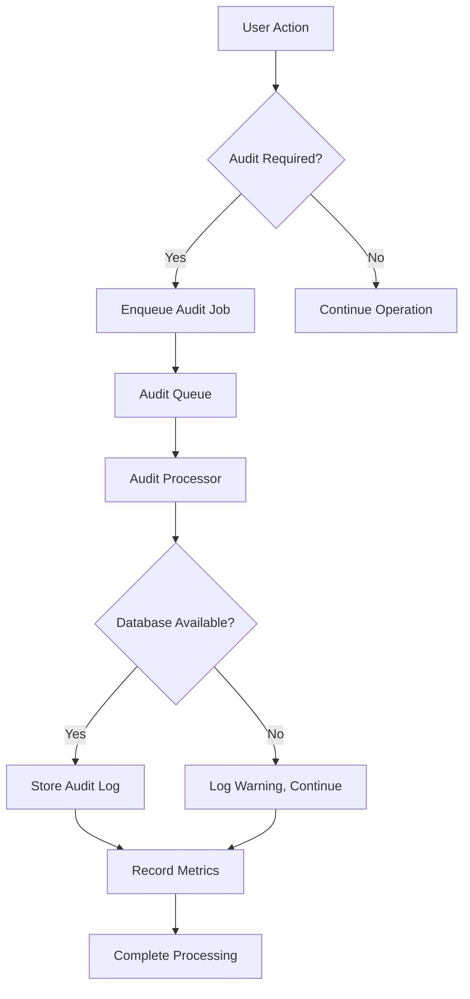
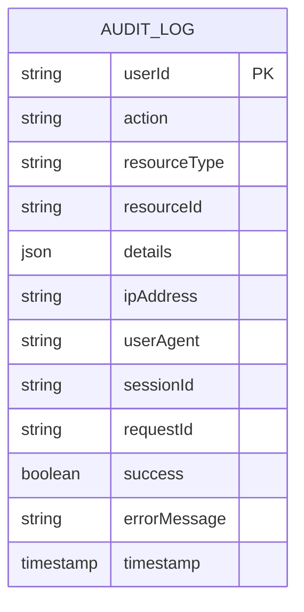
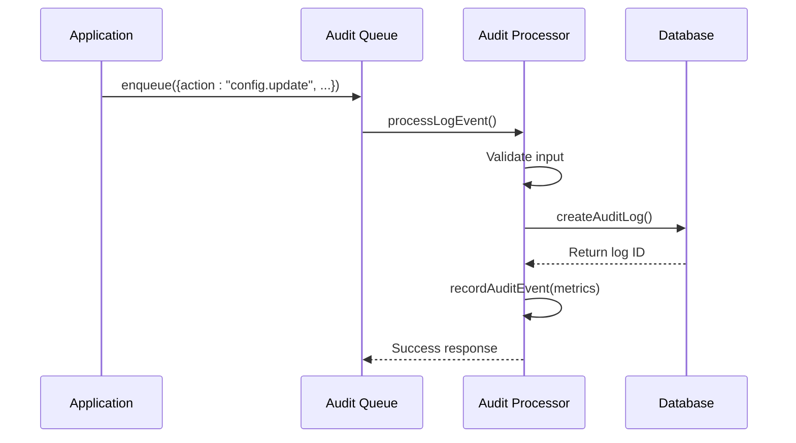
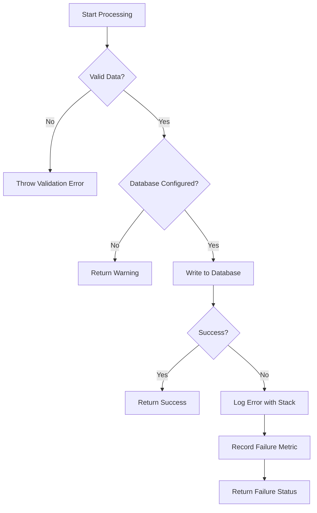
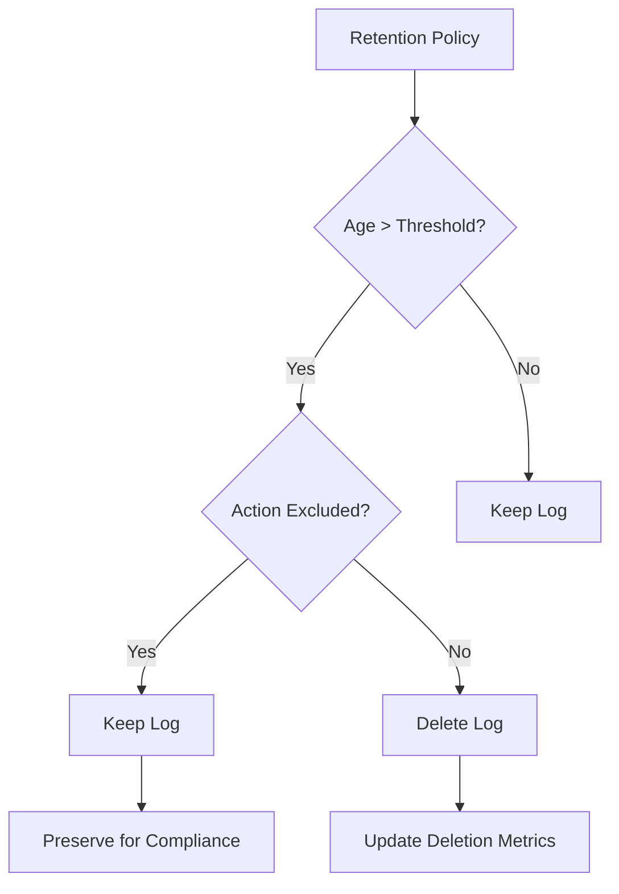
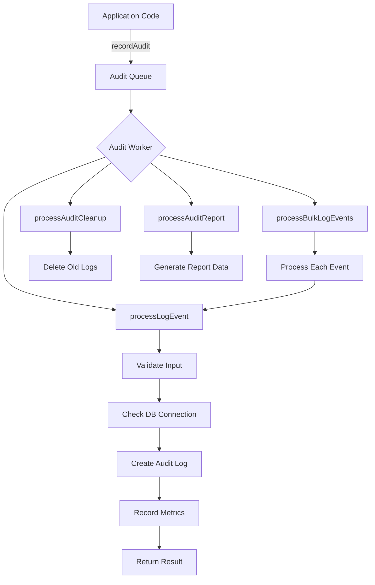

# Audit Processor

<cite>
**Referenced Files in This Document**   
- [audit-processor.js](file://apps/admin-api/src/lib/queues/audit-processor.js)
- [audit.js](file://apps/admin-api/src/services/audit.js)
- [database.js](file://apps/admin-api/src/lib/database.js)
- [config.js](file://apps/admin-api/src/config.js)
- [queue-manager.js](file://apps/admin-api/lib/queue-manager.js)
</cite>

## Table of Contents
1. [Introduction](#introduction)
2. [Core Responsibilities](#core-responsibilities)
3. [Data Structure of Audit Jobs](#data-structure-of-audit-jobs)
4. [Integration with Logging System and Database](#integration-with-logging-system-and-database)
5. [Audit Event Examples](#audit-event-examples)
6. [Error Handling and Retry Logic](#error-handling-and-retry-logic)
7. [Compliance and Retention Policies](#compliance-and-retention-policies)
8. [Processing Workflow](#processing-workflow)
9. [Conclusion](#conclusion)

## Introduction

The Audit Processor is a critical component responsible for handling asynchronous processing of audit events within the system. It ensures that all user actions, system events, and security-critical operations are securely logged and persisted for compliance, monitoring, and forensic analysis. The processor operates as a job-based system, decoupling audit logging from primary application workflows to maintain performance and reliability.

The audit system supports multiple processing modes including individual event logging, bulk operations, cleanup tasks, and report generation. It integrates tightly with the database layer for durable storage and includes built-in mechanisms for error resilience, metrics collection, and retention management.

**Section sources**
- [audit-processor.js](file://apps/admin-api/src/lib/queues/audit-processor.js#L1-L46)

## Core Responsibilities

The Audit Processor performs several key functions in maintaining system integrity and compliance:

- **Event Logging**: Captures user actions, system changes, and security-relevant events in a structured format.
- **Compliance Tracking**: Maintains an immutable record of sensitive operations such as configuration changes and permission updates.
- **Security Monitoring**: Logs access patterns and authentication events to detect potential threats or policy violations.
- **Data Retention Management**: Automatically enforces retention policies by removing expired audit records.
- **Reporting**: Generates periodic reports summarizing audit activity for administrative review.

The processor ensures that audit logging does not block primary application operations—even if audit persistence fails, the main workflow continues uninterrupted while the failure is recorded for monitoring.



**Diagram sources**
- [audit-processor.js](file://apps/admin-api/src/lib/queues/audit-processor.js#L33-L125)
- [database.js](file://apps/admin-api/src/lib/database.js#L72-L102)

## Data Structure of Audit Jobs

Each audit job contains a standardized set of fields that capture comprehensive context about the event being logged. The data structure includes:

- **userId**: Identifier of the user who performed the action
- **action**: Type of action performed (e.g., "config.update", "permission.grant")
- **resourceType**: Category of the affected resource (e.g., "guild", "user", "system")
- **resourceId**: Unique identifier of the specific resource involved
- **details**: Additional structured data about the operation
- **ipAddress**: Client IP address from which the request originated
- **userAgent**: Browser or client software information
- **sessionId**: Active session identifier for correlation
- **requestId**: Correlation ID for tracing across services
- **success**: Boolean indicating whether the action succeeded
- **errorMessage**: Description of any error that occurred

The `details` field supports arbitrary JSON data, allowing rich context to be captured such as before/after states for configuration changes or exported data scopes.



**Diagram sources**
- [audit-processor.js](file://apps/admin-api/src/lib/queues/audit-processor.js#L19-L31)
- [database.js](file://apps/admin-api/src/lib/database.js#L72-L102)

## Integration with Logging System and Database

The Audit Processor integrates with both the application's logging infrastructure and the persistent database layer to ensure reliable audit trail maintenance.

### Logging Integration

Audit events are logged using the centralized logging system based on Pino, which provides structured JSON output suitable for monitoring platforms. Each audit operation includes contextual metadata such as request IDs, timestamps, and service identifiers. In development environments, logs are formatted for readability, while production uses optimized JSON format compatible with Datadog and similar tools.

### Database Integration

Audit logs are stored durably in PostgreSQL via Prisma ORM. The integration follows these principles:

- **Connection Management**: Uses a singleton database client with connection pooling
- **Transaction Safety**: Each audit log entry is written atomically
- **Error Resilience**: Database unavailability results in warnings rather than operation failure
- **Performance Monitoring**: All queries are instrumented for duration tracking

The processor validates database configuration before attempting writes and gracefully handles connection issues.



**Diagram sources**
- [audit-processor.js](file://apps/admin-api/src/lib/queues/audit-processor.js#L56-L100)
- [database.js](file://apps/admin-api/src/lib/database.js#L72-L102)
- [queue-manager.js](file://apps/admin-api/lib/queue-manager.js#L18-L23)

**Section sources**
- [audit-processor.js](file://apps/admin-api/src/lib/queues/audit-processor.js#L56-L125)
- [database.js](file://apps/admin-api/src/lib/database.js#L72-L102)

## Audit Event Examples

The system captures various types of audit events critical for security and compliance:

### Configuration Changes
When a user updates system settings:
```json
{
  "action": "config.update",
  "resourceType": "guild",
  "resourceId": "guild_123",
  "details": {
    "changedFields": ["welcomeMessage", "moderationLevel"],
    "before": { "welcomeMessage": "Hi", "moderationLevel": 1 },
    "after": { "welcomeMessage": "Hello!", "moderationLevel": 3 }
  },
  "success": true
}
```

### Permission Updates
When roles or access rights are modified:
```json
{
  "action": "permission.grant",
  "resourceType": "channel",
  "resourceId": "channel_456",
  "details": {
    "targetUser": "user_789",
    "grantedPermissions": ["read", "write"]
  },
  "success": true
}
```

### Data Exports
When sensitive data is exported:
```json
{
  "action": "data.export",
  "resourceType": "analytics",
  "resourceId": "report_001",
  "details": {
    "exportFormat": "csv",
    "rowcount": 1500,
    "columns": ["userId", "username", "joinDate"]
  },
  "success": true
}
```

### Security Events
Failed login attempts or suspicious activity:
```json
{
  "action": "login.failed",
  "resourceType": "user",
  "resourceId": "user_789",
  "details": {
    "failureReason": "invalid_credentials",
    "attemptCount": 3
  },
  "success": false,
  "errorMessage": "Invalid password"
}
```

**Section sources**
- [audit-processor.js](file://apps/admin-api/src/lib/queues/audit-processor.js#L20-L31)
- [audit.js](file://apps/admin-api/src/services/audit.js#L6-L20)

## Error Handling and Retry Logic

The Audit Processor implements robust error handling to ensure system stability even when audit persistence encounters issues.

### Failure Tolerance

Unlike critical business operations, audit logging failures do not cause the primary operation to fail. This prevents audit system issues from impacting user functionality. Instead:

- Errors are caught and logged at the error level
- A warning is recorded in monitoring systems
- The failure is reported non-intrusively for operational awareness

### Error Classification

Errors are categorized and handled appropriately:
- **Validation Errors**: Missing required fields result in job rejection with clear messages
- **Database Connection Issues**: Logged as warnings; processing continues
- **Query Failures**: Full error details including stack traces are captured

### Metrics and Monitoring

All audit processing outcomes are tracked via metrics:
- Successful audit events are counted by action and resource type
- Failed audit attempts increment an `audit_log_failure` counter
- Processing duration is recorded for performance monitoring

The system uses exponential backoff patterns indirectly through queue retry mechanisms, though explicit retry logic is not implemented within the processor itself—the queueing system handles retries.



**Diagram sources**
- [audit-processor.js](file://apps/admin-api/src/lib/queues/audit-processor.js#L102-L124)
- [database.js](file://apps/admin-api/src/lib/database.js#L51-L53)

**Section sources**
- [audit-processor.js](file://apps/admin-api/src/lib/queues/audit-processor.js#L102-L124)

## Compliance and Retention Policies

The Audit Processor enforces compliance requirements through automated retention policies and data management controls.

### Retention Enforcement

A dedicated cleanup job (`processAuditCleanup`) removes audit logs older than a specified date:
- Configurable retention period based on compliance requirements
- Support for excluding certain high-sensitivity actions from cleanup
- Atomic deletion operations to prevent partial cleanup

Example cleanup job:
```json
{
  "beforeDate": "2024-01-01T00:00:00Z",
  "excludeActions": ["permission.grant", "data.export"]
}
```

### Compliance Features

- **Immutable Records**: Once written, audit logs cannot be modified
- **Complete Context**: Every event includes user, system, and network context
- **Tamper Detection**: Logs include cryptographic identifiers where applicable
- **Access Controls**: Audit data access is restricted to authorized personnel

### Report Generation

Regular compliance reports are generated via `processAuditReport`, providing:
- Activity summaries by user, action, and resource
- Success/failure rate analysis
- Top activity trends
- Statistical breakdowns for audit reviews

These reports support regulatory compliance requirements and internal security audits.



**Diagram sources**
- [audit-processor.js](file://apps/admin-api/src/lib/queues/audit-processor.js#L197-L256)
- [audit-processor.js](file://apps/admin-api/src/lib/queues/audit-processor.js#L267-L393)

**Section sources**
- [audit-processor.js](file://apps/admin-api/src/lib/queues/audit-processor.js#L197-L256)
- [audit-processor.js](file://apps/admin-api/src/lib/queues/audit-processor.js#L267-L393)

## Processing Workflow

The complete workflow for audit processing involves several coordinated components:

1. **Event Trigger**: Application code calls audit logging functions when significant actions occur
2. **Job Enqueuing**: Audit data is placed in a message queue for asynchronous processing
3. **Worker Processing**: The audit processor picks up jobs and processes them sequentially
4. **Validation**: Input data is validated for completeness and correctness
5. **Persistence**: Valid audit records are written to the database
6. **Metrics Collection**: Processing outcomes are recorded for monitoring
7. **Response Handling**: Results are returned to the queueing system

The system is configured with limited concurrency (2 workers) to balance throughput with database load, ensuring stable performance under varying loads.



**Diagram sources**
- [audit-processor.js](file://apps/admin-api/src/lib/queues/audit-processor.js#L395-L400)
- [queue-manager.js](file://apps/admin-api/lib/queue-manager.js#L18-L23)

**Section sources**
- [audit-processor.js](file://apps/admin-api/src/lib/queues/audit-processor.js#L33-L400)
- [queue-manager.js](file://apps/admin-api/lib/queue-manager.js#L18-L23)

## Conclusion

The Audit Processor provides a robust, reliable mechanism for capturing and managing audit trails within the system. By decoupling audit logging from primary business logic, it ensures that security and compliance requirements are met without compromising application performance or availability.

Key strengths include:
- Comprehensive data capture with rich contextual information
- Resilient error handling that protects main workflows
- Automated compliance enforcement through retention policies
- Integration with monitoring and alerting systems
- Support for multiple audit scenarios from individual events to bulk operations

The processor plays a vital role in maintaining system integrity, supporting security investigations, and meeting regulatory requirements for activity logging and data governance.