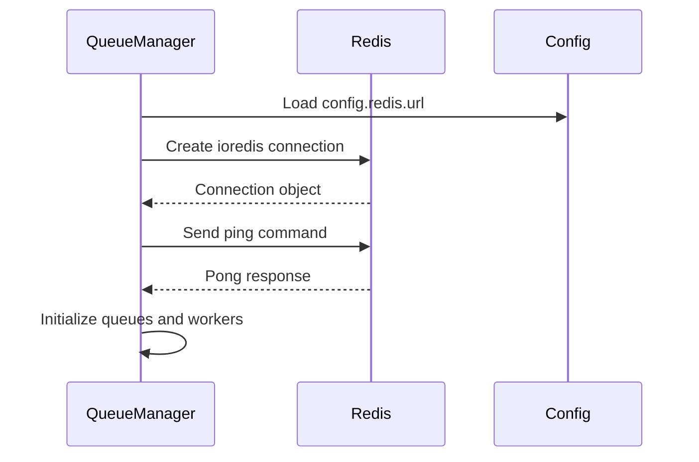
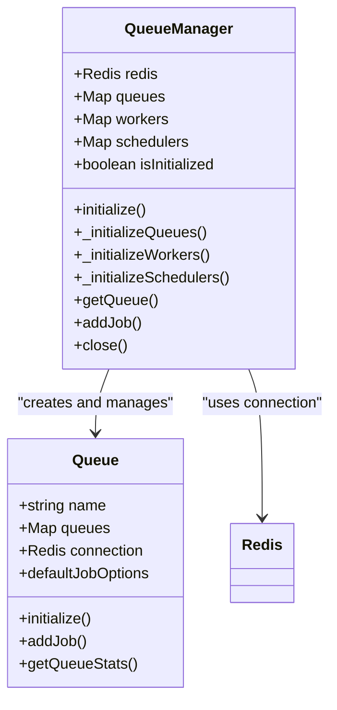
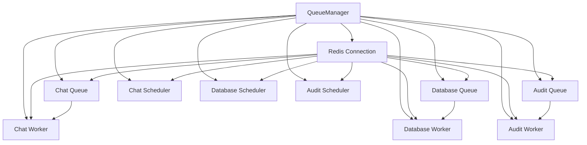
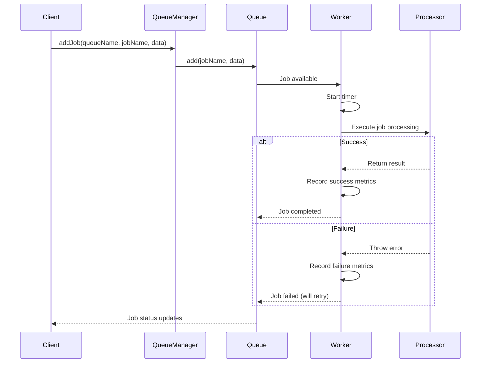

# BullMQ Configuration

<cite>
**Referenced Files in This Document**   
- [index.js](file://apps/admin-api/src/lib/queues/index.js)
- [config/index.js](file://apps/admin-api/src/lib/config/index.js)
- [chat-processor.js](file://apps/admin-api/src/lib/queues/chat-processor.js)
- [database-processor.js](file://apps/admin-api/src/lib/queues/database-processor.js)
- [audit-processor.js](file://apps/admin-api/src/lib/queues/audit-processor.js)
</cite>

## Table of Contents
1. [Introduction](#introduction)
2. [Redis Integration and Connection Management](#redis-integration-and-connection-management)
3. [Queue Initialization and Configuration](#queue-initialization-and-configuration)
4. [QueueManager Architecture](#queuemanager-architecture)
5. [Connection Pooling and Resilience](#connection-pooling-and-resilience)
6. [Configuration Options](#configuration-options)
7. [Job Processing and Worker Registration](#job-processing-and-worker-registration)
8. [Event Listeners and Monitoring](#event-listeners-and-monitoring)
9. [Environment Variables and Configuration](#environment-variables-and-configuration)
10. [Best Practices for Connection Resilience](#best-practices-for-connection-resilience)
11. [Conclusion](#conclusion)

## Introduction

The BullMQ configuration in this system provides a robust job queuing infrastructure using Redis as the backing store. This documentation details how queues are instantiated, managed, and configured for optimal performance and reliability. The system supports asynchronous processing of various operations including chat bot interactions, database operations, and audit logging through a centralized QueueManager.

The architecture leverages BullMQ with ioredis connections to provide reliable job processing with features like automatic retries, rate limiting, and comprehensive monitoring. The configuration is designed to handle production workloads with proper connection resilience and error handling.

**Section sources**
- [index.js](file://apps/admin-api/src/lib/queues/index.js#L1-L396)

## Redis Integration and Connection Management

The system integrates with Redis through the ioredis client library, establishing a connection during the initialization of the QueueManager. The Redis connection is configured with specific options to ensure reliability and performance.

The Redis connection is established using the URL from the configuration, with the following connection options:
- `maxRetriesPerRequest`: 3 retries for failed requests
- `retryDelayOnFailover`: 100ms delay between retry attempts
- `enableReadyCheck`: Disabled to prevent unnecessary checks
- `lazyConnect`: Enabled to defer connection until first use

The connection is tested with a ping operation after initialization to verify connectivity. The system uses a singleton pattern for the Redis connection, ensuring that all queues and workers share the same connection instance, which helps reduce resource consumption and connection overhead.

**Diagram sources**
- [index.js](file://apps/admin-api/src/lib/queues/index.js#L48-L57)

**Section sources**
- [index.js](file://apps/admin-api/src/lib/queues/index.js#L48-L58)

## Queue Initialization and Configuration

The system initializes three primary queues: chat, database, and audit, each configured with specific concurrency levels and default job options. The queue initialization process is handled by the `_initializeQueues` method in the QueueManager class.

Each queue is configured with the following default job options:
- `removeOnComplete`: 50 (keep last 50 completed jobs)
- `removeOnFail`: 100 (keep last 100 failed jobs)
- `attempts`: 3 (retry failed jobs 3 times)
- `backoff`: Exponential with 2000ms initial delay

The queues are created with the following concurrency settings:
- Chat queue: 5 concurrent jobs
- Database queue: 10 concurrent jobs
- Audit queue: 2 concurrent jobs

This configuration balances resource utilization with processing capacity, ensuring that database operations can handle higher throughput while audit operations are processed more conservatively.

**Diagram sources**
- [index.js](file://apps/admin-api/src/lib/queues/index.js#L81-L105)

**Section sources**
- [index.js](file://apps/admin-api/src/lib/queues/index.js#L81-L105)

## QueueManager Architecture

The QueueManager serves as a central component for managing all queue operations in the system. It implements a singleton pattern to ensure a single instance manages all queue-related functionality.

The QueueManager architecture consists of three main components:
1. **Queues**: Job queues for different types of operations
2. **Workers**: Job processors that execute queued jobs
3. **Schedulers**: Components that manage delayed jobs and job reliability

The QueueManager provides methods for:
- Initializing the entire queue infrastructure
- Adding jobs to specific queues
- Retrieving queue statistics
- Gracefully closing all components

The manager maintains references to all queues, workers, and schedulers in Maps, allowing for efficient lookup and management. It also implements proper error handling and logging throughout the initialization and operation lifecycle.

**Diagram sources**
- [index.js](file://apps/admin-api/src/lib/queues/index.js#L30-L37)

**Section sources**
- [index.js](file://apps/admin-api/src/lib/queues/index.js#L30-L387)

## Connection Pooling and Resilience

The system implements connection pooling and resilience strategies to ensure reliable operation even during Redis connectivity issues. The ioredis client handles connection pooling automatically, reusing connections and managing the connection lifecycle.

Key resilience features include:
- Lazy connection establishment to prevent startup failures
- Automatic reconnection attempts with exponential backoff
- Comprehensive error handling during connection operations
- Graceful shutdown procedures that properly close all connections

The system also implements a health check mechanism by pinging Redis during initialization to verify connectivity before proceeding with queue setup. This prevents the system from operating with a broken Redis connection.

Connection resilience is further enhanced by the configuration of retry options in the ioredis client, which automatically handles transient network issues and Redis failover scenarios.

**Section sources**
- [index.js](file://apps/admin-api/src/lib/queues/index.js#L48-L57)

## Configuration Options

The BullMQ configuration supports various options that can be customized through the system configuration. These options are primarily set through environment variables and the central configuration system.

### Default Job Options
The system configures default job options for all queues:
- **Job Retention**: Completed jobs are retained for 50 instances, failed jobs for 100 instances
- **Retry Strategy**: Failed jobs are retried up to 3 times with exponential backoff starting at 2 seconds
- **Job Removal**: Automatic cleanup of completed and failed jobs based on the retention policies

### Prefixing
The system uses Redis key prefixing through the BullMQ configuration, with queue names serving as natural prefixes. This helps organize keys in Redis and prevents naming conflicts.

### Rate Limiting
While not directly part of the BullMQ configuration, the system implements rate limiting at the API level to control job submission rates. The rate limiting is configured through environment variables and applied to specific endpoints.

The configuration system validates required environment variables and provides defaults where appropriate, ensuring the system can operate in different environments with minimal configuration changes.

**Section sources**
- [index.js](file://apps/admin-api/src/lib/queues/index.js#L90-L98)
- [config/index.js](file://apps/admin-api/src/lib/config/index.js#L191-L194)

## Job Processing and Worker Registration

The system registers workers for each queue to process jobs asynchronously. Workers are initialized during the QueueManager setup process and configured with specific concurrency levels.

Each worker is responsible for:
- Processing jobs from its assigned queue
- Recording job metrics (duration, success/failure)
- Handling errors appropriately
- Returning results to the queue system

The worker registration process creates a Worker instance for each queue, specifying:
- The queue name to process jobs from
- The processing function to execute for each job
- Concurrency settings
- The Redis connection to use

Job processing is implemented through a consistent pattern across all workers:
1. Start timing the job execution
2. Execute the appropriate processor function based on job type
3. Record success metrics and return results
4. On failure, record error metrics and re-throw the error

**Diagram sources**
- [index.js](file://apps/admin-api/src/lib/queues/index.js#L112-L130)

**Section sources**
- [index.js](file://apps/admin-api/src/lib/queues/index.js#L110-L179)

## Event Listeners and Monitoring

The system implements comprehensive monitoring and event handling for job processing. Event listeners are configured to track job lifecycle events and record metrics for observability.

Key monitoring features include:
- Job duration tracking for performance analysis
- Job completion and failure counters
- Detailed logging of job operations
- Queue statistics collection

The system records the following metrics for each job:
- Queue time: When the job was added to the queue
- Processing duration: How long the job took to execute
- Success/failure status: Whether the job completed successfully
- Retry attempts: Number of times a job has been retried

Event listeners are implemented within the worker processing functions, with try-catch blocks that capture both successful completions and failures. This allows for accurate metrics collection regardless of job outcome.

The system also provides methods to retrieve queue statistics, including counts of waiting, active, completed, failed, and delayed jobs, enabling monitoring and alerting on queue health.

**Section sources**
- [index.js](file://apps/admin-api/src/lib/queues/index.js#L114-L123)

## Environment Variables and Configuration

The BullMQ configuration is influenced by environment variables through the central configuration system. The primary environment variable affecting Redis and queue behavior is REDIS_URL.

The configuration system loads settings from environment variables and validates them before use. Key configuration options include:
- `REDIS_URL`: The connection URL for Redis, used by both the cache and queue systems
- Various other environment variables that affect system behavior but not directly queue operation

The configuration is loaded in the config/index.js file, which validates required variables and provides sensible defaults. The Redis configuration is specifically handled in the redis section of the config object, with the URL and enabled status derived from the REDIS_URL environment variable.

The system checks for the presence of REDIS_URL to determine if Redis functionality should be enabled, providing a simple way to disable Redis in development or testing environments.

**Section sources**
- [config/index.js](file://apps/admin-api/src/lib/config/index.js#L191-L194)

## Best Practices for Connection Resilience

The system implements several best practices for ensuring connection resilience with Redis:

### Connection Management
- **Lazy Connection**: Connections are established only when needed, preventing startup failures
- **Connection Testing**: A ping operation verifies connectivity after connection establishment
- **Graceful Shutdown**: Proper cleanup procedures close all connections and components in the correct order

### Error Handling
- **Retry Logic**: The ioredis client handles automatic retries for transient failures
- **Comprehensive Logging**: All connection issues are logged with appropriate severity
- **Graceful Degradation**: The system can continue operating (with reduced functionality) if Redis is unavailable

### Monitoring and Recovery
- **Health Checks**: The ping operation serves as a basic health check
- **Proper Shutdown**: The close() method ensures all resources are properly released
- **Error Isolation**: Issues with one component don't necessarily affect others

### Configuration Best Practices
- **Environment-Based Configuration**: Different settings for development, staging, and production
- **Validation**: Configuration values are validated before use
- **Defaults**: Sensible defaults are provided for optional settings

These practices ensure that the system can handle temporary Redis outages, network issues, and other common problems without catastrophic failure.

**Section sources**
- [index.js](file://apps/admin-api/src/lib/queues/index.js#L344-L387)

## Conclusion

The BullMQ configuration in this system provides a robust, production-ready job queuing infrastructure with comprehensive Redis integration. The architecture centers around the QueueManager, which centralizes queue access and management while ensuring proper connection handling and resilience.

Key strengths of the implementation include:
- Clean separation of concerns between queue management, job processing, and monitoring
- Comprehensive error handling and logging
- Configurable job processing with sensible defaults
- Proper resource cleanup and graceful shutdown
- Integration with the overall system monitoring and metrics infrastructure

The configuration balances performance, reliability, and maintainability, making it suitable for production workloads. By following best practices for Redis connection management and implementing proper resilience patterns, the system can handle the demands of asynchronous job processing in a distributed environment.

**Section sources**
- [index.js](file://apps/admin-api/src/lib/queues/index.js#L1-L396)