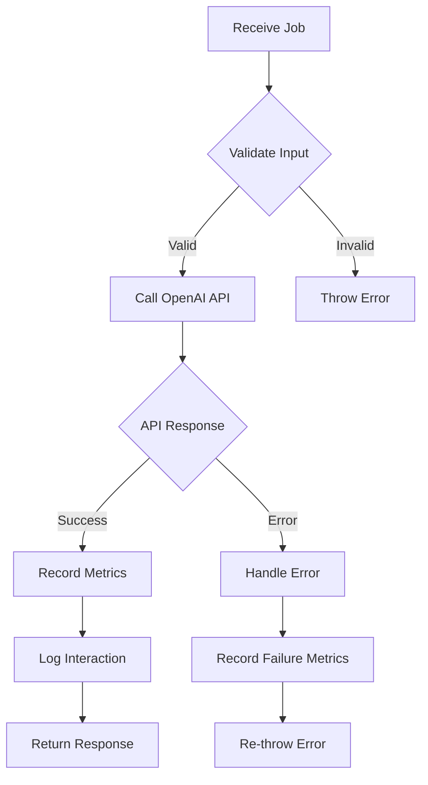
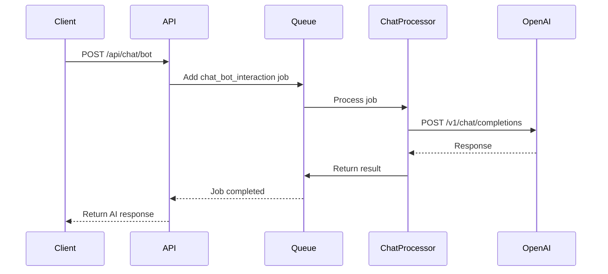
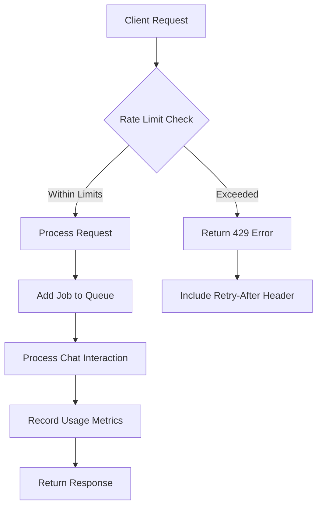
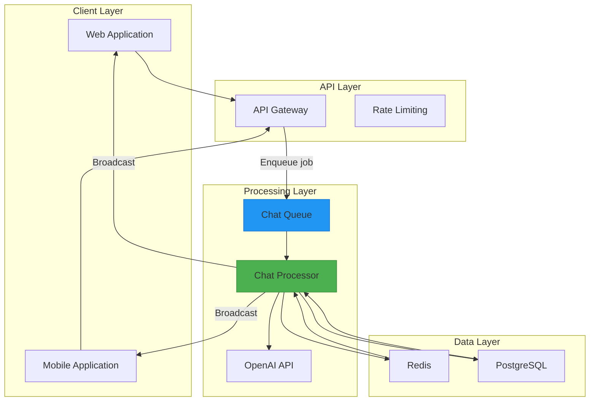

# Chat Processor

<cite>
**Referenced Files in This Document**   
- [chat-processor.js](file://apps/admin-api/src/lib/queues/chat-processor.js)
- [chat-bot.js](file://apps/admin-api/src/services/chat-bot.js)
- [chat.js](file://apps/admin-api/src/routes/chat.js)
- [index.js](file://apps/admin-api/src/lib/queues/index.js)
- [metrics.js](file://apps/admin-api/src/lib/monitoring/metrics.js)
- [usage-openai.js](file://apps/admin-api/lib/usage-openai.js)
- [rate-limiter.ts](file://apps/web/lib/rate-limiter.ts)
- [storage.ts](file://apps/web/lib/chat/storage.ts)
</cite>

## Table of Contents
1. [Introduction](#introduction)
2. [Job Payload Structure](#job-payload-structure)
3. [Processing Workflow](#processing-workflow)
4. [OpenAI Integration](#openai-integration)
5. [Usage Tracking and Rate Limiting](#usage-tracking-and-rate-limiting)
6. [Error Handling and Fallbacks](#error-handling-and-fallbacks)
7. [Job Enqueueing and API Integration](#job-enqueueing-and-api-integration)
8. [Real-time Message Delivery](#real-time-message-delivery)
9. [Architecture Overview](#architecture-overview)

## Introduction

The chat-processor job type is responsible for handling asynchronous chat message processing in the Slimy AI system. It manages the complete lifecycle of chat interactions, from receiving user input to generating AI-powered responses through OpenAI integration. The processor operates as part of a distributed job queue system, enabling scalable and reliable chat processing without blocking API responses.

The system is designed to handle various chat-related operations including bot interactions, message validation, and bulk message processing. By decoupling chat processing from API request handling, the system ensures responsive user experiences even during periods of high load or when external AI services experience latency.

**Section sources**
- [chat-processor.js](file://apps/admin-api/src/lib/queues/chat-processor.js#L1-L279)
- [chat-bot.js](file://apps/admin-api/src/services/chat-bot.js#L1-L61)

## Job Payload Structure

The chat processor handles job payloads that contain essential conversation context, user input, and configuration settings. The primary job type processed by the chat-processor is `chat_bot_interaction`, which includes the following structure:

- **prompt**: The user's message or question (string, required)
- **guildId**: Discord guild ID for contextual awareness (string, required)
- **userId**: Identifier of the user initiating the request (string, required)
- **requestId**: Unique identifier for tracking the request through the system (string, required)

The payload also supports personality settings through the guild context, where different guilds can have customized AI behavior patterns. The system uses the guildId to determine the appropriate prompt template, allowing for tailored responses based on the specific community context.

When processing chat bot interactions, the system maintains conversation state through external storage mechanisms, with message history and conversation metadata stored in the database and retrieved as needed for context-aware responses.

**Section sources**
- [chat-processor.js](file://apps/admin-api/src/lib/queues/chat-processor.js#L27-L68)
- [chat-bot.js](file://apps/admin-api/src/services/chat-bot.js#L13-L19)

## Processing Workflow

The chat processor follows a structured workflow for handling chat bot interactions:

1. **Job Initialization**: When a chat bot interaction job is received, the processor logs the initiation of processing with relevant metadata including the request ID, guild ID, and prompt length.

2. **AI Service Integration**: The processor calls the `askChatBot` service to interact with OpenAI's API, passing the user's prompt and guild context to generate an appropriate response.

3. **Result Recording**: Upon successful response generation, the processor records metrics about the interaction, including success status, response length, and whether a fallback response was used.

4. **Audit Logging**: The system logs the complete interaction for audit purposes, storing both the prompt and reply (with truncation for long messages) in the database.

5. **Response Formatting**: The processor formats the response with timestamps and processing metadata before returning it to the queue system.

The workflow includes comprehensive error handling at each stage, with detailed logging and metric recording for both successful and failed interactions. The processor also handles message validation and bulk message processing as additional job types within the same queue system.

**Diagram sources**
- [chat-processor.js](file://apps/admin-api/src/lib/queues/chat-processor.js#L27-L95)
- [chat-bot.js](file://apps/admin-api/src/services/chat-bot.js#L13-L58)

**Section sources**
- [chat-processor.js](file://apps/admin-api/src/lib/queues/chat-processor.js#L27-L95)

## OpenAI Integration

The chat processor integrates with OpenAI's API through the `askChatBot` service, which handles the direct communication with the OpenAI platform. The integration follows a conditional approach based on configuration:

- When OpenAI API credentials are configured, the system makes direct HTTP requests to the OpenAI API endpoint with the appropriate authorization headers.
- When OpenAI is not configured, the system returns a predefined fallback message indicating that the integration is not yet set up.

The integration uses the chat completions endpoint with the following parameters:
- **Model**: Configurable via system settings (default: GPT model specified in configuration)
- **Messages**: An array containing a system message with guild context and the user's prompt
- **Max tokens**: Limited to 180 tokens to control response length and cost
- **Temperature**: Set to 0.7 for balanced creativity and consistency

The system constructs a context-aware prompt using the guildId, creating different system messages for specific guilds versus general interactions. This allows the AI to provide more relevant responses based on the community context.

**Diagram sources**
- [chat-bot.js](file://apps/admin-api/src/services/chat-bot.js#L26-L41)
- [chat-processor.js](file://apps/admin-api/src/lib/queues/chat-processor.js#L38-L39)

**Section sources**
- [chat-bot.js](file://apps/admin-api/src/services/chat-bot.js#L21-L58)

## Usage Tracking and Rate Limiting

The chat processing system implements comprehensive usage tracking and rate limiting to monitor API consumption and prevent abuse. The system tracks various metrics through the metrics module, including:

- Chat message counts
- Job processing statistics (queued, completed, failed)
- Response times and performance metrics
- Error rates and failure patterns

Rate limiting is implemented at multiple levels:
- **IP-based rate limiting**: The web application enforces rate limits based on client IP addresses, allowing 5 chat requests per minute per IP.
- **File-backed rate limiting**: A simple file-based system stores rate limit counters and reset times in JSON files under the data/rate-limits directory.
- **Queue-based throttling**: The job queue system itself provides natural throttling through its concurrency limits and retry mechanisms.

The usage tracking system currently has a placeholder implementation that provides basic logging functionality, with plans to enhance it with more sophisticated tracking of OpenAI API usage, token consumption, and cost metrics.

**Diagram sources**
- [rate-limiter.ts](file://apps/web/lib/rate-limiter.ts#L23-L68)
- [metrics.js](file://apps/admin-api/src/lib/monitoring/metrics.js#L63-L65)

**Section sources**
- [rate-limiter.ts](file://apps/web/lib/rate-limiter.ts#L1-L90)
- [usage-openai.js](file://apps/admin-api/lib/usage-openai.js#L1-L6)
- [metrics.js](file://apps/admin-api/src/lib/monitoring/metrics.js#L63-L65)

## Error Handling and Fallbacks

The chat processor implements robust error handling and fallback mechanisms to ensure reliability and graceful degradation:

- **Configuration Fallback**: When OpenAI API credentials are not configured, the system returns a predefined fallback message instead of failing the request.
- **Error Classification**: The system distinguishes between different error types, including missing prompts, API errors, and validation failures, each with appropriate error codes.
- **Retry Mechanisms**: Jobs that fail are automatically retried up to three times using exponential backoff (starting with a 2-second delay).
- **Comprehensive Logging**: All errors are logged with full context including stack traces, error codes, and request metadata for debugging purposes.
- **Audit Trail**: Failed interactions are recorded in the audit log, providing visibility into error patterns and system reliability.

The processor also implements defensive programming practices such as:
- Input validation with length and content restrictions
- Security checks for potentially unsafe content (script tags, javascript URLs)
- Database connection validation before attempting to log interactions
- Non-blocking error handling for audit logging (logging failures don't affect main processing)

When errors occur, the system preserves the original error while adding contextual information, enabling effective troubleshooting and monitoring.

**Section sources**
- [chat-processor.js](file://apps/admin-api/src/lib/queues/chat-processor.js#L70-L95)
- [chat-bot.js](file://apps/admin-api/src/services/chat-bot.js#L43-L49)

## Job Enqueueing and API Integration

Chat processing jobs are enqueued through API routes that handle the initial request and return immediate acknowledgment to the client. The primary endpoint for chat interactions is `POST /api/chat/bot`, which:

1. Validates the incoming request (authentication, CSRF protection, role requirements)
2. Performs basic validation of the prompt and guildId parameters
3. Submits a job to the chat queue with the interaction details
4. Returns a job ID and status to the client for subsequent status polling

The API route requires member-level authentication and uses CSRF protection for security. When a job is successfully enqueued, the client receives:
- `ok: true` to indicate successful submission
- `jobId` for tracking the job status
- `status: "queued"` indicating the initial state
- `estimatedWaitTime` providing a rough estimate of processing duration

Clients can then use the `GET /api/chat/jobs/:jobId` endpoint to check the status of their job and retrieve the final result when processing is complete.

**Section sources**
- [chat.js](file://apps/admin-api/src/routes/chat.js#L53-L87)
- [index.js](file://apps/admin-api/src/lib/queues/index.js#L207-L223)

## Real-time Message Delivery

The system supports real-time message delivery through WebSocket connections, enabling immediate updates when chat messages are processed. The delivery mechanism works as follows:

1. **WebSocket Connection**: Clients establish WebSocket connections to the server, authenticated via JWT tokens.
2. **Room Joining**: Connected clients join rooms based on their guild memberships, allowing for targeted message delivery.
3. **Message Broadcasting**: When a chat message is processed, it is broadcast to the appropriate audience:
   - Regular messages are sent to all connected clients
   - Admin-only messages are restricted to admin users
4. **Client-Side Handling**: The client application receives messages through the WebSocket connection and updates the UI accordingly.

The system also implements client-side message caching using localStorage to maintain conversation history across sessions, with plans to migrate to server-side persistence for improved reliability.

**Section sources**
- [socket.js](file://apps/admin-api/src/socket.js#L141-L156)
- [SlimeChatBar.jsx](file://apps/admin-ui/components/SlimeChatBar.jsx#L88-L94)

## Architecture Overview

The chat processing system follows a distributed architecture with clear separation of concerns between components:

**Diagram sources**
- [index.js](file://apps/admin-api/src/lib/queues/index.js#L30-L396)
- [chat-processor.js](file://apps/admin-api/src/lib/queues/chat-processor.js#L1-L279)

**Section sources**
- [index.js](file://apps/admin-api/src/lib/queues/index.js#L30-L396)
- [chat.js](file://apps/admin-api/src/routes/chat.js#L1-L657)