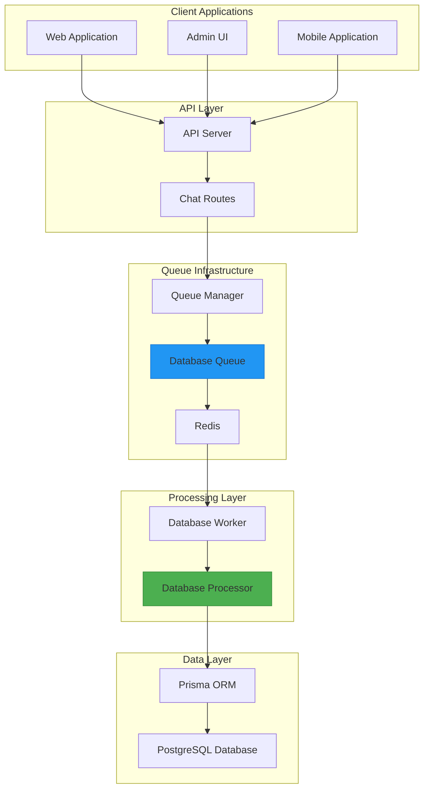
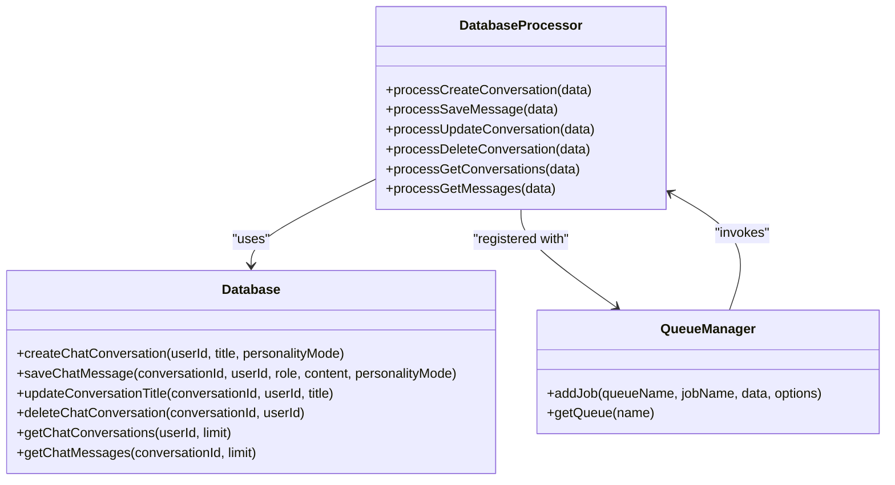
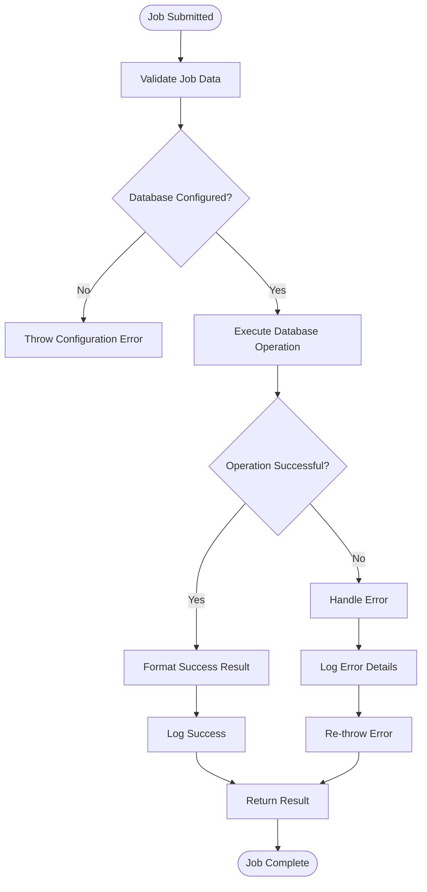
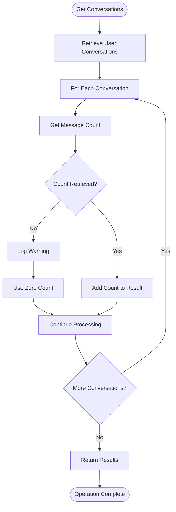
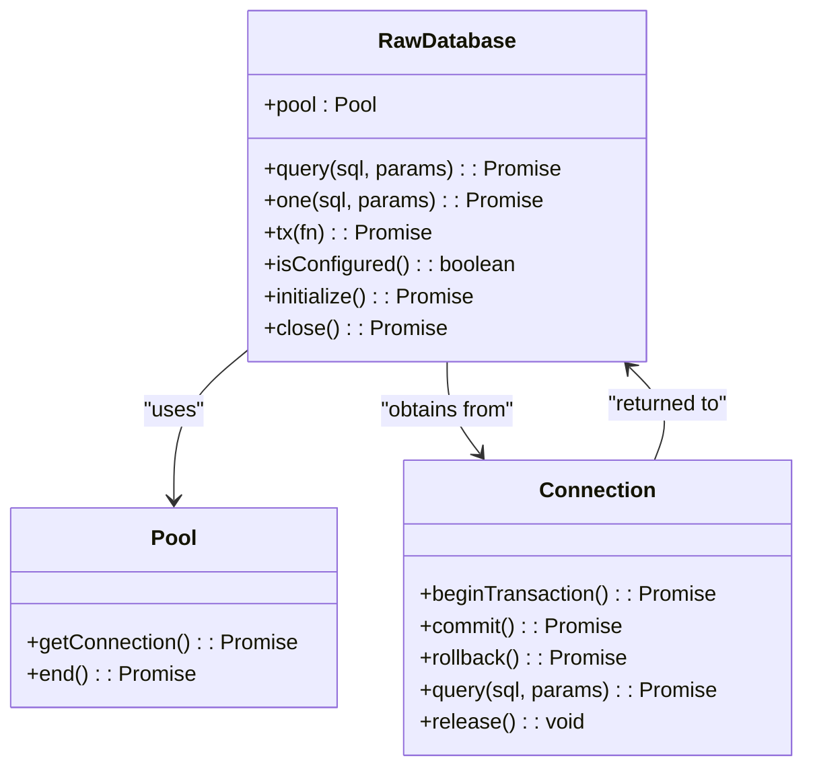
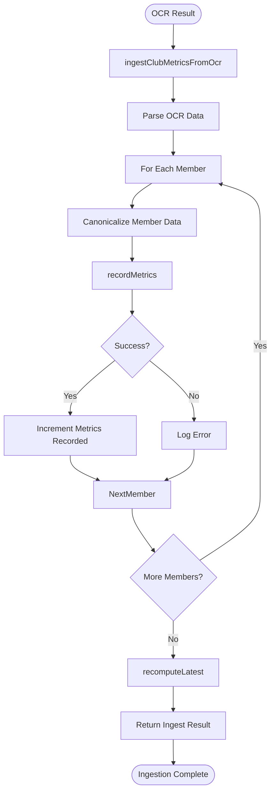
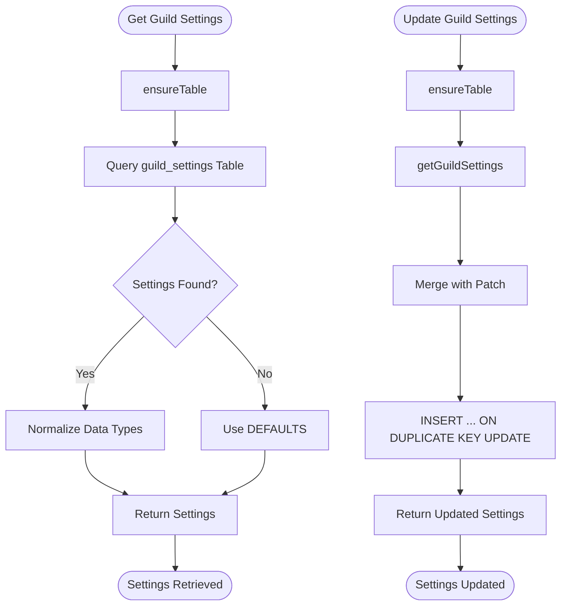
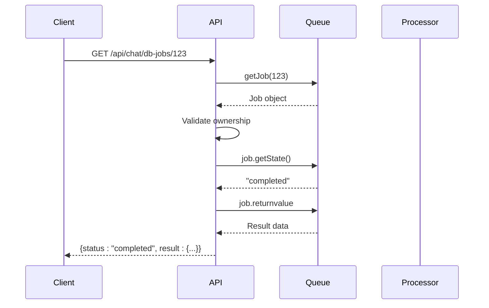
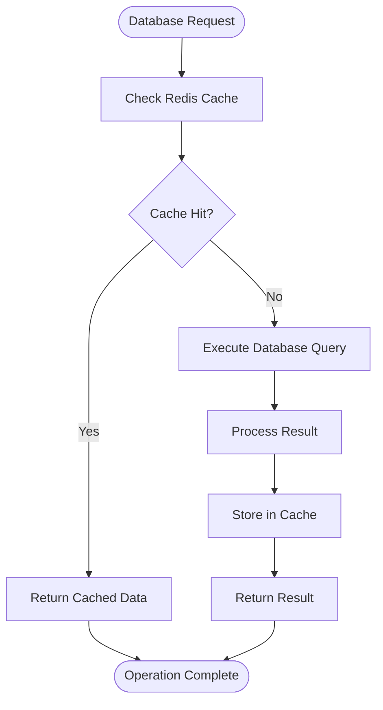

# Database Processor

<cite>
**Referenced Files in This Document**   
- [database-processor.js](file://apps/admin-api/src/lib/queues/database-processor.js)
- [database.js](file://apps/admin-api/src/lib/database.js)
- [index.js](file://apps/admin-api/src/lib/queues/index.js)
- [chat.js](file://apps/admin-api/src/routes/chat.js)
- [database-optimization.js](file://apps/admin-api/lib/database-optimization.js)
- [club-ingest.js](file://apps/admin-api/lib/club-ingest.js)
- [guild-settings.js](file://apps/admin-api/lib/guild-settings.js)
- [guild-settings.sql](file://apps/admin-api/lib/guild-settings.sql)
- [club-schema.sql](file://apps/admin-api/lib/club-schema.sql)
</cite>

## Table of Contents
1. [Introduction](#introduction)
2. [Architecture Overview](#architecture-overview)
3. [Core Responsibilities](#core-responsibilities)
4. [Job Processing Workflow](#job-processing-workflow)
5. [Data Consistency and Transaction Management](#data-consistency-and-transaction-management)
6. [Prisma ORM Integration](#prisma-orm-integration)
7. [Raw SQL Execution Patterns](#raw-sql-execution-patterns)
8. [Use Case Examples](#use-case-examples)
9. [Progress Tracking and Error Recovery](#progress-tracking-and-error-recovery)
10. [Locking and Concurrency Control](#locking-and-concurrency-control)
11. [Performance Optimization](#performance-optimization)

## Introduction

The Database Processor is a specialized job type within the slimy-monorepo system designed to handle long-running database operations asynchronously. It operates as part of a larger queue infrastructure that enables the system to perform resource-intensive database tasks without blocking user-facing operations. The processor is responsible for executing critical database operations such as conversation management, message persistence, and bulk data processing while maintaining data consistency and preventing transaction timeouts.

This documentation provides a comprehensive overview of the Database Processor's architecture, responsibilities, and implementation patterns. It details how the system handles database operations through queued jobs, ensures data integrity, integrates with Prisma ORM, and manages performance-critical operations using both ORM and raw SQL execution patterns.

## Architecture Overview

The Database Processor operates within a distributed queue system that separates database operations from user-facing API requests. This architecture enables the system to handle long-running database tasks asynchronously while providing immediate feedback to users.



**Diagram sources**
- [database-processor.js](file://apps/admin-api/src/lib/queues/database-processor.js)
- [index.js](file://apps/admin-api/src/lib/queues/index.js)
- [chat.js](file://apps/admin-api/src/routes/chat.js)

**Section sources**
- [database-processor.js](file://apps/admin-api/src/lib/queues/database-processor.js)
- [index.js](file://apps/admin-api/src/lib/queues/index.js)

## Core Responsibilities

The Database Processor is responsible for handling various database operations that require asynchronous processing to prevent blocking user requests. Its primary responsibilities include:

- **Conversation Management**: Creating, updating, and deleting chat conversations in the database
- **Message Persistence**: Saving chat messages to the database with proper user and conversation associations
- **Bulk Data Retrieval**: Efficiently retrieving multiple conversations and messages for user interfaces
- **Data Consistency**: Ensuring referential integrity and data validation during all database operations
- **Error Handling**: Managing database errors and providing appropriate feedback to the calling system
- **Performance Monitoring**: Tracking execution times and recording metrics for database operations

The processor handles these responsibilities through a series of specialized job handlers that are invoked when jobs are dequeued from the Redis-based queue system. Each job type corresponds to a specific database operation, allowing for focused error handling and monitoring.



**Diagram sources**
- [database-processor.js](file://apps/admin-api/src/lib/queues/database-processor.js)
- [database.js](file://apps/admin-api/src/lib/database.js)
- [index.js](file://apps/admin-api/src/lib/queues/index.js)

**Section sources**
- [database-processor.js](file://apps/admin-api/src/lib/queues/database-processor.js)
- [database.js](file://apps/admin-api/src/lib/database.js)

## Job Processing Workflow

The Database Processor follows a standardized workflow for handling database jobs, ensuring consistent error handling, logging, and result reporting. When a job is submitted to the database queue, it goes through the following processing stages:



**Diagram sources**
- [database-processor.js](file://apps/admin-api/src/lib/queues/database-processor.js)

**Section sources**
- [database-processor.js](file://apps/admin-api/src/lib/queues/database-processor.js)

The workflow begins when a job is submitted to the database queue through the QueueManager's addJob method. The job contains a type identifier and data payload specific to the operation being performed. When the job is processed by the worker, the Database Processor routes it to the appropriate handler function based on the job type.

Each handler follows a consistent pattern:
1. Extract parameters from the job data
2. Validate that the database is properly configured
3. Execute the corresponding database operation
4. Format and return a success result with timestamps
5. Handle any errors with comprehensive logging and re-throwing

This standardized approach ensures that all database operations are processed consistently, with proper error handling and monitoring.

## Data Consistency and Transaction Management

The Database Processor ensures data consistency through several mechanisms, including proper error handling, transaction management, and referential integrity enforcement. While the current implementation relies on Prisma ORM's built-in transaction capabilities, it also implements application-level safeguards to prevent data corruption.

For operations that require atomicity, such as creating a conversation and its first message, the system would typically use Prisma's transaction support. However, since jobs are processed asynchronously, the processor ensures consistency by validating data before operations and implementing appropriate error recovery procedures.

The processor also handles partial failures gracefully. For example, in the processGetConversations handler, if retrieving message counts for individual conversations fails, the processor continues with the available data rather than failing the entire operation:



**Diagram sources**
- [database-processor.js](file://apps/admin-api/src/lib/queues/database-processor.js)

**Section sources**
- [database-processor.js](file://apps/admin-api/src/lib/queues/database-processor.js)

This approach prioritizes availability over consistency for read operations, ensuring that users receive partial data rather than no data when non-critical components fail.

## Prisma ORM Integration

The Database Processor integrates with Prisma ORM as the primary interface for database operations. Prisma provides a type-safe, auto-generated client that enables the system to interact with the PostgreSQL database using JavaScript methods rather than raw SQL queries.

The integration is structured around a Database class that encapsulates the Prisma client instance and provides higher-level methods for common operations:

```mermaid
classDiagram
class Database {
-prisma : PrismaClient
-isInitialized : boolean
+initialize() : Promise<boolean>
+isConfigured() : boolean
+getClient() : PrismaClient
+close() : Promise<void>
+createChatConversation(userId, title, personalityMode) : Promise<string>
+saveChatMessage(conversationId, userId, role, content, personalityMode) : Promise<void>
+updateConversationTitle(conversationId, userId, title) : Promise<void>
+deleteChatConversation(conversationId, userId) : Promise<void>
+getChatConversations(userId, limit) : Promise<Conversation[]>
+getChatMessages(conversationId, limit) : Promise<Message[]>
}
class PrismaClient {
+$connect() : Promise<void>
+$disconnect() : Promise<void>
+$use(middleware) : void
+conversation : ConversationDelegate
+chatMessage : ChatMessageDelegate
}
Database --> PrismaClient : "contains"
Database -.-> "Database Processor" : "provides interface to"
```

**Diagram sources**
- [database.js](file://apps/admin-api/src/lib/database.js)

**Section sources**
- [database.js](file://apps/admin-api/src/lib/database.js)

The Database class implements several important features:

1. **Connection Management**: The class handles Prisma client initialization and connection lifecycle, ensuring that the database connection is properly established before operations.

2. **Metrics Middleware**: The system adds a middleware function to the Prisma client that records query execution times and error rates, enabling performance monitoring.

3. **Error Handling**: The class provides consistent error handling across all database operations, with proper logging and error propagation.

4. **Configuration Validation**: The isConfigured method checks whether the database URL is properly configured in the environment.

This abstraction layer allows the Database Processor to interact with the database through a consistent interface while benefiting from Prisma's type safety, query optimization, and migration capabilities.

## Raw SQL Execution Patterns

While the primary database access pattern uses Prisma ORM, the system also supports raw SQL execution for performance-critical operations or complex queries that are difficult to express through the ORM. This capability is provided through a separate database module that uses the mysql2/promise library.

The raw SQL execution pattern is implemented in the legacy database module, which provides functions for executing parameterized queries and managing transactions:



**Diagram sources**
- [database.js](file://apps/admin-api/lib/database.js)

**Section sources**
- [database.js](file://apps/admin-api/lib/database.js)

The tx function implements a transaction wrapper that automatically handles begin, commit, and rollback operations:

```javascript
async function tx(fn) {
  const conn = await pool.getConnection();
  try {
    await conn.beginTransaction();
    const res = await fn({
      query: (s, p) => conn.query(s, p).then(([r]) => r),
      execute: (s, p) => conn.execute(s, p)
    });
    await conn.commit();
    return res;
  } catch (e) {
    try { await conn.rollback(); } catch (_) {}
    throw e;
  } finally {
    conn.release();
  }
}
```

This pattern ensures that transactions are properly managed, with automatic rollback in case of errors and connection cleanup in the finally block. The function accepts a callback that receives query and execute functions bound to the transaction connection, making it easy to perform multiple operations within a single transaction.

## Use Case Examples

The Database Processor handles several important use cases in the system, including conversation management and data ingestion for club analytics. These examples demonstrate how the processor is used in real-world scenarios.

### Club Data Ingestion

The club data ingestion process involves processing OCR results from club screenshots and storing the extracted metrics in the database. This process uses both the Database Processor pattern and direct database access for different stages of the operation:



**Diagram sources**
- [club-ingest.js](file://apps/admin-api/lib/club-ingest.js)

**Section sources**
- [club-ingest.js](file://apps/admin-api/lib/club-ingest.js)

The ingestion process begins with the ingestClubMetricsFromOcr function, which processes OCR results from club screenshots. For each member detected in the OCR output, it calls recordMetrics to store the data in the database. After processing all members, it calls recomputeLatest to update aggregate statistics.

### Guild Settings Synchronization

The guild settings synchronization process manages the storage and retrieval of guild-specific configuration options. This use case demonstrates how the system handles structured data storage with fallback to default values:



**Diagram sources**
- [guild-settings.js](file://apps/admin-api/lib/guild-settings.js)

**Section sources**
- [guild-settings.js](file://apps/admin-api/lib/guild-settings.js)

The guild settings system uses a MySQL table with an ON DUPLICATE KEY UPDATE clause to implement upsert functionality. When settings are retrieved, the system first checks if they exist in the database, returning default values if not found. When updating settings, it performs a merge between existing settings and the provided patch before executing the upsert operation.

## Progress Tracking and Error Recovery

The Database Processor implements comprehensive progress tracking and error recovery mechanisms to ensure reliable operation and provide meaningful feedback to users.

### Job Status Tracking

The system provides a mechanism for clients to track the status of database jobs through the /api/chat/db-jobs/:jobId endpoint. This allows clients to poll for job completion and receive results when available:



**Diagram sources**
- [chat.js](file://apps/admin-api/src/routes/chat.js)

**Section sources**
- [chat.js](file://apps/admin-api/src/routes/chat.js)

The job status endpoint checks both the job's existence and the requesting user's ownership before returning status information. This ensures that users can only access information about their own jobs.

### Error Recovery Procedures

The Database Processor implements several error recovery procedures to handle failures gracefully:

1. **Retry Mechanism**: The queue system is configured with automatic retries for failed jobs, with exponential backoff to prevent overwhelming the database during transient failures.

2. **Comprehensive Logging**: All errors are logged with full stack traces and relevant context data, enabling effective debugging and monitoring.

3. **Graceful Degradation**: For non-critical operations, the system continues processing even when individual components fail, as demonstrated in the conversation retrieval handler.

4. **Error Propagation**: Errors are re-thrown after logging to ensure they are properly handled by the queue system, which can then implement retry logic or mark the job as failed.

The retry configuration is set in the QueueManager initialization:

```javascript
defaultJobOptions: {
  removeOnComplete: 50,
  removeOnFail: 100,
  attempts: 3,
  backoff: {
    type: 'exponential',
    delay: 2000,
  },
}
```

This configuration allows each job to be attempted up to three times, with an initial 2-second delay that increases exponentially for subsequent attempts.

## Locking and Concurrency Control

The Database Processor manages concurrency through several mechanisms to prevent race conditions and ensure data integrity during simultaneous operations.

### Queue-Based Concurrency Control

The primary concurrency control mechanism is the queue system itself, which limits the number of concurrent workers processing database jobs:

```javascript
// Queue configuration with concurrency limits
const queueConfigs = [
  { name: 'chat', concurrency: 5 },
  { name: 'database', concurrency: 10 },
  { name: 'audit', concurrency: 2 },
];
```

By limiting the number of concurrent database workers, the system prevents the database from being overwhelmed by too many simultaneous connections. This approach provides a simple but effective way to control resource usage.

### Application-Level Locking

For operations that require strict consistency, the system relies on database-level constraints and transactions. The Prisma ORM integration ensures that operations that should be atomic are executed within database transactions when necessary.

For example, when updating conversation titles, the system verifies ownership at the application level before performing the update:

```javascript
async function processUpdateConversation(data) {
  const { conversationId, userId, title } = data;
  
  // Verify the user owns the conversation through the database layer
  await database.updateConversationTitle(conversationId, userId, title);
}
```

The database layer would then enforce this constraint, ensuring that only the conversation owner can modify its title.

### Optimistic Concurrency Control

The system uses timestamps (createdAt, updatedAt) on database records to support optimistic concurrency control. When updating records, the system can check whether the record has been modified since it was last read, preventing lost updates.

## Performance Optimization

The Database Processor includes several performance optimization strategies to ensure efficient database operations and responsive user experiences.

### Query Optimization

The system implements query optimization through several techniques:

1. **Batch Operations**: Where possible, operations are batched to reduce the number of database round trips.

2. **Selective Field Retrieval**: Queries retrieve only the fields needed for the operation, reducing data transfer.

3. **Proper Indexing**: The database schema includes appropriate indexes to speed up common queries.

4. **Connection Pooling**: Both the Prisma and raw database modules use connection pooling to reuse database connections.

### Caching Strategy

For frequently accessed data, the system implements caching through the DatabaseOptimizer class:



**Diagram sources**
- [database-optimization.js](file://apps/admin-api/lib/database-optimization.js)

**Section sources**
- [database-optimization.js](file://apps/admin-api/lib/database-optimization.js)

The DatabaseOptimizer class provides caching for common query patterns, such as user data with guild associations and guild analytics. Cache entries are assigned appropriate TTL values based on how frequently the data changes.

### Monitoring and Metrics

The system includes comprehensive monitoring and metrics collection to identify performance bottlenecks:

1. **Query Timing**: All database queries are timed, and the durations are recorded as metrics.

2. **Error Rate Monitoring**: Database errors are recorded as application errors, enabling alerting on database issues.

3. **Job Performance**: The queue system records job execution times, allowing analysis of processing performance.

4. **Connection Monitoring**: Database connection counts are tracked to ensure proper resource management.

These optimization strategies work together to ensure that the Database Processor can handle its workload efficiently while maintaining responsiveness and reliability.