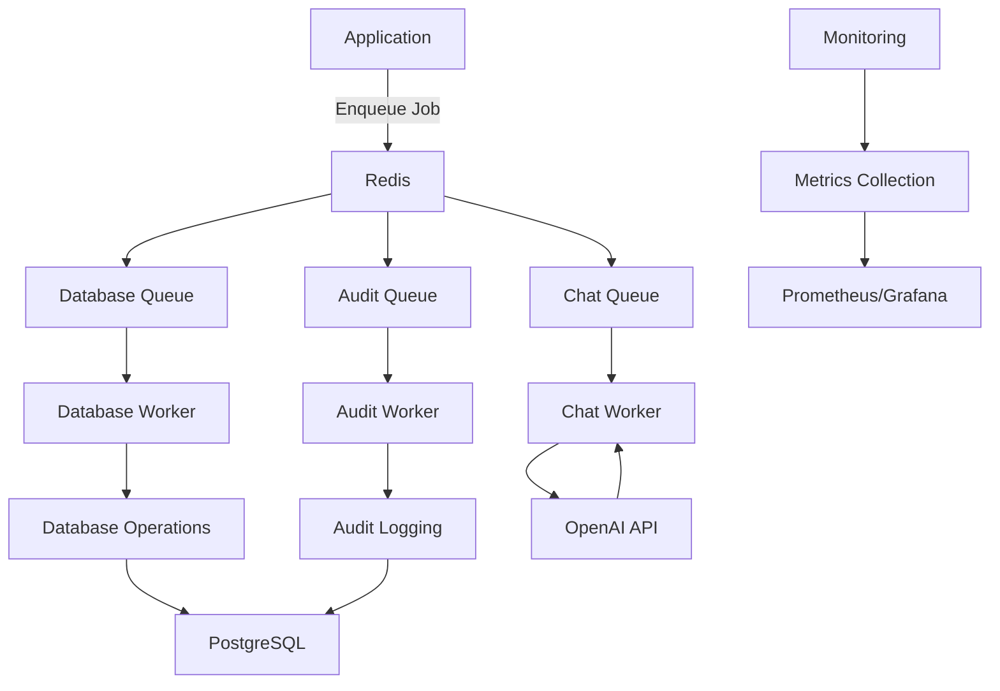
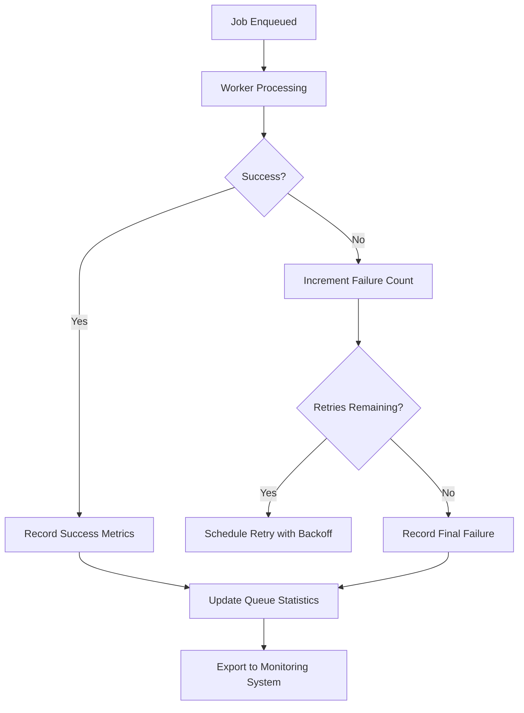

# Job Queue System

<cite>
**Referenced Files in This Document**   
- [index.js](file://apps/admin-api/src/lib/queues/index.js)
- [audit-processor.js](file://apps/admin-api/src/lib/queues/audit-processor.js)
- [chat-processor.js](file://apps/admin-api/src/lib/queues/chat-processor.js)
- [database-processor.js](file://apps/admin-api/src/lib/queues/database-processor.js)
- [metrics.js](file://apps/admin-api/src/lib/monitoring/metrics.js)
- [chat.js](file://apps/admin-api/src/routes/chat.js)
- [config/index.js](file://apps/admin-api/src/lib/config/index.js)
</cite>

## Table of Contents
1. [Introduction](#introduction)
2. [Architecture Overview](#architecture-overview)
3. [Queue Infrastructure](#queue-infrastructure)
4. [Job Types and Responsibilities](#job-types-and-responsibilities)
5. [Worker Patterns and Processing](#worker-patterns-and-processing)
6. [Error Handling and Retry Mechanisms](#error-handling-and-retry-mechanisms)
7. [Job Prioritization and Scheduling](#job-prioritization-and-scheduling)
8. [Background Processing and Decoupling](#background-processing-and-decoupling)
9. [Monitoring and Performance Metrics](#monitoring-and-performance-metrics)
10. [Code Examples](#code-examples)

## Introduction
The job queue system in the Slimy monorepo implements a robust background processing infrastructure using BullMQ with Redis as the message broker. This system enables asynchronous processing of time-consuming operations, decoupling them from the request-response cycle to improve application responsiveness and reliability. The architecture supports three primary queues—chat, database, and audit—each handling specific types of operations with dedicated workers and processing logic. This documentation provides a comprehensive overview of the queue infrastructure, job types, processing patterns, error handling, and monitoring capabilities.

## Architecture Overview
The job queue system follows a producer-consumer pattern where jobs are enqueued by various application components and processed asynchronously by dedicated workers. The system is built on BullMQ, which provides Redis-based queue management with advanced features like job prioritization, retry mechanisms, and delayed processing. The architecture consists of three main queues, each with its own worker process and specialized job processors. The system is initialized as a singleton instance of the QueueManager class, which manages Redis connections, queue instances, workers, and schedulers. Jobs are processed in isolation, with comprehensive error handling and retry logic to ensure reliability.



**Diagram sources**
- [index.js](file://apps/admin-api/src/lib/queues/index.js#L30-L388)
- [chat-processor.js](file://apps/admin-api/src/lib/queues/chat-processor.js#L1-L279)
- [database-processor.js](file://apps/admin-api/src/lib/queues/database-processor.js#L1-L324)

## Queue Infrastructure
The queue infrastructure is implemented using BullMQ with Redis as the persistent storage layer. The system initializes three distinct queues—chat, database, and audit—each configured with specific concurrency levels and job processing options. The QueueManager class serves as the central coordinator, managing Redis connections and providing a unified interface for job submission and queue management. Each queue is configured with default job options including automatic cleanup of completed and failed jobs, retry attempts with exponential backoff, and performance monitoring integration.

The Redis connection is established with specific configuration options for reliability, including retry mechanisms for failover scenarios. Queue schedulers are initialized to ensure job reliability and proper handling of delayed jobs. The system implements comprehensive lifecycle management with proper shutdown procedures that close workers, schedulers, queues, and the Redis connection in the correct order to prevent data loss.

**Section sources**
- [index.js](file://apps/admin-api/src/lib/queues/index.js#L42-L388)

## Job Types and Responsibilities
The system supports multiple job types distributed across three specialized queues, each with distinct responsibilities and processing requirements.

### Chat Processor
The chat queue handles asynchronous processing of chat-related operations, primarily focusing on interactions with the OpenAI API. The primary job type is `chat_bot_interaction`, which processes user messages and generates AI responses. This processor also handles message validation and interaction logging for audit purposes. The chat processor integrates with the OpenAI service to generate responses while implementing fallback mechanisms when the API is unavailable.

### Database Processor
The database queue manages all database operations related to chat conversations and message persistence. It supports several job types:
- `create_conversation`: Creates new chat conversations in the database
- `save_message`: Persists chat messages to the database
- `update_conversation`: Updates conversation metadata such as titles
- `delete_conversation`: Removes conversations from the database
- `get_conversations`: Retrieves a user's conversation history
- `get_messages`: Fetches messages for a specific conversation

These operations ensure data consistency and provide the foundation for the chat history functionality.

### Audit Processor
The audit queue handles event sourcing and compliance-related logging. Its primary job type is `log_event`, which records user actions and system events for security and auditing purposes. The processor captures detailed information about each action, including user identity, resource affected, action type, and contextual details. Additional job types support bulk audit logging, audit cleanup for data retention compliance, and audit report generation.

**Section sources**
- [chat-processor.js](file://apps/admin-api/src/lib/queues/chat-processor.js#L27-L279)
- [database-processor.js](file://apps/admin-api/src/lib/queues/database-processor.js#L25-L324)
- [audit-processor.js](file://apps/admin-api/src/lib/queues/audit-processor.js#L33-L401)

## Worker Patterns and Processing
The system implements a worker pattern where dedicated worker processes consume jobs from their respective queues and execute the appropriate processing logic. Each queue has a corresponding worker with configurable concurrency levels—5 for chat, 10 for database, and 2 for audit operations—optimized based on the resource requirements and performance characteristics of each job type.

Workers are implemented as BullMQ Worker instances that subscribe to their respective queues and execute job processing functions. Each worker wraps job execution in comprehensive error handling and performance monitoring. The processing flow includes timing the job duration, recording success or failure metrics, and proper error propagation. The worker pattern ensures that jobs are processed efficiently while maintaining system stability and providing detailed observability.

The processing logic is organized in a modular fashion, with the QueueManager delegating to specialized processor functions based on the job type. This separation of concerns allows for independent development and testing of each processing component while maintaining a consistent interface.

**Section sources**
- [index.js](file://apps/admin-api/src/lib/queues/index.js#L110-L177)

## Error Handling and Retry Mechanisms
The system implements robust error handling and retry mechanisms to ensure job reliability and fault tolerance. Each job is configured with automatic retry capabilities, attempting to process failed jobs up to three times with exponential backoff starting at a 2-second delay. This approach allows transient failures, such as temporary network issues or service unavailability, to be automatically resolved without manual intervention.

Error handling is implemented at multiple levels. Individual job processors catch and handle errors specific to their domain, while the worker layer provides additional error handling for uncaught exceptions. When a job fails after all retry attempts, it is moved to the failed jobs list for monitoring and potential manual intervention. The system maintains detailed error information, including stack traces, to facilitate debugging.

The audit processor demonstrates a sophisticated error handling pattern where certain types of failures (such as audit logging failures) are handled gracefully without failing the entire operation, recognizing that audit logging is a secondary concern that should not impact primary functionality.

**Section sources**
- [index.js](file://apps/admin-api/src/lib/queues/index.js#L94-L98)
- [chat-processor.js](file://apps/admin-api/src/lib/queues/chat-processor.js#L70-L94)
- [database-processor.js](file://apps/admin-api/src/lib/queues/database-processor.js#L55-L61)
- [audit-processor.js](file://apps/admin-api/src/lib/queues/audit-processor.js#L102-L125)

## Job Prioritization and Scheduling
While the current implementation does not explicitly use job priorities in the code, the system supports priority-based processing through BullMQ's priority options. Jobs can be assigned a priority value when enqueued, with lower numbers indicating higher priority. This allows critical operations to be processed before less important ones, ensuring optimal resource utilization.

The system implements job scheduling through QueueScheduler instances for each queue, which handle delayed jobs and ensure reliable job processing. The schedulers manage jobs that are delayed for a specified period before processing, enabling use cases like rate limiting or scheduled operations.

Job configuration includes options for delaying job execution, allowing for precise control over when jobs are processed. This capability supports scenarios where operations need to be performed at specific times or after certain conditions are met.

**Section sources**
- [index.js](file://apps/admin-api/src/lib/queues/index.js#L184-L195)
- [index.js](file://apps/admin-api/src/lib/queues/index.js#L214-L217)

## Background Processing and Decoupling
The job queue system effectively decouples time-consuming operations from the request-response cycle, significantly improving application responsiveness. When a client requests an operation that requires substantial processing time, such as generating an AI response or performing complex database operations, the system immediately returns a job identifier and queues the operation for background processing. This approach prevents request timeouts and allows the application to handle a higher volume of concurrent requests.

Clients can subsequently poll for job status using the provided job ID, receiving updates on the processing progress and final results when available. This pattern transforms synchronous, blocking operations into asynchronous, non-blocking workflows, enhancing both user experience and system scalability.

The decoupling also enables better resource management, as background workers can be scaled independently of the main application servers based on processing load. This separation of concerns allows each component to be optimized for its specific role, with web servers focusing on request handling and worker processes dedicated to computational tasks.

**Section sources**
- [chat.js](file://apps/admin-api/src/routes/chat.js#L53-L92)
- [chat.js](file://apps/admin-api/src/routes/chat.js#L127-L181)

## Monitoring and Performance Metrics
The system includes comprehensive monitoring and performance metrics collection to ensure observability and facilitate troubleshooting. The metrics module tracks various aspects of queue performance, including job throughput, success rates, processing durations, and system resource utilization.

Key metrics collected for each queue include:
- Number of queued, active, completed, and failed jobs
- Job success rate percentage
- Average job processing duration
- Job throughput (jobs per minute)
- Total jobs queued, completed, and failed

System-level metrics include memory usage, CPU utilization, request rates, response times, and error rates. These metrics are exposed through a snapshot function that provides a comprehensive overview of system health and performance. The monitoring data can be integrated with external observability platforms like Prometheus and Grafana for visualization and alerting.

The system also implements request-level logging with correlation IDs, enabling end-to-end tracing of operations from initial request through job processing and final response. This capability is essential for debugging complex issues and understanding system behavior under various conditions.



**Diagram sources**
- [metrics.js](file://apps/admin-api/src/lib/monitoring/metrics.js#L26-L48)
- [index.js](file://apps/admin-api/src/lib/queues/index.js#L117-L124)

## Code Examples
The following examples demonstrate how jobs are created and processed within the system:

### Enqueuing a Chat Bot Interaction
When a user submits a message to the chat bot, the system creates a job in the chat queue:

```javascript
// Job submission (simplified)
const job = await queueManager.addJob('chat', 'chat_bot_interaction', {
  prompt: userMessage,
  guildId: currentGuild,
  userId: currentUser,
  requestId: correlationId
});
```

### Processing a Database Operation
Database operations are handled through dedicated job types in the database queue:

```javascript
// Creating a conversation job
await queueManager.addJob('database', 'create_conversation', {
  userId: user.id,
  title: conversationTitle,
  personalityMode: selectedMode
});
```

### Handling Audit Events
Audit logging is performed asynchronously to avoid impacting primary operations:

```javascript
// Logging a user action
await queueManager.addJob('audit', 'log_event', {
  userId: user.id,
  action: 'conversation.created',
  resourceType: 'conversation',
  resourceId: newConversation.id,
  details: { title: conversationTitle },
  success: true
});
```

### Checking Job Status
Clients can poll for job status using the job ID returned during submission:

```javascript
// Status check endpoint
const job = await chatQueue.getJob(jobId);
const state = await job.getState();
// Return status to client
```

These examples illustrate the clean separation between job submission and processing, enabling the system to handle operations efficiently while maintaining responsiveness.

**Section sources**
- [chat.js](file://apps/admin-api/src/routes/chat.js#L72-L77)
- [chat.js](file://apps/admin-api/src/routes/chat.js#L376-L381)
- [chat.js](file://apps/admin-api/src/routes/chat.js#L138-L140)
- [audit-processor.js](file://apps/admin-api/src/lib/queues/audit-processor.js#L33-L46)