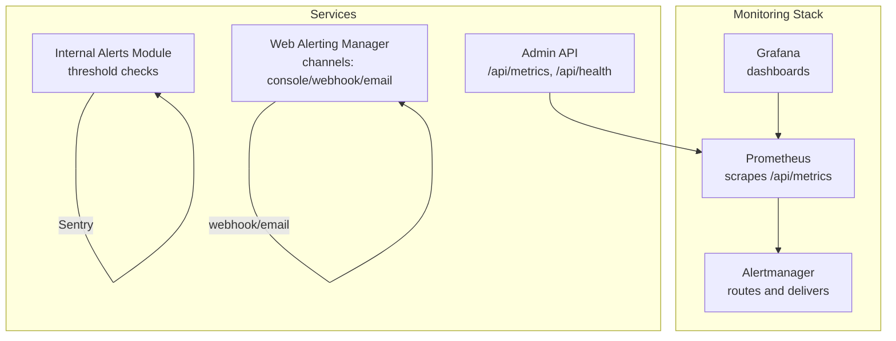
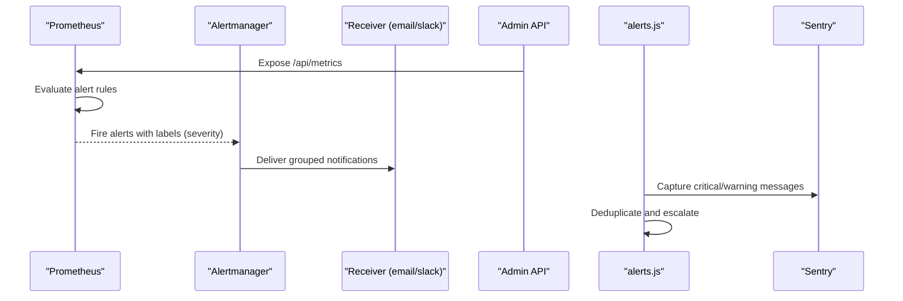
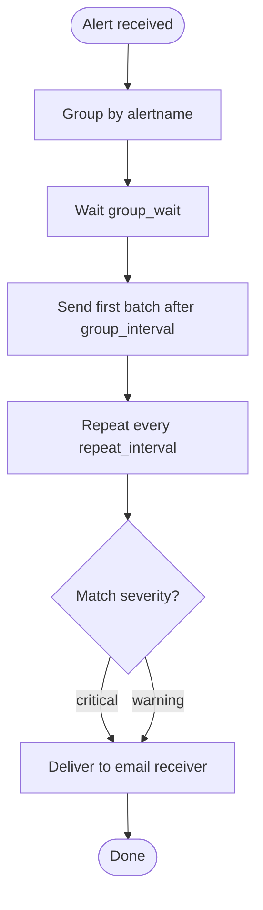
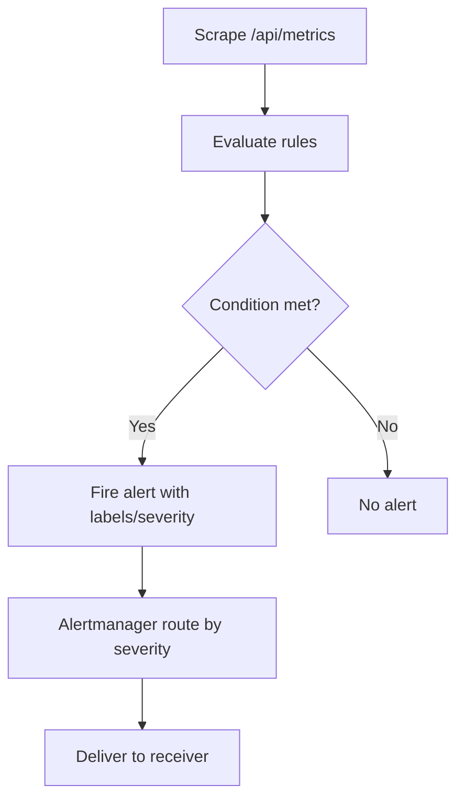
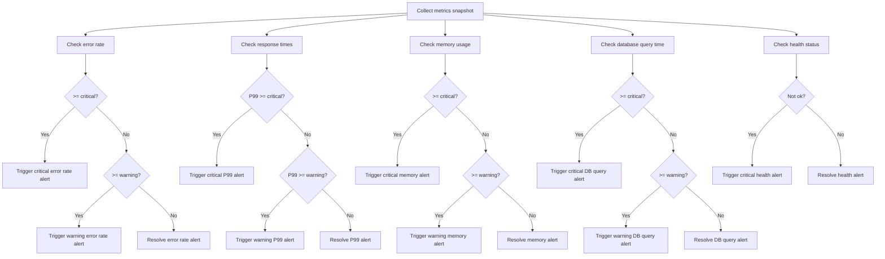
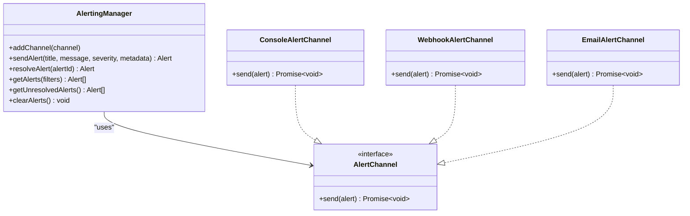
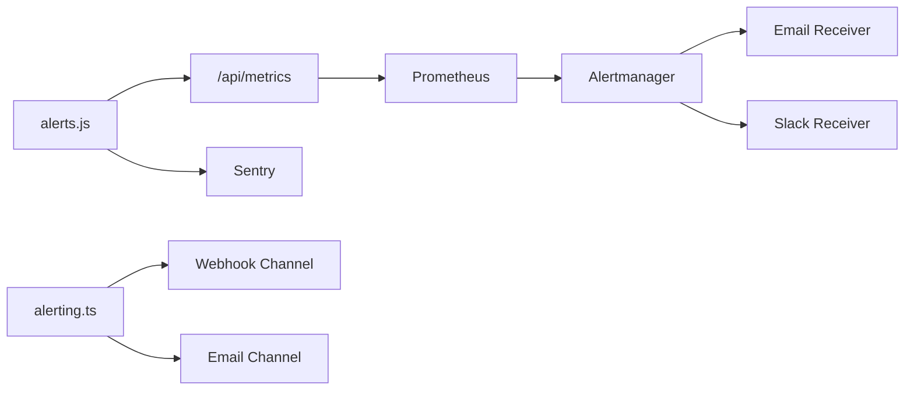

# Alerting with Alertmanager

<cite>
**Referenced Files in This Document**
- [alertmanager.yml](file://apps/web/monitoring/alertmanager.yml)
- [docker-compose.monitoring.yml](file://apps/web/docker-compose.monitoring.yml)
- [prometheus.yml](file://apps/admin-api/prometheus.yml)
- [alerts.js](file://apps/admin-api/src/lib/alerts.js)
- [metrics.js](file://apps/admin-api/src/lib/monitoring/metrics.js)
- [sentry.js](file://apps/admin-api/src/lib/monitoring/sentry.js)
- [MONITORING_README.md](file://apps/admin-api/MONITORING_README.md)
- [grafana-dashboard.json](file://apps/admin-api/monitoring/dashboards/grafana-dashboard.json)
- [alerting.ts](file://apps/web/lib/monitoring/alerting.ts)
</cite>

## Table of Contents
1. [Introduction](#introduction)
2. [Project Structure](#project-structure)
3. [Core Components](#core-components)
4. [Architecture Overview](#architecture-overview)
5. [Detailed Component Analysis](#detailed-component-analysis)
6. [Dependency Analysis](#dependency-analysis)
7. [Performance Considerations](#performance-considerations)
8. [Troubleshooting Guide](#troubleshooting-guide)
9. [Conclusion](#conclusion)
10. [Appendices](#appendices)

## Introduction
This document explains how alerting works in the Slimy Monorepo, focusing on Alertmanager configuration and routing, Prometheus alert rules, internal alerting via the alerts.js service, and integration points with monitoring and observability. It covers how Prometheus alerts (e.g., high error rates, slow API responses, memory usage) are evaluated and delivered, how internal alerts are generated and deduplicated, and how to manage silences, inhibit rules, and escalations. It also provides practical guidance for adding new alert rules, testing alert delivery, and avoiding common pitfalls like alert fatigue and misconfigured matchers.

## Project Structure
The alerting stack spans multiple services and files:
- Alertmanager configuration defines receivers and routing trees.
- Prometheus configuration scrapes the Admin API metrics endpoint and can define alert rules.
- The Admin API exposes a metrics endpoint and includes an internal alerting module that evaluates thresholds and sends alerts to Sentry and logs.
- Grafana is configured to visualize metrics and can be used to test alert conditions.
- The Web app includes a TypeScript alerting manager that can send alerts to webhook/email channels.

**Diagram sources**
- [docker-compose.monitoring.yml](file://apps/web/docker-compose.monitoring.yml#L1-L63)
- [prometheus.yml](file://apps/admin-api/prometheus.yml#L1-L52)
- [alertmanager.yml](file://apps/web/monitoring/alertmanager.yml#L1-L46)
- [alerts.js](file://apps/admin-api/src/lib/alerts.js#L1-L343)
- [alerting.ts](file://apps/web/lib/monitoring/alerting.ts#L1-L200)

**Section sources**
- [docker-compose.monitoring.yml](file://apps/web/docker-compose.monitoring.yml#L1-L63)
- [prometheus.yml](file://apps/admin-api/prometheus.yml#L1-L52)
- [alertmanager.yml](file://apps/web/monitoring/alertmanager.yml#L1-L46)
- [alerts.js](file://apps/admin-api/src/lib/alerts.js#L1-L343)
- [alerting.ts](file://apps/web/lib/monitoring/alerting.ts#L1-L200)

## Core Components
- Alertmanager configuration: Defines global SMTP settings, grouping, wait intervals, repeat intervals, and receivers. Routing tree currently directs all alerts to the email receiver, with severity-based branches.
- Prometheus configuration: Scrapes the Admin API metrics endpoint and includes commented examples of alert rules and Alertmanager integration.
- Internal alerts module: Evaluates thresholds for error rate, response time percentiles, memory usage, database query time, and service health. It deduplicates alerts using cooldowns and severity escalation logic, and integrates with Sentry for error tracking.
- Web alerting manager: Provides a TypeScript alerting system with channels (console, webhook, email) and helper methods for common alert types.
- Grafana dashboard: Visualizes metrics used by internal and Prometheus alerts.

**Section sources**
- [alertmanager.yml](file://apps/web/monitoring/alertmanager.yml#L1-L46)
- [prometheus.yml](file://apps/admin-api/prometheus.yml#L1-L52)
- [alerts.js](file://apps/admin-api/src/lib/alerts.js#L1-L343)
- [alerting.ts](file://apps/web/lib/monitoring/alerting.ts#L1-L200)
- [grafana-dashboard.json](file://apps/admin-api/monitoring/dashboards/grafana-dashboard.json#L1-L364)

## Architecture Overview
The alerting pipeline combines internal checks and external monitoring:

- Internal checks (Admin API):
  - Metrics snapshot collected via metrics middleware and snapshot.
  - Threshold checks evaluate error rate, response times, memory usage, database query time, and health status.
  - Deduplication prevents repeated alerts within a cooldown period and escalates severity only when necessary.
  - Critical alerts are logged and sent to Sentry for tracking.

- External monitoring (Prometheus + Alertmanager):
  - Prometheus scrapes the Admin API metrics endpoint.
  - Alert rules define conditions and severity labels.
  - Alertmanager routes alerts by severity and delivers them to configured receivers (email, Slack).

**Diagram sources**
- [prometheus.yml](file://apps/admin-api/prometheus.yml#L1-L52)
- [alertmanager.yml](file://apps/web/monitoring/alertmanager.yml#L1-L46)
- [alerts.js](file://apps/admin-api/src/lib/alerts.js#L1-L343)
- [sentry.js](file://apps/admin-api/src/lib/monitoring/sentry.js#L1-L148)

## Detailed Component Analysis

### Alertmanager Configuration and Routing
- Global SMTP settings enable email delivery.
- Route configuration:
  - Groups alerts by alertname.
  - Sets group_wait, group_interval, and repeat_interval to control batching and repetition cadence.
  - Routes severity critical and warning to the email receiver.
- Receivers:
  - Email receiver configured with recipient, subject, and body templating.
  - Slack receiver is commented out for easy activation.

**Diagram sources**
- [alertmanager.yml](file://apps/web/monitoring/alertmanager.yml#L1-L46)

**Section sources**
- [alertmanager.yml](file://apps/web/monitoring/alertmanager.yml#L1-L46)

### Prometheus Alert Rules and Evaluation
- Prometheus scrapes the Admin API metrics endpoint.
- Alert rules can be defined inline or in a separate rules file.
- The Admin API’s internal module generates Prometheus alert rules dynamically based on thresholds and service name, including:
  - High error rate and critical error rate.
  - Slow response time (P95).
  - High memory usage.
  - Slow database queries.

**Diagram sources**
- [prometheus.yml](file://apps/admin-api/prometheus.yml#L1-L52)
- [alerts.js](file://apps/admin-api/src/lib/alerts.js#L265-L342)

**Section sources**
- [prometheus.yml](file://apps/admin-api/prometheus.yml#L1-L52)
- [alerts.js](file://apps/admin-api/src/lib/alerts.js#L265-L342)

### Internal Alerting with alerts.js
- Thresholds:
  - Error rate: warning and critical thresholds.
  - Response time percentiles (P95, P99): warning and critical thresholds.
  - Memory usage: warning and critical thresholds.
  - Database query time: warning and critical thresholds.
  - Health check failures: consecutive failure threshold.
- Deduplication and escalation:
  - Cooldown prevents repeated alerts within a fixed interval.
  - Escalation occurs only when severity increases.
- Alert lifecycle:
  - Triggering logs and Sentry capture for critical alerts.
  - Resolving removes alerts from state.
- Prometheus rule generator:
  - Produces a rules object with expressions and labels derived from thresholds.

**Diagram sources**
- [alerts.js](file://apps/admin-api/src/lib/alerts.js#L1-L343)
- [metrics.js](file://apps/admin-api/src/lib/monitoring/metrics.js#L1-L357)

**Section sources**
- [alerts.js](file://apps/admin-api/src/lib/alerts.js#L1-L343)
- [metrics.js](file://apps/admin-api/src/lib/monitoring/metrics.js#L1-L357)

### Web Alerting Manager (TypeScript)
- Provides channels:
  - Console (development).
  - Webhook (production).
  - Email (placeholder).
- Helper methods for common alerts (e.g., high error rate, slow response time, database connection error, external service error, high memory usage).
- Stores recent alerts and resolves them when conditions improve.

**Diagram sources**
- [alerting.ts](file://apps/web/lib/monitoring/alerting.ts#L1-L200)

**Section sources**
- [alerting.ts](file://apps/web/lib/monitoring/alerting.ts#L1-L200)

### Grafana Dashboards and Metrics
- Grafana is configured to use Prometheus as the data source and to import a dashboard.
- The dashboard visualizes key metrics used by internal and Prometheus alerts, including error rate, response time percentiles, memory usage, database performance, and request trends.

**Section sources**
- [docker-compose.monitoring.yml](file://apps/web/docker-compose.monitoring.yml#L1-L63)
- [grafana-dashboard.json](file://apps/admin-api/monitoring/dashboards/grafana-dashboard.json#L1-L364)

## Dependency Analysis
- Prometheus depends on the Admin API metrics endpoint (/api/metrics).
- Alertmanager depends on Prometheus firing alerts and on configured receivers.
- Internal alerts (alerts.js) depend on metrics snapshot and Sentry for error tracking.
- Web alerting manager depends on environment variables for channel configuration.

**Diagram sources**
- [prometheus.yml](file://apps/admin-api/prometheus.yml#L1-L52)
- [alertmanager.yml](file://apps/web/monitoring/alertmanager.yml#L1-L46)
- [alerts.js](file://apps/admin-api/src/lib/alerts.js#L1-L343)
- [sentry.js](file://apps/admin-api/src/lib/monitoring/sentry.js#L1-L148)
- [alerting.ts](file://apps/web/lib/monitoring/alerting.ts#L1-L200)

**Section sources**
- [prometheus.yml](file://apps/admin-api/prometheus.yml#L1-L52)
- [alertmanager.yml](file://apps/web/monitoring/alertmanager.yml#L1-L46)
- [alerts.js](file://apps/admin-api/src/lib/alerts.js#L1-L343)
- [sentry.js](file://apps/admin-api/src/lib/monitoring/sentry.js#L1-L148)
- [alerting.ts](file://apps/web/lib/monitoring/alerting.ts#L1-L200)

## Performance Considerations
- Grouping and batching:
  - group_by, group_wait, group_interval, and repeat_interval reduce noise and throttle delivery frequency.
- Internal deduplication:
  - Cooldown prevents repeated alerts within a fixed interval, reducing alert fatigue.
- Metric cardinality:
  - Keep label sets minimal to avoid excessive series growth.
- Alert rule thresholds:
  - Choose thresholds that balance sensitivity and stability to avoid frequent flapping.

[No sources needed since this section provides general guidance]

## Troubleshooting Guide
- Metrics not appearing:
  - Verify the Admin API metrics endpoint is reachable and Prometheus configuration points to the correct target.
- Alerts not firing:
  - Confirm thresholds in the internal alerts module and Prometheus rules.
  - Check cooldown periods and severity escalation logic.
  - Ensure Prometheus is configured to scrape and Alertmanager is configured to receive alerts.
- Health check failing:
  - Inspect database connectivity and external service dependencies.
- Security considerations:
  - Change default Grafana admin password.
  - Protect sensitive credentials in Alertmanager configuration.
- Testing alert delivery:
  - Use Grafana dashboards to simulate conditions.
  - Manually trigger internal alerts via helper methods or adjust thresholds temporarily.

**Section sources**
- [MONITORING_README.md](file://apps/admin-api/MONITORING_README.md#L177-L208)
- [prometheus.yml](file://apps/admin-api/prometheus.yml#L1-L52)
- [alertmanager.yml](file://apps/web/monitoring/alertmanager.yml#L1-L46)

## Conclusion
The Slimy Monorepo implements a layered alerting strategy combining internal threshold checks, Prometheus alert rules, and Alertmanager routing. Internal alerts provide immediate feedback and integrate with Sentry, while external monitoring ensures robust alert delivery to email and Slack. Proper grouping, deduplication, and escalation policies help minimize alert fatigue and ensure timely incident response.

[No sources needed since this section summarizes without analyzing specific files]

## Appendices

### Adding New Alert Rules
- Define Prometheus alert rules in the Admin API Prometheus configuration or a dedicated rules file.
- Use severity labels consistently to leverage Alertmanager routing.
- Reference metric names exposed by the Admin API metrics endpoint.

**Section sources**
- [prometheus.yml](file://apps/admin-api/prometheus.yml#L1-L52)
- [metrics.js](file://apps/admin-api/src/lib/monitoring/metrics.js#L223-L306)

### Testing Alert Delivery
- Start the monitoring stack locally using the provided docker-compose file.
- Observe Grafana dashboards to validate metrics.
- Temporarily lower thresholds or simulate conditions to verify alert firing and delivery.

**Section sources**
- [docker-compose.monitoring.yml](file://apps/web/docker-compose.monitoring.yml#L1-L63)
- [grafana-dashboard.json](file://apps/admin-api/monitoring/dashboards/grafana-dashboard.json#L1-L364)

### Managing Silences and Inhibitions
- Silences:
  - Use Alertmanager UI to schedule silences for maintenance windows or noisy receivers.
- Inhibitions:
  - Configure inhibition rules to suppress less severe alerts when critical alerts are firing.
- Escalations:
  - Use Alertmanager routes to escalate critical alerts to higher-priority channels.

**Section sources**
- [alertmanager.yml](file://apps/web/monitoring/alertmanager.yml#L1-L46)

### Real Alert Scenarios
- Database connection failures:
  - Internal health checks detect unhealthy status and trigger critical alerts.
  - Prometheus rules can mirror these conditions for external monitoring.
- Authentication service outages:
  - External service error alerts can be generated by the Web alerting manager and delivered via webhook/email.

**Section sources**
- [alerts.js](file://apps/admin-api/src/lib/alerts.js#L222-L234)
- [alerting.ts](file://apps/web/lib/monitoring/alerting.ts#L292-L329)

### Best Practices and Pitfalls
- Avoid alert fatigue:
  - Tune thresholds and use grouping and deduplication effectively.
- Misconfigured matchers:
  - Ensure severity labels match Alertmanager routes.
- Credential security:
  - Protect SMTP credentials and change default passwords.

**Section sources**
- [alertmanager.yml](file://apps/web/monitoring/alertmanager.yml#L1-L46)
- [MONITORING_README.md](file://apps/admin-api/MONITORING_README.md#L194-L208)