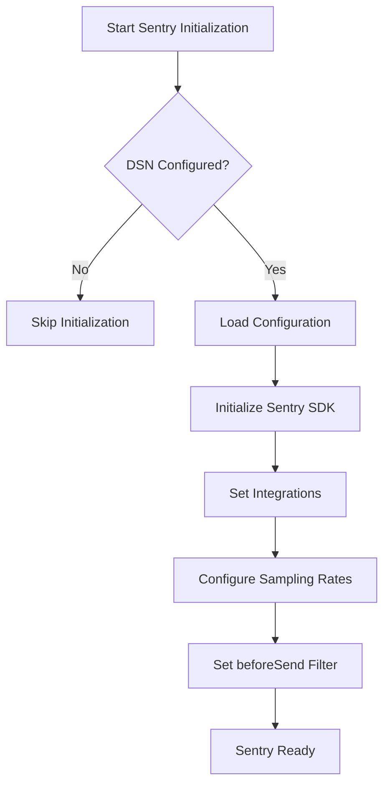
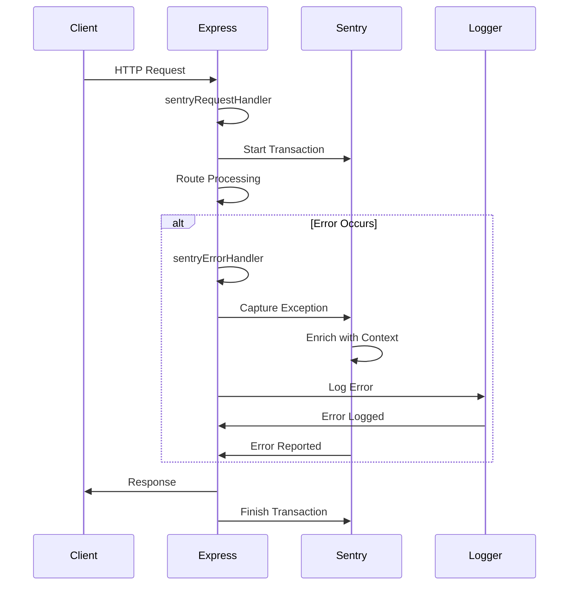
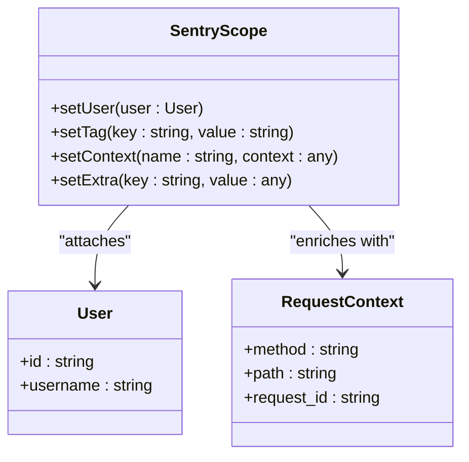
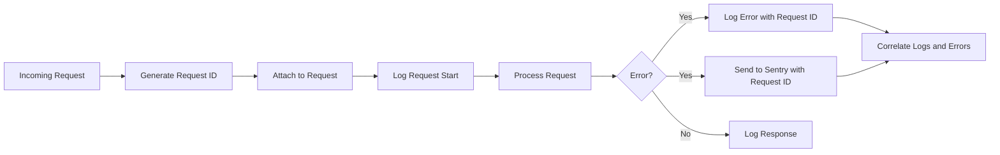
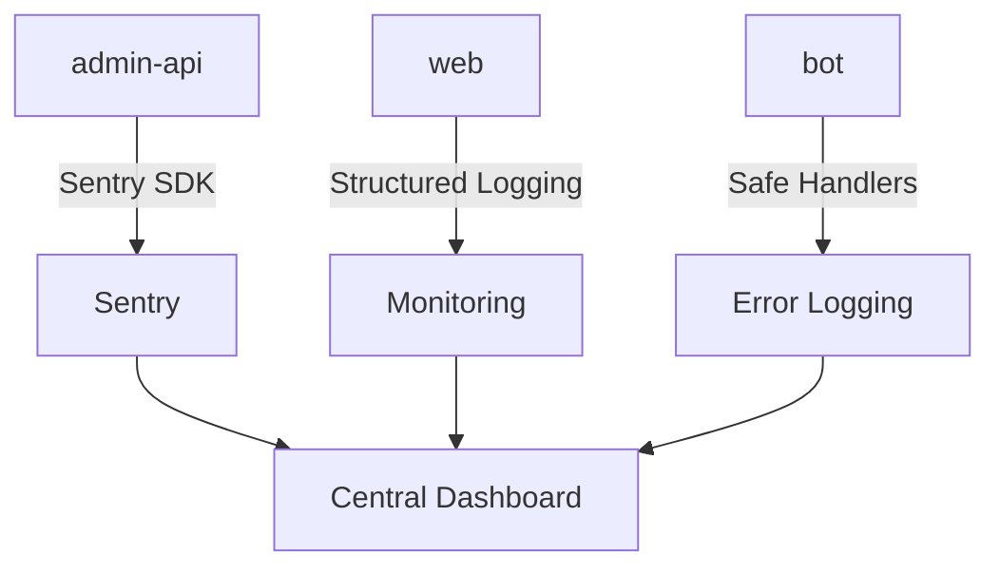
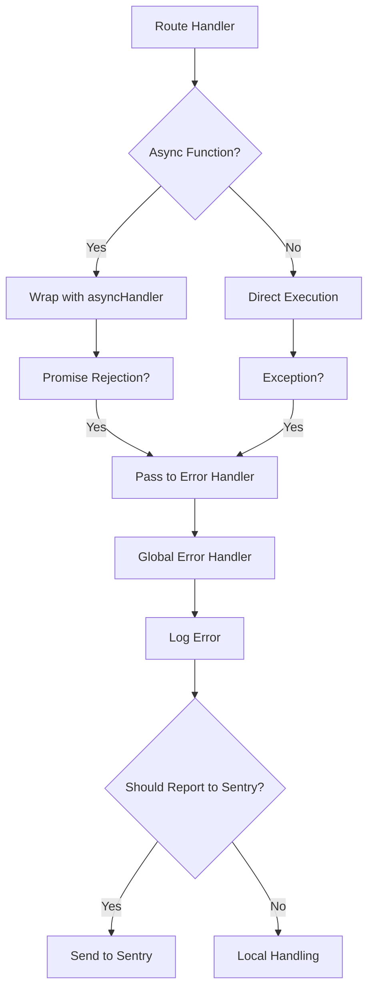
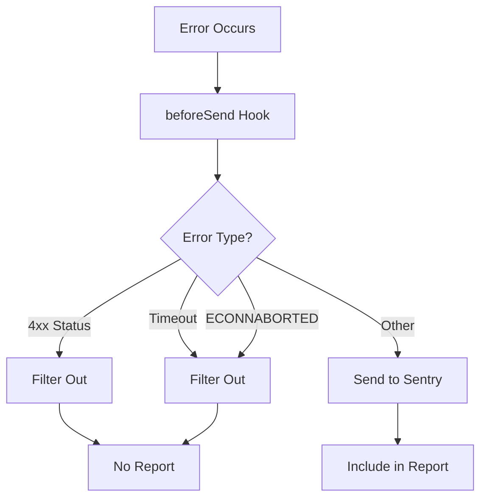

# Error Tracking with Sentry

<cite>
**Referenced Files in This Document**   
- [sentry.js](file://apps/admin-api/src/lib/monitoring/sentry.js)
- [sentry.js](file://apps/admin-api/src/lib/sentry.js)
- [error-handler.js](file://apps/admin-api/src/middleware/error-handler.js)
- [logger.js](file://apps/admin-api/src/lib/logger.js)
- [config/index.js](file://apps/admin-api/src/lib/config/index.js)
- [request-id.js](file://apps/admin-api/src/middleware/request-id.js)
- [auth.js](file://apps/admin-api/src/middleware/auth.js)
- [auth.js](file://apps/admin-api/src/routes/auth.js)
- [middleware.ts](file://apps/web/middleware.ts)
- [logger.ts](file://apps/web/lib/monitoring/logger.ts)
- [errorHandler.ts](file://apps/bot/src/lib/errorHandler.ts)
- [logger.ts](file://apps/bot/src/lib/logger.ts)
- [BOT_LOGGING.md](file://apps/bot/docs/BOT_LOGGING.md)
</cite>

## Table of Contents
1. [Introduction](#introduction)
2. [Sentry SDK Configuration](#sentry-sdk-configuration)
3. [Error Capture in Express Middleware](#error-capture-in-express-middleware)
4. [Request Context Enrichment](#request-context-enrichment)
5. [Integration with Logging System](#integration-with-logging-system)
6. [Cross-Service Error Reporting](#cross-service-error-reporting)
7. [Error Capture Patterns](#error-capture-patterns)
8. [Sampling and Filtering Strategies](#sampling-and-filtering-strategies)
9. [Source Map Management](#source-map-management)
10. [Troubleshooting Common Issues](#troubleshooting-common-issues)

## Introduction

The Slimy Monorepo implements a comprehensive error tracking system using Sentry across its microservices architecture. This documentation details how unhandled exceptions and promise rejections are captured, processed, and reported across the admin-api service and other components of the system. The implementation focuses on providing rich context for debugging while maintaining performance and minimizing noise in the error reporting system.

The error tracking infrastructure is designed to capture both server-side and client-side errors, with special attention to request context, user information, and transaction details. The system integrates seamlessly with the existing logging framework and provides mechanisms for filtering, sampling, and enriching error reports.

**Section sources**
- [sentry.js](file://apps/admin-api/src/lib/monitoring/sentry.js)
- [BOT_LOGGING.md](file://apps/bot/docs/BOT_LOGGING.md)

## Sentry SDK Configuration

The Sentry SDK is configured in the admin-api service through the `sentry.js` module located in the monitoring directory. The initialization process begins with environment variable validation and configuration loading from the central config module. The SDK is initialized only when a valid DSN is provided, preventing unnecessary initialization in development or testing environments.

The configuration includes performance monitoring features such as tracing and profiling, with sample rates adjusted based on the environment. In production, traces are sampled at 10%, while in development environments, all traces are captured to facilitate debugging. The same sampling strategy applies to profiling data.

**Diagram sources **
- [sentry.js](file://apps/admin-api/src/lib/monitoring/sentry.js)
- [config/index.js](file://apps/admin-api/src/lib/config/index.js)

**Section sources**
- [sentry.js](file://apps/admin-api/src/lib/monitoring/sentry.js)
- [config/index.js](file://apps/admin-api/src/lib/config/index.js)

## Error Capture in Express Middleware

The admin-api service implements a multi-layered error handling approach using Express middleware. The Sentry integration includes two primary middleware functions: `sentryRequestHandler` and `sentryErrorHandler`. These are strategically placed in the middleware chain to capture both request context and error information.

The request handler middleware starts a transaction for each incoming HTTP request, capturing the HTTP method and path as the transaction name. This transaction is stored on the request object and automatically finished when the response is completed, with the HTTP status code set as the transaction status.

The error handler middleware processes unhandled exceptions and routes them to Sentry with enriched context. It operates in conjunction with the standard error handling middleware, ensuring that all errors are properly logged and reported.

**Diagram sources **
- [sentry.js](file://apps/admin-api/src/lib/monitoring/sentry.js)
- [error-handler.js](file://apps/admin-api/src/middleware/error-handler.js)

**Section sources**
- [sentry.js](file://apps/admin-api/src/lib/monitoring/sentry.js)
- [error-handler.js](file://apps/admin-api/src/middleware/error-handler.js)

## Request Context Enrichment

The error tracking system enriches Sentry events with comprehensive request context to facilitate debugging and issue resolution. When an error is captured, the system automatically includes user information, request metadata, and custom tags that provide valuable context for understanding the error conditions.

User context is captured from the authenticated user object when available, including the user ID and username. This information is attached to the Sentry scope, allowing errors to be filtered and analyzed by user. Request metadata such as the HTTP method, path, and request ID are also included as tags, enabling correlation between errors and specific endpoints.

**Diagram sources **
- [sentry.js](file://apps/admin-api/src/lib/monitoring/sentry.js)
- [auth.js](file://apps/admin-api/src/middleware/auth.js)

**Section sources**
- [sentry.js](file://apps/admin-api/src/lib/monitoring/sentry.js)
- [auth.js](file://apps/admin-api/src/middleware/auth.js)

## Integration with Logging System

The error tracking system is tightly integrated with the application's logging framework, creating a cohesive observability solution. The logger module uses Pino for structured logging, with configuration that varies between development and production environments. In development, logs are formatted for human readability with color coding, while in production, JSON format is used for compatibility with monitoring platforms.

Error correlation is achieved through the use of request IDs, which are generated for each incoming request and included in both log entries and Sentry events. This allows developers to trace the complete lifecycle of a request from initial processing through to error reporting, examining both the normal execution path and any error conditions that occurred.

**Diagram sources **
- [logger.js](file://apps/admin-api/src/lib/logger.js)
- [request-id.js](file://apps/admin-api/src/middleware/request-id.js)

**Section sources**
- [logger.js](file://apps/admin-api/src/lib/logger.js)
- [request-id.js](file://apps/admin-api/src/middleware/request-id.js)

## Cross-Service Error Reporting

The Slimy Monorepo implements error tracking across multiple services, each with its own approach tailored to the service's architecture and requirements. The admin-api service uses the Sentry Node SDK with Express middleware integration, while other services employ different strategies appropriate to their technology stack.

The web application uses Next.js middleware for authentication and includes structured logging capabilities, though it does not currently integrate with Sentry according to the documentation. The bot service implements a custom error handling system with safe handler wrappers that prevent crashes from unhandled errors in event handlers, logging errors with context but without Sentry integration.

**Diagram sources **
- [middleware.ts](file://apps/web/middleware.ts)
- [errorHandler.ts](file://apps/bot/src/lib/errorHandler.ts)

**Section sources**
- [middleware.ts](file://apps/web/middleware.ts)
- [errorHandler.ts](file://apps/bot/src/lib/errorHandler.ts)

## Error Capture Patterns

The system implements several patterns for capturing errors in different contexts, from route handlers to authentication middleware. In route handlers, errors are typically captured through the centralized error handling middleware, which processes both synchronous exceptions and rejected promises.

The authentication middleware demonstrates a specific error capture pattern where token verification failures are handled gracefully, with errors logged but not reported to Sentry when they represent expected client-side issues such as expired or invalid tokens. This prevents noise in the error reporting system from routine authentication failures.

**Diagram sources **
- [auth.js](file://apps/admin-api/src/routes/auth.js)
- [error-handler.js](file://apps/admin-api/src/middleware/error-handler.js)

**Section sources**
- [auth.js](file://apps/admin-api/src/routes/auth.js)
- [error-handler.js](file://apps/admin-api/src/middleware/error-handler.js)

## Sampling and Filtering Strategies

The error tracking system employs sophisticated sampling and filtering strategies to balance comprehensive error coverage with performance and cost considerations. The configuration includes a `beforeSend` hook that filters out non-actionable errors before they are sent to Sentry, reducing noise in the error reporting system.

Client-side errors (4xx status codes) are filtered out by default, as they typically represent expected user behavior rather than application bugs. Similarly, timeout errors and connection aborts are filtered, as these often indicate network issues rather than application problems. This filtering ensures that the team can focus on genuine server-side issues that require attention.

**Diagram sources **
- [sentry.js](file://apps/admin-api/src/lib/monitoring/sentry.js)

**Section sources**
- [sentry.js](file://apps/admin-api/src/lib/monitoring/sentry.js)

## Source Map Management

The documentation indicates that source map upload is part of the error tracking configuration, though specific implementation details are not provided in the analyzed files. The presence of source map references in the configuration suggests that the build process includes steps to generate and upload source maps to Sentry, enabling readable stack traces in error reports.

Source maps are essential for debugging minified or transpiled code, as they allow Sentry to map compressed code back to the original source files and line numbers. This capability is particularly important for the web application, which likely uses bundling and minification in production.

The configuration includes environment-based settings that would affect source map processing, with different settings for development and production environments. In development, source maps may be served directly, while in production, they are uploaded to Sentry for secure storage and retrieval.

**Section sources**
- [sentry.js](file://apps/admin-api/src/lib/monitoring/sentry.js)
- [config/index.js](file://apps/admin-api/src/lib/config/index.js)

## Troubleshooting Common Issues

When troubleshooting issues with the Sentry integration, several common problems may arise. Missing stack traces typically indicate configuration issues with source maps or minification settings. Ensuring that source maps are properly generated and uploaded to Sentry is critical for maintaining readable error reports.

Rate limiting can occur when the error volume exceeds Sentry's limits, particularly in development environments where sampling rates are higher. Adjusting the sampling configuration based on the environment can help manage this issue. Additionally, verifying that the DSN is correctly configured and has the appropriate permissions is essential for successful error reporting.

For issues with request context not appearing in error reports, checking the middleware order is crucial. The Sentry request handler must be applied before any routes or other middleware that might generate errors. Similarly, ensuring that the error handler is placed after all routes but before any final error handling ensures that all errors are properly captured.

**Section sources**
- [sentry.js](file://apps/admin-api/src/lib/monitoring/sentry.js)
- [error-handler.js](file://apps/admin-api/src/middleware/error-handler.js)
- [BOT_LOGGING.md](file://apps/bot/docs/BOT_LOGGING.md)