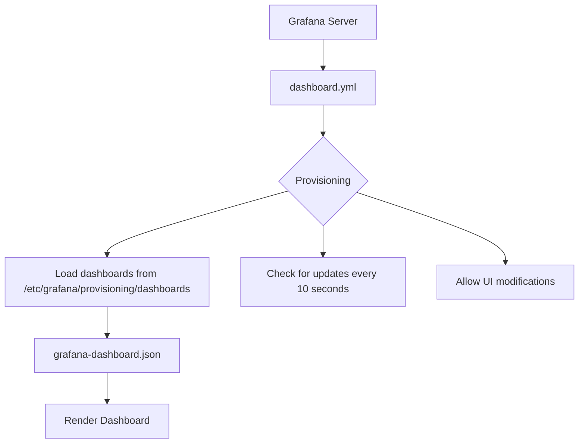
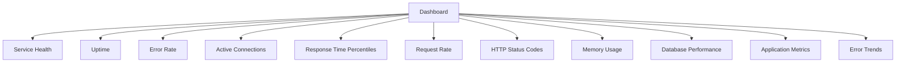
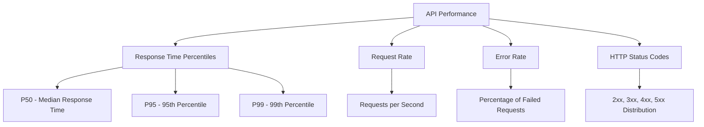
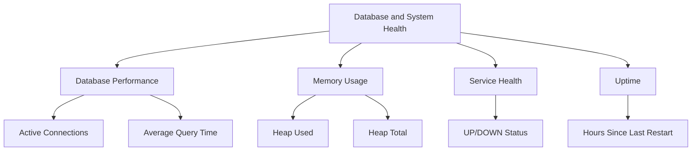
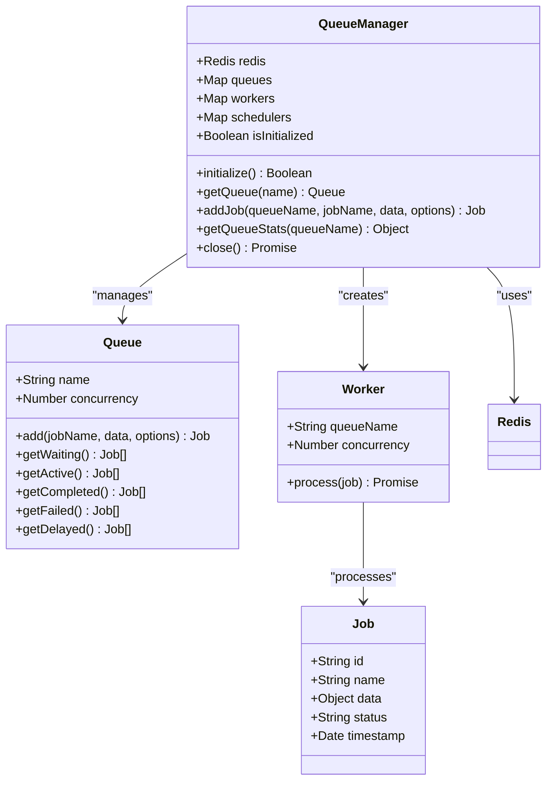
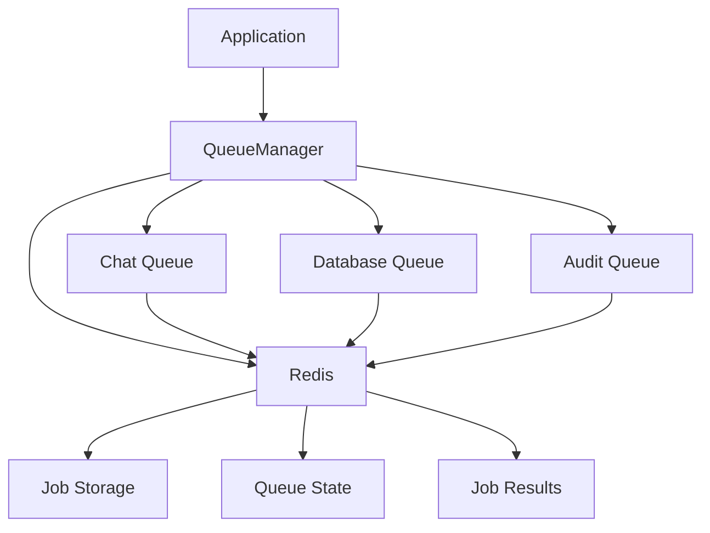
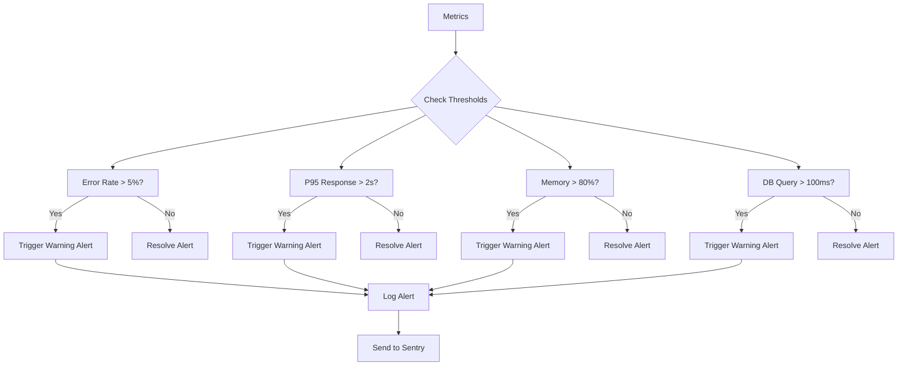

# Grafana Dashboards

<cite>
**Referenced Files in This Document**   
- [grafana-dashboard.json](file://apps/admin-api/grafana-dashboard.json)
- [dashboard.yml](file://apps/web/grafana/provisioning/dashboards/dashboard.yml)
- [prometheus.yml](file://apps/web/grafana/provisioning/datasources/prometheus.yml)
- [prometheus.yml](file://apps/admin-api/prometheus.yml)
- [metrics.js](file://apps/admin-api/src/lib/monitoring/metrics.js)
- [metrics.ts](file://apps/admin-api/src/lib/monitoring/metrics.ts)
- [alerts.js](file://apps/admin-api/src/lib/alerts.js)
- [index.js](file://apps/admin-api/src/lib/queues/index.js)
- [redis.js](file://apps/admin-api/lib/cache/redis.js)
- [MONITORING_README.md](file://apps/admin-api/MONITORING_README.md)
</cite>

## Table of Contents
1. [Introduction](#introduction)
2. [Dashboard Provisioning](#dashboard-provisioning)
3. [Core Visualizations](#core-visualizations)
4. [API Performance Monitoring](#api-performance-monitoring)
5. [Database and System Health](#database-and-system-health)
6. [Job Queue Backlogs](#job-queue-backlogs)
7. [Redis Cache Metrics](#redis-cache-metrics)
8. [Alerting Configuration](#alerting-configuration)
9. [Importing and Customizing Dashboards](#importing-and-customizing-dashboards)
10. [Best Practices](#best-practices)

## Introduction

The Grafana dashboard system in the Slimy monorepo provides comprehensive monitoring for the admin API, offering real-time insights into API performance, database health, Redis cache metrics, and job queue backlogs. The dashboard is designed to help developers and operations teams quickly identify performance bottlenecks, error patterns, and system health issues. The monitoring stack integrates with Prometheus for metric collection and Alertmanager for alert routing, providing a complete observability solution.

The dashboard displays key metrics such as response time percentiles (P50, P95, P99), request rates, error rates, memory usage, database performance, and application-specific metrics like images processed and chat messages. These visualizations are powered by custom metrics collected from the Node.js application and exposed via the `/api/metrics` endpoint in Prometheus format.

**Section sources**
- [grafana-dashboard.json](file://apps/admin-api/grafana-dashboard.json)
- [MONITORING_README.md](file://apps/admin-api/MONITORING_README.md)

## Dashboard Provisioning

The Grafana dashboard is provisioned through configuration files that define the data sources and dashboard locations. The provisioning system ensures that dashboards are automatically loaded when Grafana starts, eliminating the need for manual import in production environments.

The dashboard provisioning is configured in `dashboard.yml`, which specifies a file-based provider that monitors a specific directory for dashboard JSON files. The provider is configured to allow UI updates and checks for new dashboards every 10 seconds. This setup enables developers to add or modify dashboards by simply placing JSON files in the designated directory, which Grafana automatically detects and loads.

**Diagram sources**
- [dashboard.yml](file://apps/web/grafana/provisioning/dashboards/dashboard.yml)

**Section sources**
- [dashboard.yml](file://apps/web/grafana/provisioning/dashboards/dashboard.yml)

## Core Visualizations

The Grafana dashboard contains multiple panels that visualize different aspects of system performance and health. Each panel is configured to query Prometheus for specific metrics and display them in an appropriate visualization format. The dashboard is organized into logical sections that group related metrics together, making it easy to understand the system's current state at a glance.

The dashboard includes stat panels for key health indicators, time series graphs for trends over time, and table panels for detailed breakdowns of metrics like HTTP status codes. The layout is designed to highlight critical information at the top, with more detailed metrics below. This hierarchical organization allows operators to quickly assess system health and drill down into specific issues when needed.

**Diagram sources**
- [grafana-dashboard.json](file://apps/admin-api/grafana-dashboard.json)

**Section sources**
- [grafana-dashboard.json](file://apps/admin-api/grafana-dashboard.json)

## API Performance Monitoring

The API performance monitoring section of the dashboard focuses on key metrics that indicate the health and responsiveness of the admin API. These metrics include response time percentiles, request rates, error rates, and HTTP status code distributions. The response time percentiles (P50, P95, P99) are particularly important as they reveal the user experience for different percentiles of requests, helping to identify outliers that might not be apparent from average response times.

The request rate graph shows the number of requests per second over time, which helps identify traffic patterns and potential spikes that could indicate issues. The error rate stat panel displays the current percentage of failed requests, with color thresholds that turn orange at 5% and red at 10%, providing immediate visual feedback on service health. The HTTP status code table breaks down the distribution of response codes, making it easy to spot increases in client or server errors.

**Diagram sources**
- [grafana-dashboard.json](file://apps/admin-api/grafana-dashboard.json)
- [metrics.js](file://apps/admin-api/src/lib/monitoring/metrics.js)

**Section sources**
- [grafana-dashboard.json](file://apps/admin-api/grafana-dashboard.json)
- [metrics.js](file://apps/admin-api/src/lib/monitoring/metrics.js)
- [metrics.ts](file://apps/admin-api/src/lib/monitoring/metrics.ts)

## Database and System Health

The database and system health section monitors the performance of the database layer and the overall system resources. The database performance graph tracks both the number of active connections and the average query time, which are critical indicators of database health. High connection counts can indicate connection pool issues, while increasing query times suggest performance degradation that might require query optimization or indexing.

The memory usage graph displays both the used and total heap memory, helping to identify memory leaks or inefficient memory usage patterns. The service health stat panel provides a binary indication of whether the service is up or down, while the uptime stat shows how long the service has been running continuously. These metrics are essential for maintaining system stability and identifying potential resource exhaustion issues before they cause outages.

**Diagram sources**
- [grafana-dashboard.json](file://apps/admin-api/grafana-dashboard.json)
- [metrics.js](file://apps/admin-api/src/lib/monitoring/metrics.js)

**Section sources**
- [grafana-dashboard.json](file://apps/admin-api/grafana-dashboard.json)
- [metrics.js](file://apps/admin-api/src/lib/monitoring/metrics.js)

## Job Queue Backlogs

The job queue system uses BullMQ with Redis to handle background processing of tasks such as chat bot interactions, database operations, and audit logging. The queue manager creates three separate queues with different concurrency levels based on the resource requirements of each task type. The chat queue has a concurrency of 5, the database queue has a concurrency of 10, and the audit queue has a concurrency of 2, reflecting their relative performance characteristics and importance.

Each job in the queue is processed by a worker that records metrics such as processing duration, success/failure status, and completion rate. These metrics are exposed to Prometheus and visualized in the Grafana dashboard, allowing operators to monitor queue health and identify backlogs. The queue statistics include waiting, active, completed, failed, and delayed jobs, providing a comprehensive view of queue performance and reliability.

**Diagram sources**
- [index.js](file://apps/admin-api/src/lib/queues/index.js)
- [metrics.js](file://apps/admin-api/src/lib/monitoring/metrics.js)

**Section sources**
- [index.js](file://apps/admin-api/src/lib/queues/index.js)
- [metrics.js](file://apps/admin-api/src/lib/monitoring/metrics.js)

## Redis Cache Metrics

The Redis cache implementation in the system serves as the backbone for both the job queue system and application-level caching. While the current implementation includes a mock cache for testing purposes, the production system relies on Redis for storing queue data and potentially for caching frequently accessed data. The Redis connection is managed by the queue manager, which establishes a connection using the configuration from the environment.

The Redis metrics are indirectly monitored through the job queue statistics, as the health of the queues is closely tied to the performance of the Redis instance. Issues with Redis connectivity or performance would manifest as increased queue backlogs, failed jobs, or timeouts in the queue processing system. The system is configured with retry logic and exponential backoff to handle transient Redis failures, improving overall resilience.

**Diagram sources**
- [index.js](file://apps/admin-api/src/lib/queues/index.js)
- [redis.js](file://apps/admin-api/lib/cache/redis.js)

**Section sources**
- [index.js](file://apps/admin-api/src/lib/queues/index.js)
- [redis.js](file://apps/admin-api/lib/cache/redis.js)

## Alerting Configuration

The alerting system is configured with predefined thresholds for key metrics such as error rate, response time, memory usage, and database query performance. These thresholds trigger alerts at warning and critical levels, with appropriate cooldown periods to prevent alert fatigue. The alert thresholds are defined in the `alerts.js` file and include a warning at 5% error rate and critical at 10%, P95 response time warning at 2 seconds and critical at 5 seconds, and memory usage warning at 80% and critical at 90%.

Alerts are triggered when metrics exceed their thresholds and are automatically resolved when metrics return to normal levels. The system includes cooldown periods of 5 minutes to prevent rapid firing of alerts during transient issues. Alerts are logged and sent to Sentry for tracking, with critical alerts generating error-level logs and warnings generating warning-level logs. The alerting configuration can be extended to integrate with external systems like Slack, email, or PagerDuty.

**Diagram sources**
- [alerts.js](file://apps/admin-api/src/lib/alerts.js)
- [metrics.js](file://apps/admin-api/src/lib/monitoring/metrics.js)

**Section sources**
- [alerts.js](file://apps/admin-api/src/lib/alerts.js)
- [metrics.js](file://apps/admin-api/src/lib/monitoring/metrics.js)

## Importing and Customizing Dashboards

To import the Grafana dashboard, users can navigate to the Grafana interface and use the import functionality to upload the `grafana-dashboard.json` file. The dashboard ID should be set to null to allow Grafana to assign a new ID, preventing conflicts with existing dashboards. After import, users can customize the dashboard by modifying panel queries, adjusting time ranges, or adding new panels to monitor additional metrics.

For customization, users can edit the JSON directly or use the Grafana UI to modify panels. When creating new dashboards, developers should follow the same pattern of using Prometheus queries to extract metrics from the `/api/metrics` endpoint. Custom dashboards can be provisioned by placing them in the designated directory specified in `dashboard.yml`, ensuring they are automatically loaded by Grafana.

**Section sources**
- [grafana-dashboard.json](file://apps/admin-api/grafana-dashboard.json)
- [dashboard.yml](file://apps/web/grafana/provisioning/dashboards/dashboard.yml)

## Best Practices

When working with Grafana dashboards in this system, several best practices should be followed to ensure effective monitoring and maintainability. First, dashboards should be version controlled alongside the application code, allowing for tracking of changes and rollback if needed. Second, alert thresholds should be reviewed periodically and adjusted based on observed system behavior and performance requirements.

Third, dashboards should be organized logically, grouping related metrics together and using consistent naming conventions. Fourth, queries should be optimized to minimize load on the Prometheus server, using appropriate time ranges and aggregation functions. Finally, documentation should be maintained for custom dashboards and alerts, explaining their purpose and the actions to take when alerts are triggered.

**Section sources**
- [MONITORING_README.md](file://apps/admin-api/MONITORING_README.md)
- [grafana-dashboard.json](file://apps/admin-api/grafana-dashboard.json)
- [alerts.js](file://apps/admin-api/src/lib/alerts.js)