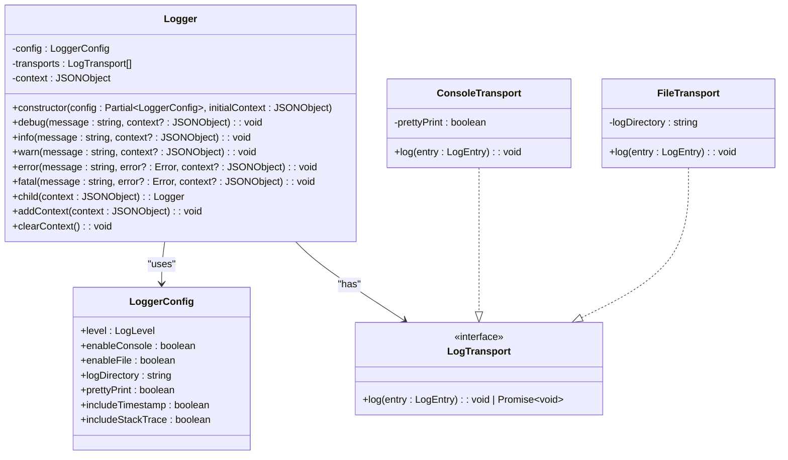
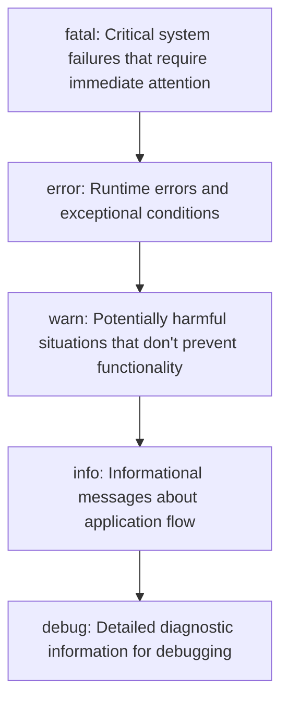
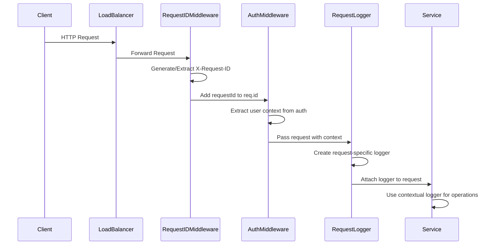
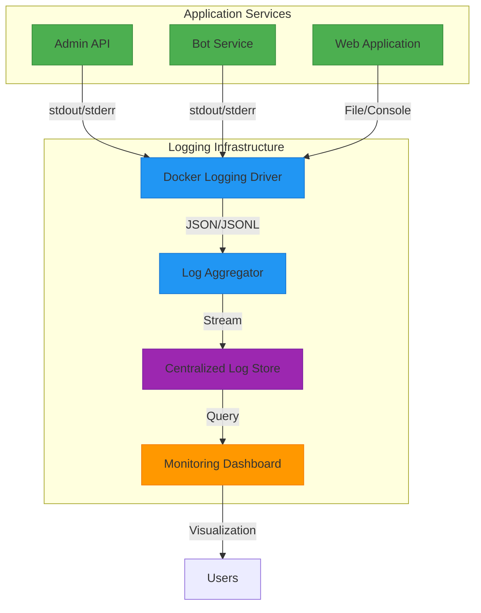
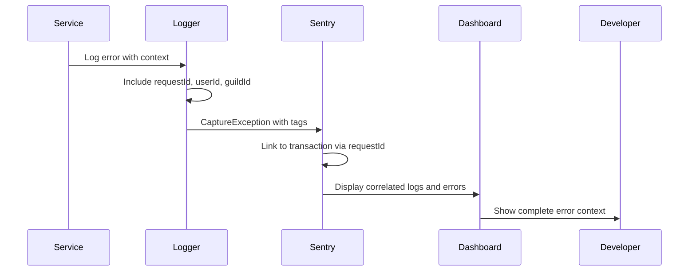
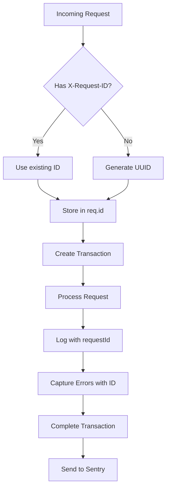
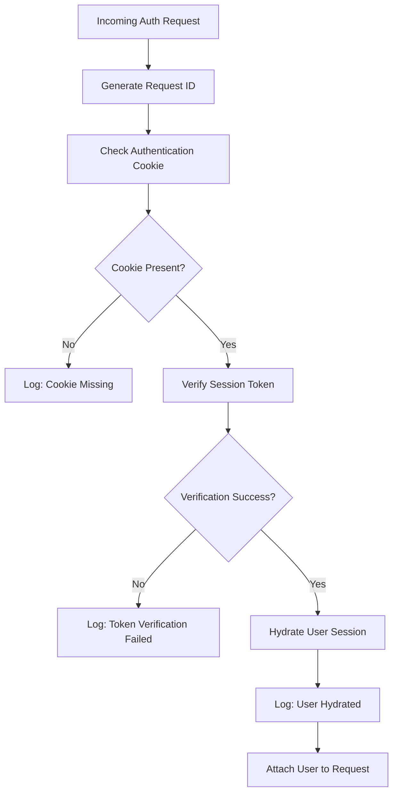
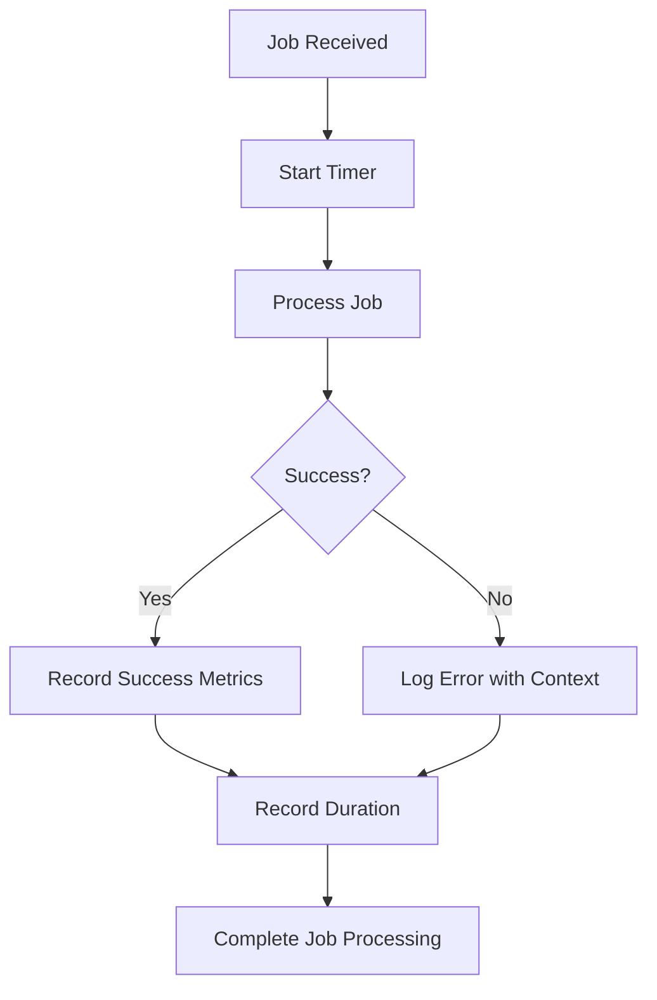
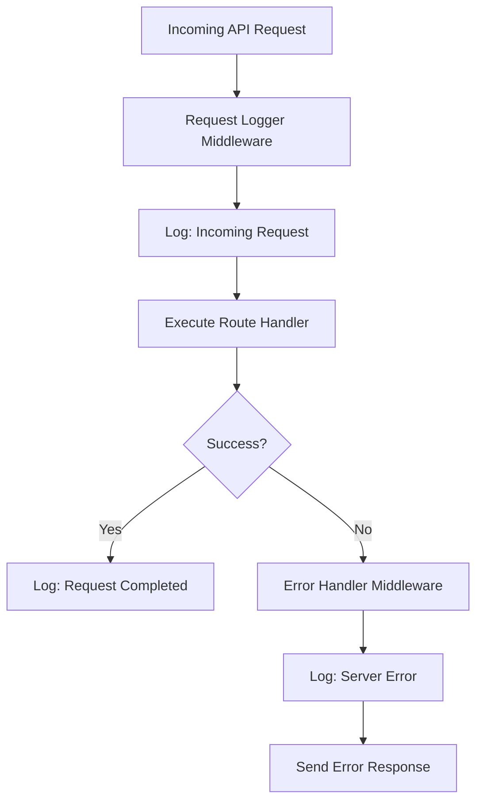

# Logging Strategy

<cite>
**Referenced Files in This Document**   
- [logger.js](file://apps/admin-api/src/lib/logger.js)
- [logger.ts](file://apps/bot/src/lib/logger.ts)
- [logger.ts](file://apps/web/lib/monitoring/logger.ts)
- [request-id.js](file://apps/admin-api/src/middleware/request-id.js)
- [auth.js](file://apps/admin-api/src/middleware/auth.js)
- [index.js](file://apps/admin-api/src/lib/queues/index.js)
- [auth.js](file://apps/admin-api/src/routes/auth.js)
- [error-handler.js](file://apps/admin-api/src/middleware/error-handler.js)
- [sentry.js](file://apps/admin-api/src/lib/sentry.js)
- [sentry.js](file://apps/admin-api/src/lib/monitoring/sentry.js)
- [apm.ts](file://apps/web/lib/monitoring/apm.ts)
</cite>

## Table of Contents
1. [Introduction](#introduction)
2. [Structured Logging Implementation](#structured-logging-implementation)
3. [Log Levels and Usage](#log-levels-and-usage)
4. [Context Propagation](#context-propagation)
5. [Log Aggregation and Collection](#log-aggregation-and-collection)
6. [Sentry Integration and Distributed Tracing](#sentry-integration-and-distributed-tracing)
7. [Logging Examples](#logging-examples)
8. [Best Practices](#best-practices)
9. [Performance Considerations](#performance-considerations)

## Introduction
The Slimy Monorepo implements a comprehensive centralized logging strategy across its microservices to ensure observability, debugging capabilities, and monitoring. The logging system is designed with structured JSON formatting, consistent log levels, contextual information propagation, and integration with monitoring tools like Sentry for error tracking and distributed tracing. This document details the implementation and best practices for logging across the monorepo's services.

## Structured Logging Implementation
The monorepo employs structured logging using JSON format across its services, with different implementations tailored to each application's needs. The primary approach involves custom logger wrappers that enhance console.log with structured data, timestamps, and context.

The web application uses a sophisticated Logger class that supports multiple transports (console and file), configurable log levels, and structured JSON output. This implementation includes a ConsoleTransport for human-readable output during development and a FileTransport that writes JSONL (JSON Lines) format to log files in production.

**Diagram sources**
- [logger.ts](file://apps/web/lib/monitoring/logger.ts#L1-L310)

**Section sources**
- [logger.ts](file://apps/web/lib/monitoring/logger.ts#L1-L310)
- [logger.js](file://apps/admin-api/src/lib/logger.js#L1-L160)
- [logger.ts](file://apps/bot/src/lib/logger.ts#L1-L93)

## Log Levels and Usage
The logging system implements a standard hierarchy of log levels with specific usage patterns across services. Each level serves a distinct purpose and is filtered based on the environment configuration.

### Log Level Hierarchy
The monorepo uses the following log levels in descending order of severity:

**Diagram sources**
- [logger.ts](file://apps/web/lib/monitoring/logger.ts#L144-L149)
- [logger.js](file://apps/admin-api/src/lib/logger.js#L6-L7)
- [logger.ts](file://apps/bot/src/lib/logger.ts#L14)

### Level-Specific Usage Guidelines
Each log level has specific use cases and implementation patterns across the monorepo:

- **info**: Used for significant application events such as service startup, queue initialization, and successful operations. In the admin-api, info logs include service context like hostname, PID, and version information.

- **warn**: Reserved for unexpected but recoverable conditions, such as missing configuration values, fallback behaviors, or potential performance issues. The system filters out non-actionable warnings in production.

- **error**: Reserved for runtime errors and exceptional conditions that affect functionality. Error logs include full error objects with message, name, and stack trace when appropriate.

- **debug**: Used exclusively for detailed diagnostic information during development. Debug logging is disabled in production environments to reduce log volume and potential performance impact.

- **fatal**: Indicates critical system failures that may require immediate intervention. These logs typically precede service termination or critical failure states.

The log level filtering is implemented through a simple ordinal comparison, where messages are only logged if their level is equal to or more severe than the configured threshold level.

**Section sources**
- [logger.ts](file://apps/web/lib/monitoring/logger.ts#L144-L149)
- [logger.js](file://apps/admin-api/src/lib/logger.js#L6-L7)
- [logger.ts](file://apps/bot/src/lib/logger.ts#L14)

## Context Propagation
The logging system implements comprehensive context propagation to enable effective log correlation and debugging across distributed components. Contextual information is automatically captured and propagated through middleware and service layers.

### Request Context Propagation
The system uses middleware to automatically capture and propagate request context across the application:

**Diagram sources**
- [request-id.js](file://apps/admin-api/src/middleware/request-id.js#L1-L24)
- [auth.js](file://apps/admin-api/src/middleware/auth.js#L24-L230)
- [logger.js](file://apps/admin-api/src/lib/logger.js#L101-L127)

### Contextual Information
The system propagates several key contextual elements through the logging pipeline:

- **Request ID**: A unique identifier generated for each incoming request, used to correlate logs across services and components.
- **User ID**: The authenticated user's identifier, captured from authentication tokens and headers.
- **Guild ID**: The Discord guild context, extracted from route parameters, query strings, or request bodies.
- **Session Information**: User session data including roles, permissions, and guild memberships.

The request logger middleware automatically creates a child logger with request-specific context, including method, path, and IP address. This ensures that all logs generated during request processing include the necessary correlation information.

**Section sources**
- [request-id.js](file://apps/admin-api/src/middleware/request-id.js#L1-L24)
- [auth.js](file://apps/admin-api/src/middleware/auth.js#L24-L230)
- [logger.js](file://apps/admin-api/src/lib/logger.js#L101-L127)

## Log Aggregation and Collection
The monorepo implements a robust log aggregation strategy that collects logs from Docker containers and prepares them for monitoring and analysis.

### Docker Container Logging
Services are configured to output logs to stdout and stderr, following the twelve-factor app methodology. Docker's default json-file logging driver captures these streams and formats them for collection by monitoring systems.

The production configuration enables file-based logging in JSONL format, with separate files for each log level rotated daily. This approach facilitates efficient log processing and querying by log aggregation tools.

### Log Collection Architecture
The log collection pipeline consists of multiple components working together:

**Diagram sources**
- [Dockerfile](file://apps/admin-api/Dockerfile)
- [docker-compose.yml](file://docker-compose.yml)
- [logger.ts](file://apps/web/lib/monitoring/logger.ts#L76-L104)

The file transport implementation ensures atomic writes to log files using append mode, preventing data corruption in high-concurrency scenarios. Log files are organized by level and date, enabling efficient rotation and archival.

**Section sources**
- [logger.ts](file://apps/web/lib/monitoring/logger.ts#L76-L104)
- [Dockerfile](file://apps/admin-api/Dockerfile)
- [docker-compose.yml](file://docker-compose.yml)

## Sentry Integration and Distributed Tracing
The logging strategy integrates with Sentry for comprehensive error tracking and distributed tracing, providing enhanced observability beyond traditional logging.

### Sentry Error Correlation
The system correlates logs with Sentry errors through shared context and request identifiers:

**Diagram sources**
- [sentry.js](file://apps/admin-api/src/lib/sentry.js#L45-L110)
- [sentry.js](file://apps/admin-api/src/lib/monitoring/sentry.js#L42-L104)

The integration uses Sentry's beforeSend hook to filter non-actionable errors (such as client-side 4xx errors and timeouts) while ensuring server-side errors are captured. Error context is enriched with user information, request details, and custom tags for better filtering and analysis.

### Distributed Tracing Implementation
The system implements distributed tracing through a combination of request IDs and performance monitoring:

The tracing system generates or propagates a request ID for each incoming request, which is then used to correlate logs, metrics, and traces. This enables developers to follow the complete lifecycle of a request across multiple services and components.

**Section sources**
- [sentry.js](file://apps/admin-api/src/lib/sentry.js#L45-L110)
- [sentry.js](file://apps/admin-api/src/lib/monitoring/sentry.js#L42-L104)
- [apm.ts](file://apps/web/lib/monitoring/apm.ts#L62-L121)

## Logging Examples
The monorepo demonstrates consistent logging patterns across different components, with specific examples from key services.

### Auth Middleware Logging
The authentication middleware implements comprehensive logging to track user authentication flows:

The auth middleware uses targeted logging statements to track the authentication process, including cookie presence, token verification status, and user hydration. These logs are critical for debugging authentication issues and monitoring security events.

**Section sources**
- [auth.js](file://apps/admin-api/src/middleware/auth.js#L16-L127)
- [auth.js](file://apps/admin-api/src/routes/auth.js#L124-L372)

### Queue Processor Logging
Queue processors implement structured logging to monitor background job execution:

The queue manager logs key events in the job lifecycle, including initialization, job queuing, processing success/failure, and shutdown. Error logs include the job ID and type, enabling correlation with specific background tasks.

**Section sources**
- [index.js](file://apps/admin-api/src/lib/queues/index.js#L58-L74)
- [index.js](file://apps/admin-api/src/lib/queues/index.js#L124-L126)

### API Route Logging
API routes use contextual logging to track request processing:

The request logger middleware automatically logs incoming requests and completion events, including method, path, query parameters, and response duration. This provides a comprehensive audit trail of API usage and performance.

**Section sources**
- [auth.js](file://apps/admin-api/src/routes/auth.js#L124-L372)
- [logger.js](file://apps/admin-api/src/lib/logger.js#L107-L123)

## Best Practices
The monorepo follows several best practices for effective logging that ensure logs are useful, maintainable, and performant.

### Log Message Formatting
Log messages follow a consistent format with clear, descriptive text that can stand alone without context. Messages use complete sentences with proper grammar and avoid abbreviations. Contextual data is included as structured fields rather than embedded in the message text.

### PII Protection
The system strictly avoids logging personally identifiable information (PII) such as passwords, tokens, or sensitive user data. When necessary, sensitive data is redacted or hashed before logging. The error serialization process excludes sensitive properties from logged error objects.

### Contextual Enrichment
Loggers are enriched with relevant context at creation time, reducing the need to pass context through multiple function calls. Child loggers inherit parent context while allowing additional context to be added, creating a hierarchical context structure.

### Error Logging
Errors are logged with full context including the error object, stack trace (when appropriate), and relevant operational context. The system distinguishes between operational errors (expected exceptions) and programmer errors (bugs), handling them appropriately in logs and monitoring.

**Section sources**
- [logger.ts](file://apps/web/lib/monitoring/logger.ts#L164-L172)
- [logger.js](file://apps/admin-api/src/lib/logger.js#L133-L142)
- [logger.ts](file://apps/bot/src/lib/logger.ts#L55-L59)

## Performance Considerations
The logging implementation considers performance implications, especially when logging at scale in production environments.

### Asynchronous Logging
The system uses asynchronous operations for file-based logging to prevent blocking the main execution thread. The writeLog method returns a Promise that resolves when all transport operations complete, allowing non-blocking log writes.

### Conditional Logging
Debug-level logging is disabled in production environments to reduce log volume and I/O overhead. The log level filtering occurs early in the logging pipeline, preventing unnecessary string formatting and object serialization for filtered messages.

### Memory Management
The implementation avoids memory leaks by properly closing transports and cleaning up resources during application shutdown. The file transport ensures atomic writes using append mode, preventing data corruption during concurrent access.

### Production Optimizations
In production, the system optimizes logging by:
- Disabling pretty printing and color codes
- Using compact JSON format instead of human-readable output
- Limiting stack trace inclusion to error and fatal levels
- Implementing log rotation and retention policies

These optimizations ensure that logging has minimal impact on application performance while maintaining sufficient observability.

**Section sources**
- [logger.ts](file://apps/web/lib/monitoring/logger.ts#L175-L178)
- [logger.js](file://apps/admin-api/src/lib/logger.js#L52-L68)
- [logger.ts](file://apps/bot/src/lib/logger.ts#L73-L75)