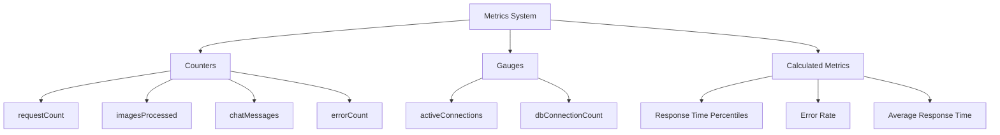
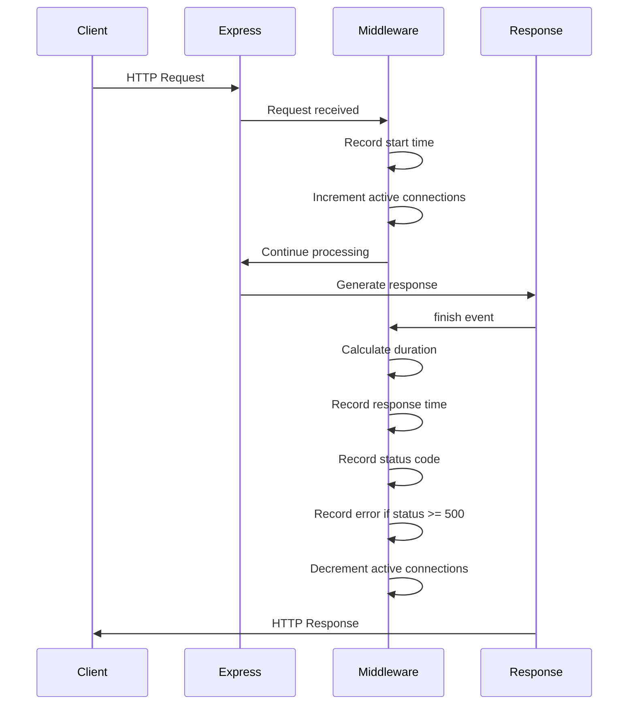
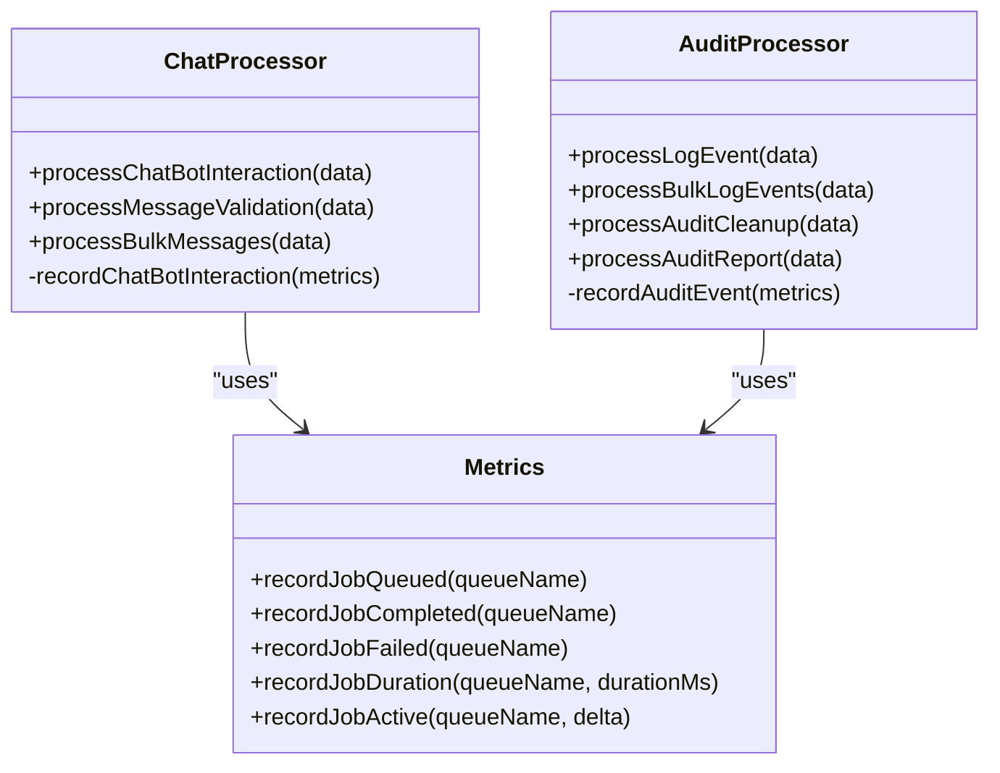
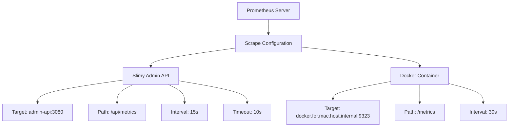

# Metrics Collection with Prometheus

<cite>
**Referenced Files in This Document**   
- [metrics.js](file://apps/admin-api/src/lib/monitoring/metrics.js)
- [metrics.ts](file://apps/admin-api/src/lib/monitoring/metrics.ts)
- [chat-processor.js](file://apps/admin-api/src/lib/queues/chat-processor.js)
- [audit-processor.js](file://apps/admin-api/src/lib/queues/audit-processor.js)
- [app.js](file://apps/admin-api/src/app.js)
- [index.js](file://apps/admin-api/src/routes/index.js)
- [prometheus.yml](file://apps/admin-api/prometheus.yml)
- [MONITORING_README.md](file://apps/admin-api/MONITORING_README.md)
</cite>

## Table of Contents
1. [Introduction](#introduction)
2. [Core Metrics Implementation](#core-metrics-implementation)
3. [HTTP Request Metrics via Express.js Middleware](#http-request-metrics-via-expressjs-middleware)
4. [BullMQ Job Processor Metrics](#bullmq-job-processor-metrics)
5. [Metrics Endpoint and Scraping Configuration](#metrics-endpoint-and-scraping-configuration)
6. [Key Metrics Examples](#key-metrics-examples)
7. [Adding New Metrics and Label Cardinality](#adding-new-metrics-and-label-cardinality)
8. [Security Considerations](#security-considerations)
9. [Conclusion](#conclusion)

## Introduction

The Slimy Monorepo implements a comprehensive Prometheus-based monitoring system to track application performance, system health, and business logic execution. This documentation details the implementation of custom metrics including counters, gauges, histograms, and summaries for API latency, request rates, error counts, and queue processing. The system integrates with Express.js via middleware to track HTTP request duration and status codes, and provides detailed metrics for BullMQ job processors including chat-processor and audit-processor. The /metrics endpoint exposes these metrics in Prometheus-compatible format, enabling effective monitoring and alerting through the configured scraping configuration in prometheus.yml.

**Section sources**
- [MONITORING_README.md](file://apps/admin-api/MONITORING_README.md#L1-L208)

## Core Metrics Implementation

The Slimy Monorepo implements a comprehensive metrics system through the monitoring/metrics.js and monitoring/metrics.ts files, which provide a complete suite of metrics types for monitoring application performance and health. The implementation includes counters for tracking discrete events such as request counts, image processing, and chat messages; gauges for monitoring current values like active connections; and calculated metrics for response time percentiles and error rates.

The metrics system tracks HTTP request metrics including request count, response times, status code distribution, and error rates. It also monitors database performance with metrics for query count, average query time, and connection count. System-level metrics include memory usage (RSS, heap total, heap used) and CPU usage (user and system time). The implementation maintains a sliding window of the last 1000 response times to calculate percentiles (P50, P95, P99) while keeping memory usage bounded.

**Diagram sources**
- [metrics.js](file://apps/admin-api/src/lib/monitoring/metrics.js#L1-L357)

**Section sources**
- [metrics.js](file://apps/admin-api/src/lib/monitoring/metrics.js#L1-L357)
- [metrics.ts](file://apps/admin-api/src/lib/monitoring/metrics.ts#L1-L202)

## HTTP Request Metrics via Express.js Middleware

The Slimy Monorepo integrates metrics collection with Express.js through a dedicated middleware function that tracks HTTP request duration and status codes. The metricsMiddleware function is implemented in the monitoring/metrics.js file and is designed to be used as Express.js middleware to automatically capture request metrics without requiring changes to individual route handlers.

When a request is received, the middleware records the start time and increments the active connection counter. Upon response completion (via the 'finish' event), it calculates the request duration, records the response time, updates the status code distribution, and decrements the active connection counter. If the response status code is 500 or higher, it also increments the error counter. This approach provides comprehensive HTTP metrics including request rate, latency distribution, and error rates without impacting the core application logic.

**Diagram sources**
- [metrics.js](file://apps/admin-api/src/lib/monitoring/metrics.js#L308-L331)

**Section sources**
- [metrics.js](file://apps/admin-api/src/lib/monitoring/metrics.js#L308-L331)
- [app.js](file://apps/admin-api/src/app.js#L2-L64)

## BullMQ Job Processor Metrics

The Slimy Monorepo implements detailed metrics for BullMQ job processors, specifically for the chat-processor and audit-processor. These processors are responsible for handling asynchronous operations such as chat bot interactions and audit event logging, and their performance is critical to the overall system reliability.

The chat-processor tracks metrics for chat bot interactions, including successful and failed interactions, response lengths, and whether fallback responses were used. It processes three types of jobs: chat bot interactions, message validation, and bulk message processing. Each job type has specific metrics recorded, with successful interactions incrementing the success counter and failed interactions incrementing the error counter while also recording the error details.

Similarly, the audit-processor tracks metrics for audit event logging, including successful and failed log events, bulk logging operations, audit cleanup, and report generation. The processor records metrics for each audit action, resource type, and success status, providing detailed visibility into the audit trail system's performance and reliability.

**Diagram sources**
- [chat-processor.js](file://apps/admin-api/src/lib/queues/chat-processor.js#L1-L279)
- [audit-processor.js](file://apps/admin-api/src/lib/queues/audit-processor.js#L1-L401)

**Section sources**
- [chat-processor.js](file://apps/admin-api/src/lib/queues/chat-processor.js#L1-L279)
- [audit-processor.js](file://apps/admin-api/src/lib/queues/audit-processor.js#L1-L401)

## Metrics Endpoint and Scraping Configuration

The Slimy Monorepo exposes metrics through the /api/metrics endpoint, which is configured in the Express.js application and scraped by Prometheus according to the configuration in prometheus.yml. The endpoint is accessible at /api/metrics and returns metrics in Prometheus-compatible format, enabling integration with standard monitoring and alerting systems.

The prometheus.yml configuration file defines the scraping job for the Slimy Admin API with a 15-second scrape interval and 10-second timeout. The configuration specifies the target as 'admin-api:3080' with the metrics path set to '/api/metrics'. This configuration ensures that Prometheus regularly collects metrics from the application, providing near real-time visibility into system performance and health.

The monitoring system also includes configuration for Docker container metrics, scraping from 'docker.for.mac.host.internal:9323' with a 30-second interval. This allows monitoring of both application-level metrics and container-level resource usage, providing a comprehensive view of system performance.

**Diagram sources**
- [prometheus.yml](file://apps/admin-api/prometheus.yml#L1-L52)
- [index.js](file://apps/admin-api/src/routes/index.js#L1-L76)

**Section sources**
- [prometheus.yml](file://apps/admin-api/prometheus.yml#L1-L52)
- [index.js](file://apps/admin-api/src/routes/index.js#L1-L76)

## Key Metrics Examples

The Slimy Monorepo implements several key metrics that provide critical insights into system performance and reliability. These metrics follow Prometheus best practices and are designed to support effective monitoring, alerting, and troubleshooting.

The primary HTTP request duration metric is exposed as part of the response time tracking system, capturing the duration of each HTTP request in milliseconds. This metric is used to calculate percentiles (P50, P95, P99) which are essential for understanding latency distribution and identifying performance outliers. The metric is updated by the Express.js middleware and is available through the snapshot() function.

For job processing, the system tracks bullmq_job_duration through the job metrics system, which records the duration of job processing for each queue (chat, database, audit). This metric is updated via the recordJobDuration() function and is used to calculate average job duration and throughput. The job metrics also include counters for queued, completed, and failed jobs, providing a comprehensive view of job processing performance.

Other key metrics include:
- http_requests_total: Counter for total HTTP requests
- http_request_errors_total: Counter for HTTP errors (status >= 500)
- active_connections: Gauge for current active connections
- database_query_duration: Histogram for database query times
- job_completion_rate: Summary for job completion success rate

These metrics are exposed through the /api/metrics endpoint and can be used to create dashboards and alerts in monitoring systems like Grafana.

**Section sources**
- [metrics.js](file://apps/admin-api/src/lib/monitoring/metrics.js#L1-L357)
- [metrics.ts](file://apps/admin-api/src/lib/monitoring/metrics.ts#L1-L202)

## Adding New Metrics and Label Cardinality

To add new metrics in the Slimy Monorepo, developers should extend the existing metrics system in monitoring/metrics.js or monitoring/metrics.ts by defining new counters, gauges, or calculated metrics. The process involves declaring new variables to store metric values, creating functions to update these metrics, and exposing them through the snapshot() function for export via the /api/metrics endpoint.

When adding new metrics, it's essential to consider label cardinality to prevent metric explosion and performance degradation. High-cardinality labels (such as user IDs, request IDs, or timestamps) should be avoided as they can create an unbounded number of time series. Instead, use low-cardinality labels that represent meaningful categories or dimensions, such as:
- HTTP method (GET, POST, PUT, DELETE)
- Route path (without dynamic parameters)
- Status code ranges (2xx, 4xx, 5xx)
- Job queue names (chat, audit, database)
- Error types (validation, timeout, internal)

For metrics that require higher cardinality, consider using histograms or summaries instead of individual counters or gauges. For example, instead of creating a separate counter for each user, use a histogram to track request duration distribution across all users. This approach provides valuable insights while maintaining manageable metric cardinality.

Additionally, the system should implement proper metric cleanup and memory management, such as the sliding window approach used for response times, to prevent unbounded memory growth. The current implementation limits response time storage to the last 1000 requests, which balances historical data availability with memory efficiency.

**Section sources**
- [metrics.js](file://apps/admin-api/src/lib/monitoring/metrics.js#L1-L357)
- [metrics.ts](file://apps/admin-api/src/lib/monitoring/metrics.ts#L1-L202)

## Security Considerations

The Slimy Monorepo's metrics implementation includes several security considerations that must be addressed to protect sensitive information and prevent potential attack vectors. The primary concern is the exposure of the /api/metrics endpoint, which currently has no authentication and is publicly accessible.

The MONITORING_README.md explicitly notes this security consideration: "Metrics endpoint is public (consider authentication for production)". This represents a potential security risk as the metrics endpoint could be used for reconnaissance by attackers to understand system architecture, performance characteristics, and potential vulnerabilities. In a production environment, this endpoint should be protected with authentication and access controls to limit exposure to authorized monitoring systems only.

Additional security considerations include:
- Rate limiting the metrics endpoint to prevent denial-of-service attacks
- Avoiding exposure of sensitive information in metric labels or values
- Implementing proper network segmentation to restrict access to the metrics endpoint
- Using HTTPS for metrics transmission to prevent eavesdropping
- Regularly auditing the metrics being exposed to ensure no sensitive data is included

The current implementation also exposes detailed health check information through the /api/health endpoint, which could provide attackers with insights into system configuration and dependencies. This should be considered when deploying to production environments.

**Section sources**
- [MONITORING_README.md](file://apps/admin-api/MONITORING_README.md#L194-L200)

## Conclusion

The Slimy Monorepo implements a comprehensive Prometheus-based metrics collection system that provides deep visibility into application performance, system health, and business logic execution. The system effectively combines counters, gauges, and calculated metrics to monitor HTTP request rates, latency, error counts, and system resource usage.

Key strengths of the implementation include the seamless integration with Express.js through middleware, detailed tracking of BullMQ job processor performance, and a well-structured metrics endpoint that follows Prometheus best practices. The system provides valuable metrics for both operational monitoring and business insights, enabling effective alerting and troubleshooting.

To enhance the system further, the following recommendations should be considered:
1. Implement authentication for the /api/metrics endpoint in production environments
2. Add more granular metrics with appropriate label cardinality for key business operations
3. Implement histogram metrics for request duration and job processing time to provide more detailed distribution insights
4. Enhance the metrics system to support custom business KPIs and domain-specific metrics
5. Integrate with distributed tracing to correlate metrics across service boundaries

The current implementation provides a solid foundation for monitoring and observability, and with these enhancements, it can evolve into a comprehensive observability platform for the Slimy Monorepo.