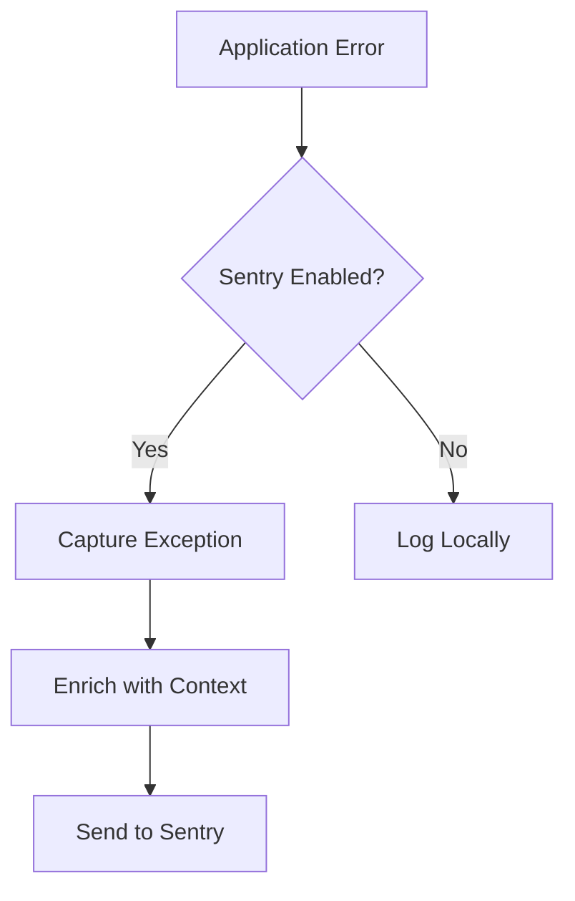
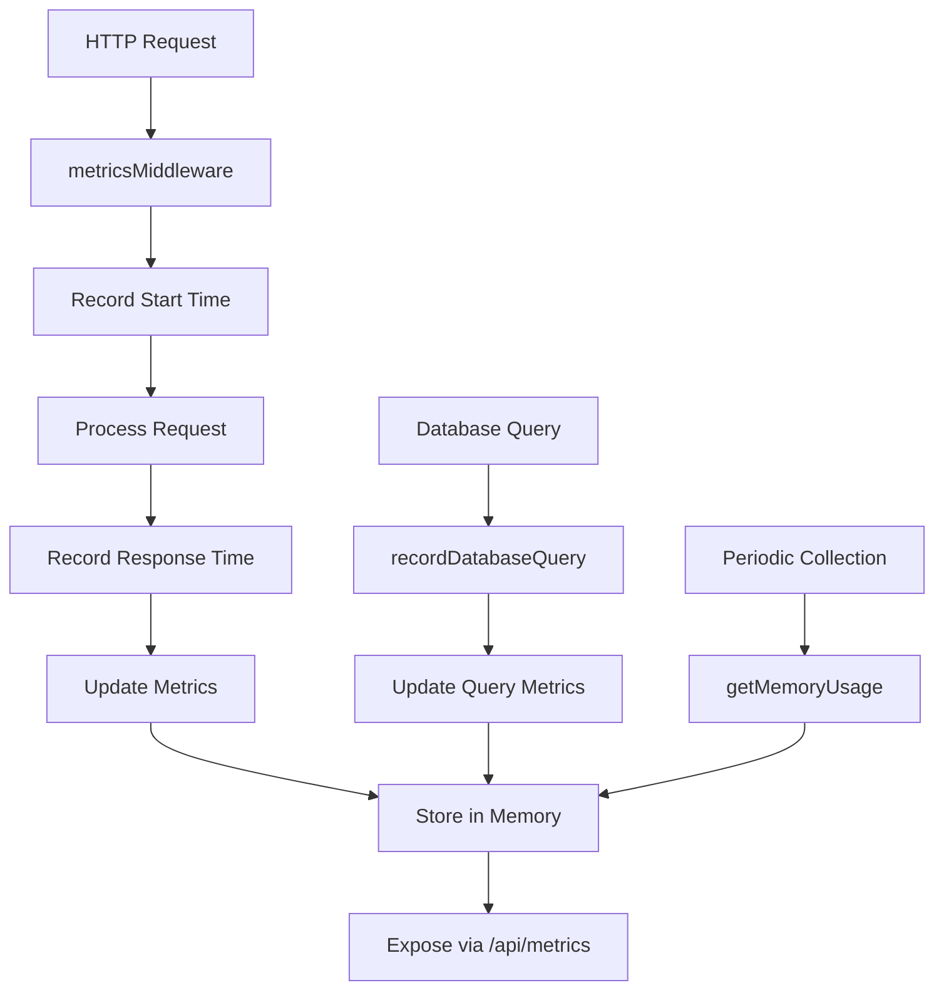
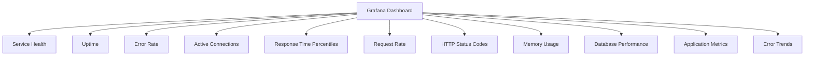
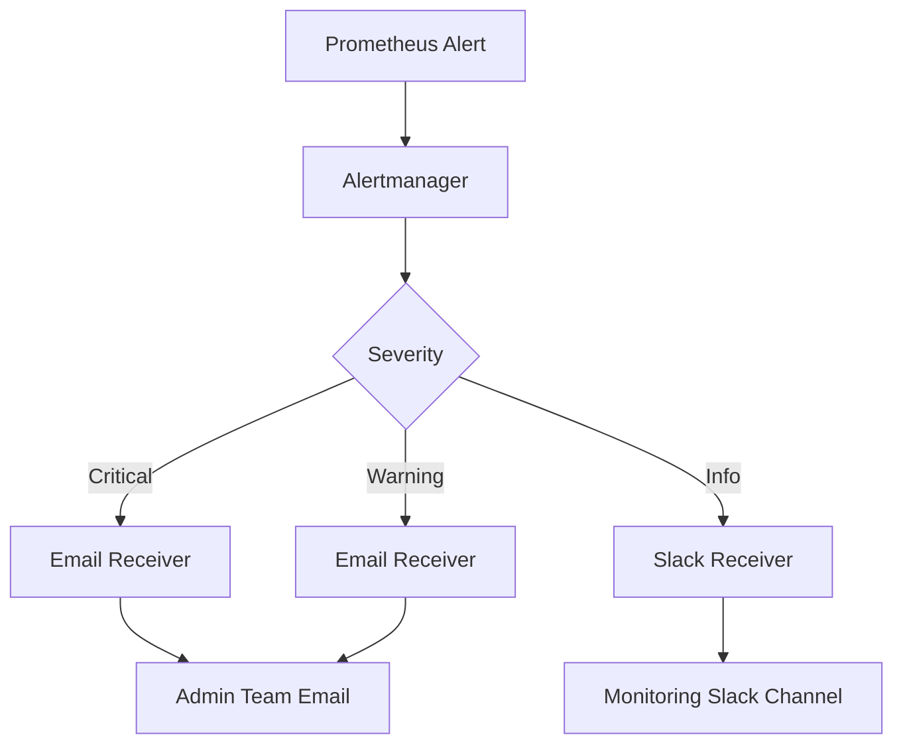
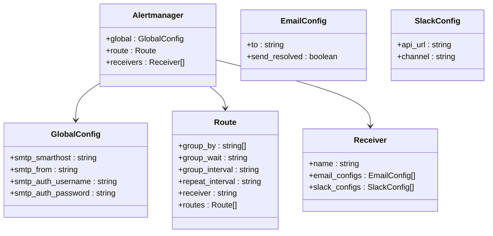
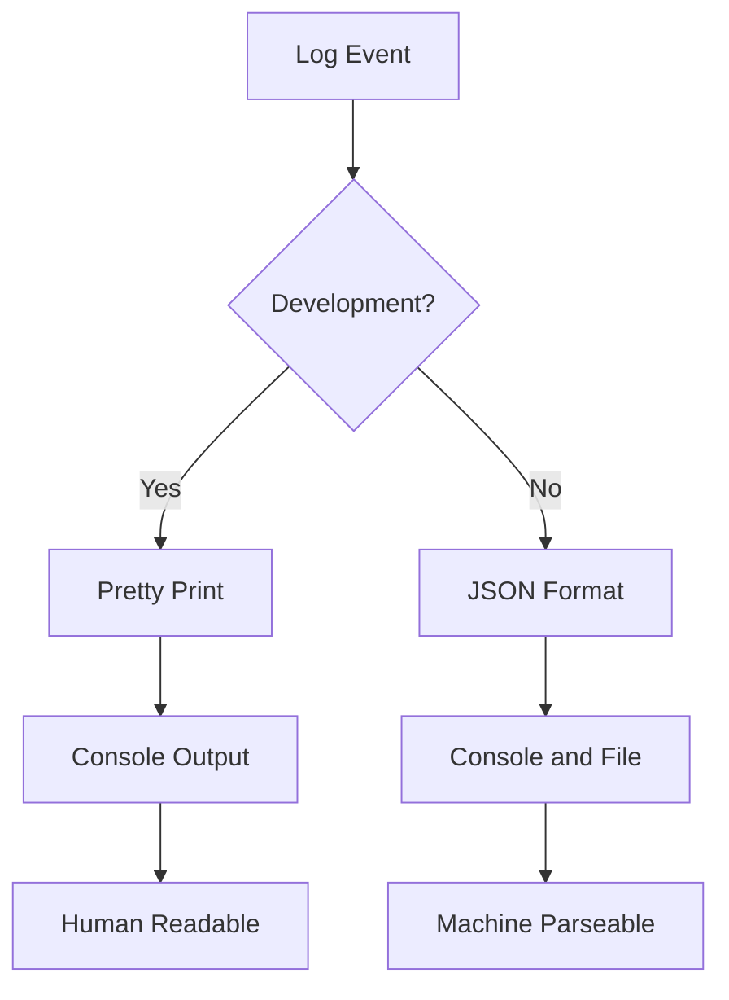
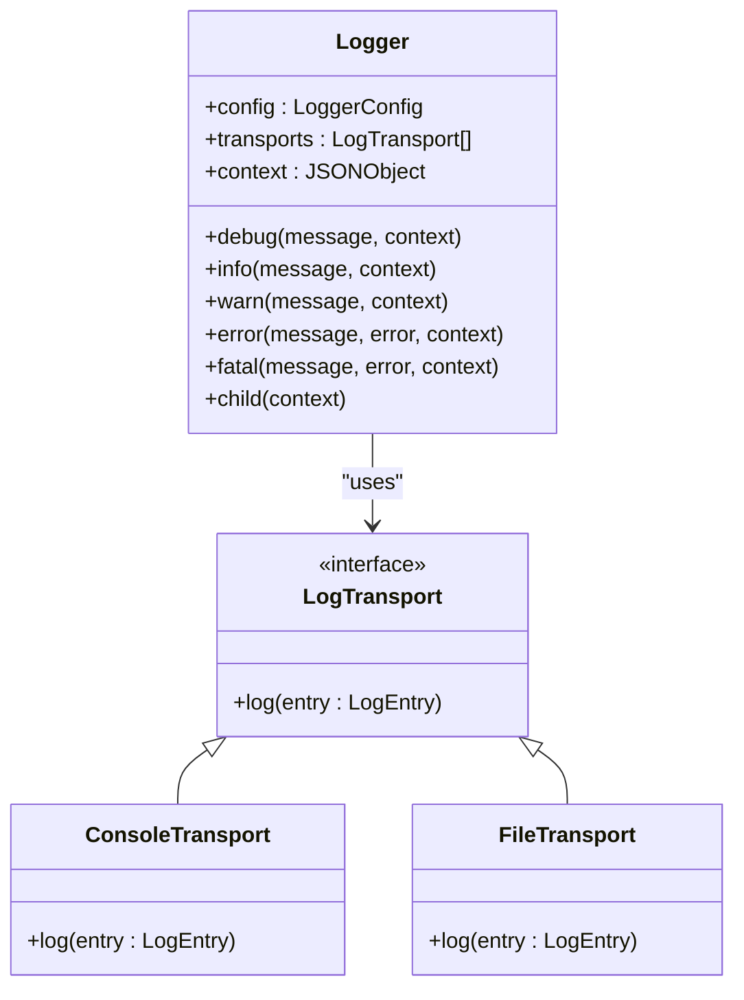
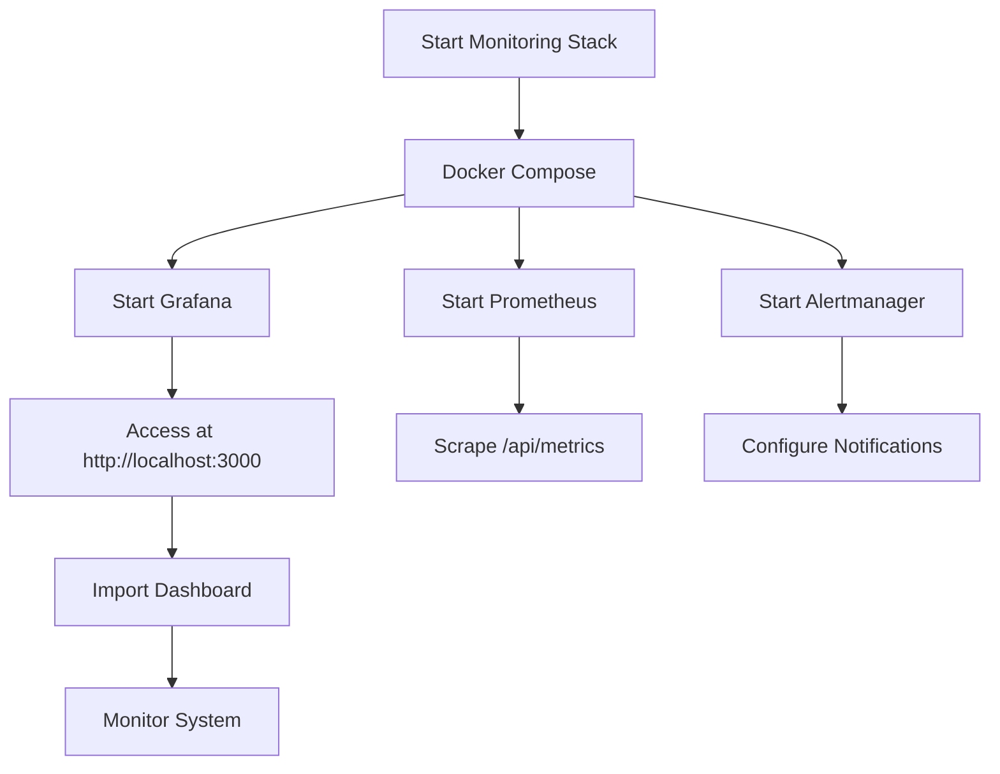
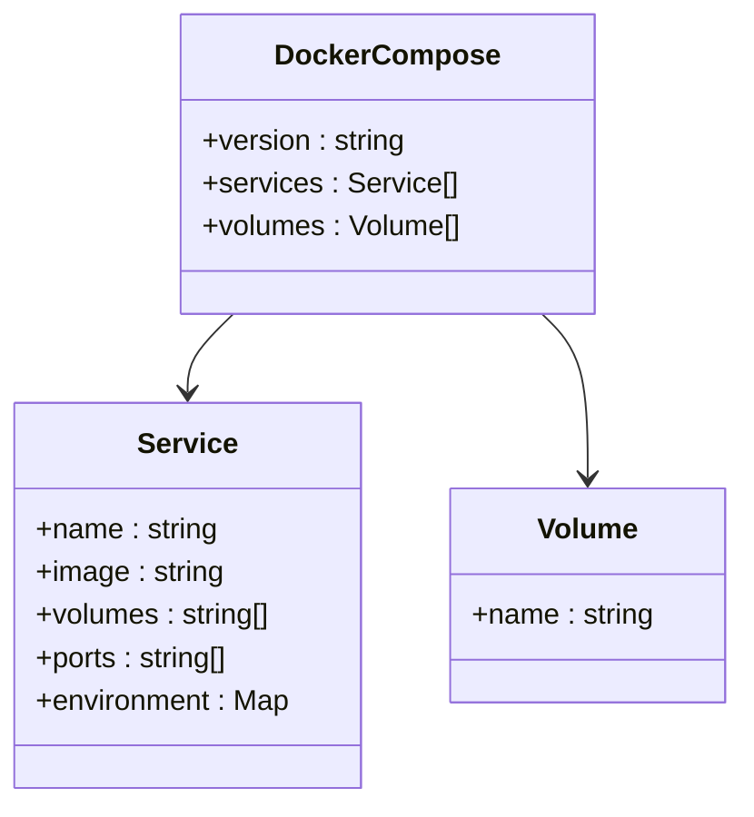

# Monitoring and Observability

<cite>
**Referenced Files in This Document**   
- [MONITORING_README.md](file://apps/admin-api/MONITORING_README.md)
- [MONITORING_SETUP_GUIDE.md](file://apps/admin-api/MONITORING_SETUP_GUIDE.md)
- [prometheus.yml](file://apps/admin-api/prometheus.yml)
- [alertmanager.yml](file://apps/web/monitoring/alertmanager.yml)
- [grafana-dashboard.json](file://apps/admin-api/grafana-dashboard.json)
- [sentry.js](file://apps/admin-api/src/lib/monitoring/sentry.js)
- [metrics.js](file://apps/admin-api/src/lib/monitoring/metrics.js)
- [alerts.js](file://apps/admin-api/src/lib/alerts.js)
- [logger.js](file://apps/admin-api/src/lib/logger.js)
- [docker-compose.monitoring.yml](file://apps/web/docker-compose.monitoring.yml)
- [dashboard.yml](file://apps/web/grafana/provisioning/dashboards/dashboard.yml)
- [prometheus.yml](file://apps/web/grafana/provisioning/datasources/prometheus.yml)
</cite>

## Table of Contents
1. [Introduction](#introduction)
2. [Error Tracking with Sentry](#error-tracking-with-sentry)
3. [Metrics Collection with Prometheus](#metrics-collection-with-prometheus)
4. [Grafana Dashboard Configuration](#grafana-dashboard-configuration)
5. [Alertmanager Setup](#alertmanager-setup)
6. [Logging Strategy](#logging-strategy)
7. [Monitoring Stack Setup](#monitoring-stack-setup)
8. [Interpreting Key Metrics](#interpreting-key-metrics)
9. [Troubleshooting Common Issues](#troubleshooting-common-issues)
10. [Conclusion](#conclusion)

## Introduction

The Slimy Monorepo implements a comprehensive monitoring and observability system to ensure service reliability, performance, and rapid incident response. The system integrates multiple components including Sentry for error tracking, Prometheus for metrics collection, Grafana for visualization, Alertmanager for alert routing, and structured logging across services. This documentation provides detailed guidance on the implementation, configuration, and operation of the monitoring stack.

The monitoring system provides real-time visibility into application health, performance metrics, error rates, and system resources. It enables proactive detection of issues through automated alerts and provides historical data for performance analysis and capacity planning. The system is designed to be deployed across different environments with appropriate configuration for development, staging, and production use.

**Section sources**
- [MONITORING_README.md](file://apps/admin-api/MONITORING_README.md#L1-L208)
- [MONITORING_SETUP_GUIDE.md](file://apps/admin-api/MONITORING_SETUP_GUIDE.md#L1-L357)

## Error Tracking with Sentry

The Slimy Monorepo uses Sentry for comprehensive error tracking and performance monitoring. Sentry captures exceptions, provides stack traces, and offers performance insights through transaction tracing and profiling.

### Exception Capture

Sentry is configured to automatically capture unhandled exceptions and promise rejections in the Admin API. The integration is initialized through the `sentry.js` module, which reads configuration from environment variables:



The error capture process includes filtering to avoid noise from expected client errors (4xx status codes) and network timeouts. The `beforeSend` hook in the Sentry configuration filters out non-actionable errors while preserving critical server-side exceptions.

### Context Enrichment

Sentry events are enriched with contextual information to facilitate debugging and incident investigation. The system automatically includes:

- User identification (ID and username) when available
- Request ID for correlation across logs and traces
- HTTP method and path for request context
- Service metadata (name, version, environment)

Custom context can be added using the `captureError` and `captureMessage` utility functions, which allow developers to include relevant business context with error reports. This enables more effective root cause analysis by providing additional information about the application state when errors occur.

```mermaid
classDiagram
class Sentry {
+initSentry()
+sentryRequestHandler()
+sentryErrorHandler()
+captureError(error, context)
+captureMessage(message, level, context)
+startTransaction(name, op)
}
class Context {
+user : {id, username}
+requestId : string
+method : string
+path : string
+service : string
+version : string
+environment : string
}
Sentry --> Context : "enriches with"
```

**Diagram sources**
- [sentry.js](file://apps/admin-api/src/lib/monitoring/sentry.js#L8-L147)

**Section sources**
- [sentry.js](file://apps/admin-api/src/lib/monitoring/sentry.js#L8-L147)
- [MONITORING_README.md](file://apps/admin-api/MONITORING_README.md#L8-L10)
- [MONITORING_SETUP_GUIDE.md](file://apps/admin-api/MONITORING_SETUP_GUIDE.md#L85-L94)

## Metrics Collection with Prometheus

The monitoring system collects comprehensive metrics using Prometheus, exposing them through a dedicated endpoint in the Admin API. The metrics cover application performance, system health, and business-specific KPIs.

### Custom Metrics Implementation

The metrics collection is implemented in the `metrics.js` module, which tracks various aspects of the application's behavior and performance. The system collects several categories of metrics:

#### HTTP Metrics
- Request count and rate
- Response time percentiles (P50, P95, P99)
- HTTP status code distribution
- Error rates

#### Database Metrics
- Query count and rate
- Average query execution time
- Connection pool usage

#### System Metrics
- Memory usage (heap used, heap total)
- CPU usage
- Service uptime

#### Application Metrics
- Images processed
- Chat messages handled
- Active sessions
- Job queue performance

The metrics are collected through middleware that wraps HTTP requests, recording response times and status codes. Database query metrics are captured by instrumenting database operations, while system metrics are collected from Node.js process information.



### Metrics Endpoint

The Admin API exposes metrics in Prometheus format at the `/api/metrics` endpoint. This endpoint returns plain text with metrics in the Prometheus exposition format, making it compatible with any Prometheus-compatible monitoring system. The endpoint is publicly accessible to allow Prometheus to scrape metrics without authentication.

The metrics are updated in real-time as requests are processed, with response times stored in a sliding window of the last 1000 requests to calculate percentiles efficiently. The system also provides a snapshot function that returns a comprehensive view of all metrics for debugging and diagnostics.

**Section sources**
- [metrics.js](file://apps/admin-api/src/lib/monitoring/metrics.js#L1-L357)
- [MONITORING_README.md](file://apps/admin-api/MONITORING_README.md#L13-L16)
- [MONITORING_SETUP_GUIDE.md](file://apps/admin-api/MONITORING_SETUP_GUIDE.md#L110-L115)

## Grafana Dashboard Configuration

The monitoring system includes a comprehensive Grafana dashboard for visualizing key metrics and system health. The dashboard provides real-time insights into application performance, error rates, and resource utilization.

### Key Visualizations

The Grafana dashboard contains multiple panels organized into logical groups:



#### Service Health and Uptime
The top row of the dashboard displays overall service health as a simple UP/DOWN indicator, service uptime in hours, current error rate with color-coded thresholds, and active connection count. These panels provide an immediate overview of the system's current state.

#### Performance Metrics
The middle section focuses on performance with graphs showing response time percentiles (P50, P95, P99), request rate over time, and HTTP status code distribution. These visualizations help identify performance bottlenecks and traffic patterns.

#### Resource Utilization
The bottom section monitors system resources with graphs for memory usage (heap used vs. total), database performance (connections and query times), and application-specific metrics like images processed and chat messages. This helps identify resource constraints and capacity issues.

### Dashboard Configuration

The dashboard is defined in the `grafana-dashboard.json` file, which contains the complete configuration including panel layouts, queries, and visualization settings. The dashboard is designed to refresh every 30 seconds to provide near real-time monitoring.

The dashboard uses Prometheus as its data source and queries metrics using PromQL. For example, the error rate panel uses the `slimy_admin_api_error_rate_percent` metric with thresholds configured to display green (normal), orange (warning), and red (critical) based on the error rate.

```mermaid
classDiagram
class GrafanaDashboard {
+id : null
+title : "Slimy Admin API Monitoring"
+panels : Array
+time : {from : "now-1h", to : "now"}
+refresh : "30s"
}
class Panel {
+id : number
+title : string
+type : string
+targets : Array
+gridPos : {h : number, w : number, x : number, y : number}
}
GrafanaDashboard --> Panel : "contains"
```

**Diagram sources**
- [grafana-dashboard.json](file://apps/admin-api/grafana-dashboard.json#L1-L364)
- [dashboard.yml](file://apps/web/grafana/provisioning/dashboards/dashboard.yml#L1-L10)

**Section sources**
- [grafana-dashboard.json](file://apps/admin-api/grafana-dashboard.json#L1-L364)
- [MONITORING_README.md](file://apps/admin-api/MONITORING_README.md#L112-L127)
- [MONITORING_SETUP_GUIDE.md](file://apps/admin-api/MONITORING_SETUP_GUIDE.md#L244-L259)

## Alertmanager Setup

The alerting system is configured using Alertmanager, which handles alert routing, grouping, and notification. The system provides automated alerts for critical issues with configurable thresholds and cooldown periods.

### Alert Configuration

Alertmanager is configured through the `alertmanager.yml` file, which defines the global settings, routing rules, and notification receivers. The configuration includes:

- SMTP settings for email notifications
- Alert grouping by alert name
- Group wait and interval settings to prevent alert storms
- Repeat interval to avoid duplicate notifications

The routing configuration directs alerts to different receivers based on severity, with critical alerts sent immediately and warnings potentially grouped to reduce noise.



### Alert Routing

The alert routing is configured to group alerts by alert name, which helps consolidate multiple instances of the same issue into a single notification. This prevents alert fatigue when multiple systems experience the same problem simultaneously.

The system supports multiple notification channels, with email configured as the primary channel. Slack integration is available but commented out in the default configuration, allowing teams to enable it as needed.



**Diagram sources**
- [alertmanager.yml](file://apps/web/monitoring/alertmanager.yml#L1-L46)
- [prometheus.yml](file://apps/admin-api/prometheus.yml#L31-L52)

**Section sources**
- [alertmanager.yml](file://apps/web/monitoring/alertmanager.yml#L1-L46)
- [MONITORING_README.md](file://apps/admin-api/MONITORING_README.md#L29-L32)
- [MONITORING_SETUP_GUIDE.md](file://apps/admin-api/MONITORING_SETUP_GUIDE.md#L117-L137)

## Logging Strategy

The monitoring system implements a structured logging strategy across services to facilitate log aggregation, analysis, and troubleshooting. The logging approach varies between development and production environments to optimize for different use cases.

### Structured Logging Implementation

The Admin API uses Pino as the logging library, configured to output JSON-formatted logs in production and pretty-printed logs in development. The JSON format includes structured fields that make logs easily parseable by log aggregation systems.

All log entries include consistent metadata:
- Timestamp in ISO format
- Log level (debug, info, warn, error)
- Service name and version
- Environment (development, staging, production)
- Hostname and process ID
- Request ID for correlation



### Log Aggregation Patterns

The logging system is designed to work with centralized log aggregation platforms. In production, logs are output in JSON format with consistent field names, enabling easy parsing and indexing by systems like ELK stack or similar.

The system includes request correlation through request IDs, which are included in all logs for a given request. This allows operators to trace a request's path through the system by searching for the request ID across all log entries.

For the Web application, the logging system supports multiple transports including console output and file logging in JSON Lines format. The file transport writes logs to dated files with log levels separated into different files (e.g., `info-2025-01-01.jsonl`), facilitating log rotation and archival.



**Diagram sources**
- [logger.js](file://apps/admin-api/src/lib/logger.js#L1-L159)
- [logger.ts](file://apps/web/lib/monitoring/logger.ts#L1-L310)

**Section sources**
- [logger.js](file://apps/admin-api/src/lib/logger.js#L1-L159)
- [logger.ts](file://apps/web/lib/monitoring/logger.ts#L1-L310)
- [MONITORING_README.md](file://apps/admin-api/MONITORING_README.md#L24-L28)
- [MONITORING_SETUP_GUIDE.md](file://apps/admin-api/MONITORING_SETUP_GUIDE.md#L139-L149)

## Monitoring Stack Setup

The monitoring stack can be deployed in different environments using Docker Compose configurations. The setup includes Prometheus, Grafana, and Alertmanager services with appropriate networking and volume configurations.

### Local Development Setup

For local development, the monitoring stack is started using Docker Compose with the `docker-compose.monitoring.yml` file. This configuration exposes the services on standard ports:

- Grafana: http://localhost:3000 (default credentials: admin/admin)
- Prometheus: http://localhost:9090
- Alertmanager: http://localhost:9093

The setup process involves:
1. Navigating to the web directory
2. Starting the stack with Docker Compose
3. Importing the Grafana dashboard
4. Configuring Prometheus to scrape the Admin API metrics endpoint



### Production Deployment

For production environments, the monitoring services should be deployed separately from the application services for better isolation and security. The production setup requires:

- Configuring Prometheus with the production `prometheus.yml` file
- Setting up persistent storage for Grafana
- Configuring secure credentials for all services
- Implementing appropriate network security and access controls

The Docker Compose configuration for production includes volume mounts for persistent data storage and environment variables for secure configuration of admin passwords and notification credentials.



**Diagram sources**
- [docker-compose.monitoring.yml](file://apps/web/docker-compose.monitoring.yml#L1-L50)
- [prometheus.yml](file://apps/admin-api/prometheus.yml#L1-L52)

**Section sources**
- [docker-compose.monitoring.yml](file://apps/web/docker-compose.monitoring.yml#L1-L50)
- [MONITORING_README.md](file://apps/admin-api/MONITORING_README.md#L91-L111)
- [MONITORING_SETUP_GUIDE.md](file://apps/admin-api/MONITORING_SETUP_GUIDE.md#L151-L242)

## Interpreting Key Metrics

Understanding the key metrics collected by the monitoring system is essential for maintaining system health and performance. This section explains how to interpret the most important metrics and identify potential issues.

### Error Rate Analysis

The error rate metric represents the percentage of requests that result in server errors (5xx status codes). Normal operation should maintain an error rate below 1%, with spikes indicating potential issues.

- **Warning threshold**: 5% error rate
- **Critical threshold**: 10% error rate

When the error rate exceeds thresholds, investigate:
- Recent code deployments
- Database connectivity issues
- External service dependencies
- Resource constraints (memory, CPU)

### Response Time Percentiles

Response time metrics are reported as percentiles (P50, P95, P99) to provide a complete picture of performance distribution. P50 represents median response time, P95 represents the response time for 95% of requests, and P99 represents the response time for 99% of requests.

- **P95 warning**: 2 seconds
- **P95 critical**: 5 seconds
- **P99 warning**: 5 seconds
- **P99 critical**: 10 seconds

High P99 values with acceptable P50 values indicate that most users have good performance, but a small percentage experience significant delays. This pattern often indicates issues with specific requests or data patterns.

### Memory Usage

Memory usage is monitored as a percentage of heap memory utilization. High memory usage can lead to garbage collection pauses and performance degradation.

- **Warning threshold**: 80% memory usage
- **Critical threshold**: 90% memory usage

Monitor memory trends over time to identify memory leaks. A steadily increasing memory usage pattern without corresponding increases in traffic may indicate a memory leak that requires investigation.

### Database Performance

Database metrics include query count, average query time, and connection count. Slow database queries are a common cause of performance issues.

- **Query time warning**: 100ms average
- **Query time critical**: 500ms average

High query counts with low response times may indicate inefficient data access patterns, while high average query times suggest the need for query optimization or indexing improvements.

**Section sources**
- [alerts.js](file://apps/admin-api/src/lib/alerts.js#L7-L42)
- [MONITORING_README.md](file://apps/admin-api/MONITORING_README.md#L58-L62)
- [MONITORING_SETUP_GUIDE.md](file://apps/admin-api/MONITORING_SETUP_GUIDE.md#L121-L125)

## Troubleshooting Common Issues

This section provides guidance on diagnosing and resolving common issues encountered with the monitoring system.

### Metrics Not Appearing

When metrics are not appearing in Grafana, follow these steps:

1. Verify the `/api/metrics` endpoint is accessible and returns data
2. Check Prometheus configuration to ensure it's scraping the correct target
3. Review Prometheus logs for scrape errors
4. Verify network connectivity between Prometheus and the Admin API
5. Check that the metrics middleware is properly registered in the application

The most common cause is incorrect target configuration in `prometheus.yml`, where the hostname or port doesn't match the running service.

### Alerts Not Firing

When expected alerts are not firing, investigate:

1. Verify alert thresholds in `src/lib/alerts.js`
2. Check that alert checking is running (look for "Alert monitoring started" in logs)
3. Review alert cooldown periods (5 minutes default)
4. Verify that the metrics being evaluated are being collected correctly
5. Check Alertmanager configuration for routing issues

The alert system includes cooldown periods to prevent alert spam, which may delay the initial firing of an alert when a threshold is first exceeded.

### Health Check Failures

When health checks fail, diagnose by checking:

1. Database connectivity using `docker-compose logs postgres`
2. External service credentials (Discord API, etc.)
3. System resources (memory, disk space)
4. Network connectivity between services
5. Configuration files for correct settings

Health check failures often cascade, where one failing component causes multiple health checks to fail. Start with the underlying dependency (usually the database) and work upward.

### Sentry Integration Issues

When Sentry is not capturing errors:

1. Verify the SENTRY_DSN environment variable is correctly set
2. Check Sentry project configuration in the Sentry dashboard
3. Ensure network connectivity to Sentry's ingestion endpoints
4. Review application logs for Sentry initialization messages
5. Verify that error handling middleware is properly registered

The Sentry SDK logs initialization status, which can help identify configuration issues.

**Section sources**
- [MONITORING_README.md](file://apps/admin-api/MONITORING_README.md#L177-L193)
- [MONITORING_SETUP_GUIDE.md](file://apps/admin-api/MONITORING_SETUP_GUIDE.md#L277-L297)
- [alerts.js](file://apps/admin-api/src/lib/alerts.js#L44-L83)

## Conclusion

The monitoring and observability system for the Slimy Monorepo provides comprehensive visibility into application health, performance, and errors. By integrating Sentry, Prometheus, Grafana, and Alertmanager, the system enables proactive issue detection, rapid incident response, and data-driven performance optimization.

Key strengths of the implementation include:
- Comprehensive error tracking with rich context
- Detailed metrics collection across multiple dimensions
- Intuitive visualizations through Grafana dashboards
- Automated alerting with appropriate thresholds and cooldowns
- Structured logging for effective troubleshooting

The system is designed to be deployed across different environments with appropriate configuration for development, staging, and production use. Regular maintenance, including reviewing alert thresholds and monitoring storage usage, will ensure the system continues to provide value as the application evolves.

Future enhancements could include distributed tracing across service boundaries, custom business metrics, and machine learning-based anomaly detection to further improve observability and reduce mean time to resolution for incidents.