# Shared Authentication Package

<cite>
**Referenced Files in This Document**   
- [package.json](file://packages/shared-auth/package.json)
- [auth.js](file://apps/admin-api/src/middleware/auth.js)
- [jwt.js](file://apps/admin-api/lib/jwt.js)
- [token.js](file://apps/admin-api/src/services/token.js)
- [auth.js](file://apps/admin-api/src/routes/auth.js)
- [oauth.js](file://apps/admin-api/src/services/oauth.js)
- [roles.js](file://apps/admin-api/src/lib/roles.js)
- [index.ts](file://apps/web/lib/auth/index.ts)
- [server.ts](file://apps/web/lib/auth/server.ts)
- [types.ts](file://apps/web/lib/auth/types.ts)
- [context.tsx](file://apps/web/lib/auth/context.tsx)
- [session.js](file://apps/admin-ui/lib/session.js)
- [route.ts](file://apps/web/app/api/auth/me/route.ts)
- [middleware.ts](file://apps/web/middleware.ts)
</cite>

## Table of Contents
1. [Introduction](#introduction)
2. [Architecture Overview](#architecture-overview)
3. [Core Components](#core-components)
4. [Integration Patterns](#integration-patterns)
5. [Token Management](#token-management)
6. [Error Handling](#error-handling)
7. [Versioning and Compatibility](#versioning-and-compatibility)
8. [Testing Practices](#testing-practices)
9. [Security Considerations](#security-considerations)
10. [Extensibility Guidelines](#extensibility-guidelines)

## Introduction

The shared-auth package provides centralized authentication logic across the Slimy Monorepo, ensuring consistent authentication behavior across admin-api, web, and admin-ui applications. This documentation details the export interfaces, integration patterns, and best practices for using this critical shared component.

The authentication system is built around JWT-based session management with OAuth integration for Discord authentication. It provides a unified approach to user authentication, role-based access control, and session management across multiple applications in the monorepo.

**Section sources**
- [package.json](file://packages/shared-auth/package.json)

## Architecture Overview

The shared authentication system follows a centralized pattern where authentication logic is implemented in the admin-api service and consumed by client applications (web and admin-ui). The architecture consists of three main layers:

1. **Authentication Service Layer**: Implemented in admin-api, handling OAuth flows, JWT generation, and session management
2. **Middleware Layer**: Express middleware for server-side applications and Next.js middleware for client applications
3. **Client Consumption Layer**: React context providers and utility functions for managing authentication state in UI applications

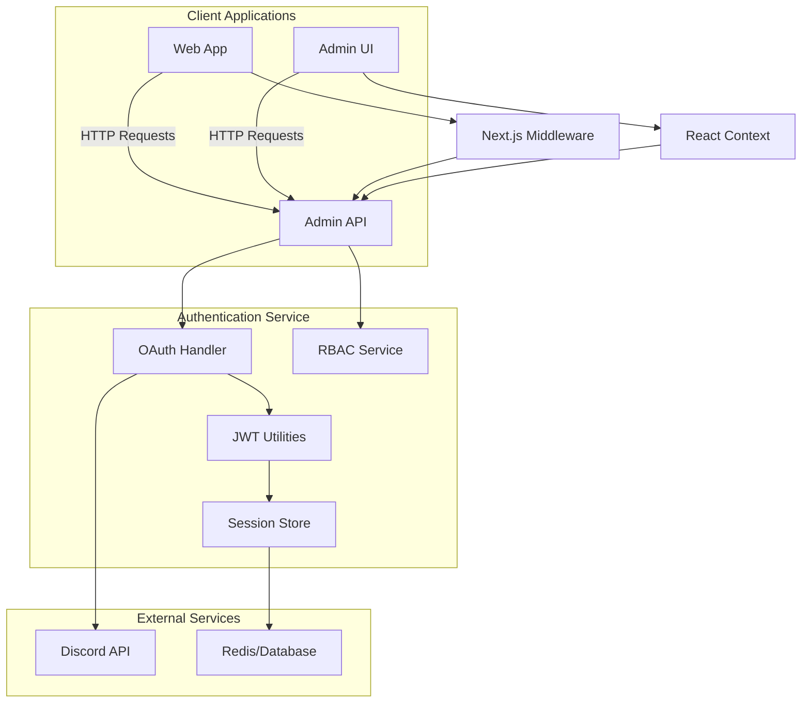

**Diagram sources**
- [auth.js](file://apps/admin-api/src/routes/auth.js)
- [middleware.ts](file://apps/web/middleware.ts)
- [session.js](file://apps/admin-ui/lib/session.js)

## Core Components

The shared authentication system consists of several core components that work together to provide a comprehensive authentication solution.

### JWT Utilities

The JWT utilities handle token creation, verification, and cookie management. The system uses HS256 algorithm for signing tokens with configurable secret keys and expiration times.

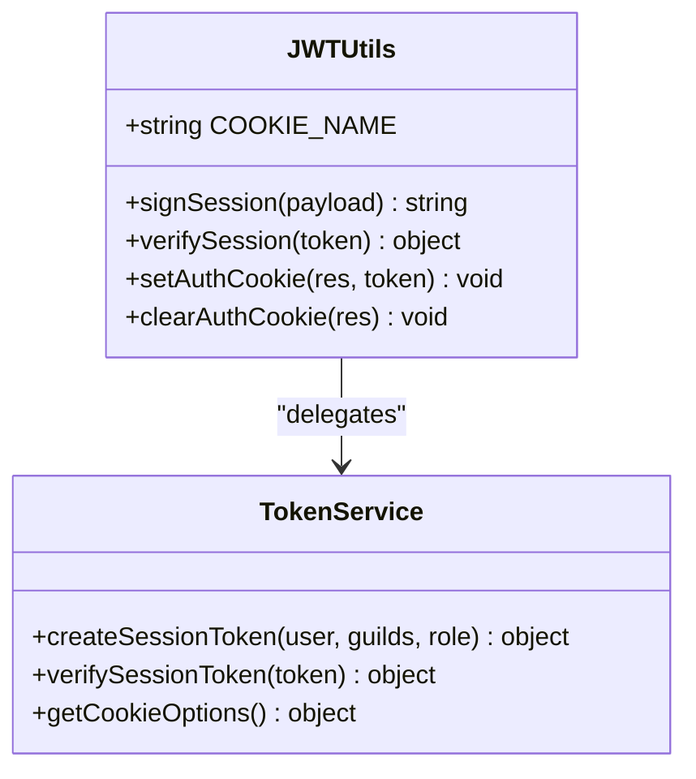

**Diagram sources**
- [jwt.js](file://apps/admin-api/lib/jwt.js)
- [token.js](file://apps/admin-api/src/services/token.js)

### Session Validation

Session validation is implemented through middleware that extracts and verifies authentication tokens from requests. The system supports multiple cookie names for backward compatibility and handles both JWT verification and session store validation.

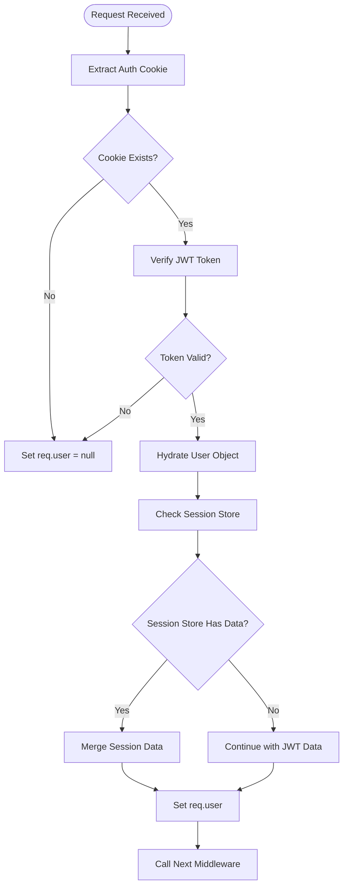

**Diagram sources**
- [auth.js](file://apps/admin-api/src/middleware/auth.js)
- [jwt.js](file://apps/admin-api/lib/jwt.js)

### OAuth Helpers

The OAuth helpers facilitate Discord authentication, handling the OAuth2 authorization code flow, token exchange, and user profile retrieval. The system includes state parameter validation to prevent CSRF attacks and parallel guild membership checks for performance optimization.

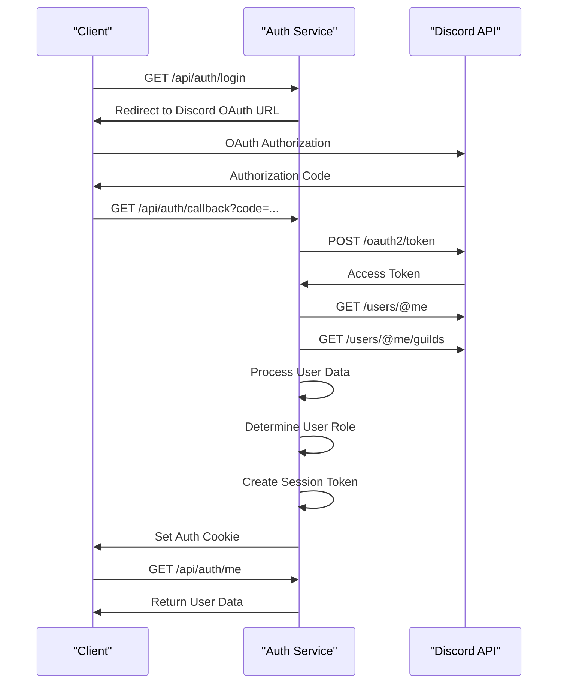

**Diagram sources**
- [auth.js](file://apps/admin-api/src/routes/auth.js)
- [oauth.js](file://apps/admin-api/src/services/oauth.js)

**Section sources**
- [auth.js](file://apps/admin-api/src/routes/auth.js)
- [oauth.js](file://apps/admin-api/src/services/oauth.js)
- [roles.js](file://apps/admin-api/src/lib/roles.js)

## Integration Patterns

The shared authentication system is consumed by multiple applications in the monorepo using different integration patterns tailored to each application's architecture.

### Express Middleware Integration

In the admin-api application, authentication is implemented as Express middleware that can be applied to specific routes or globally. The middleware provides several functions for different authentication requirements:

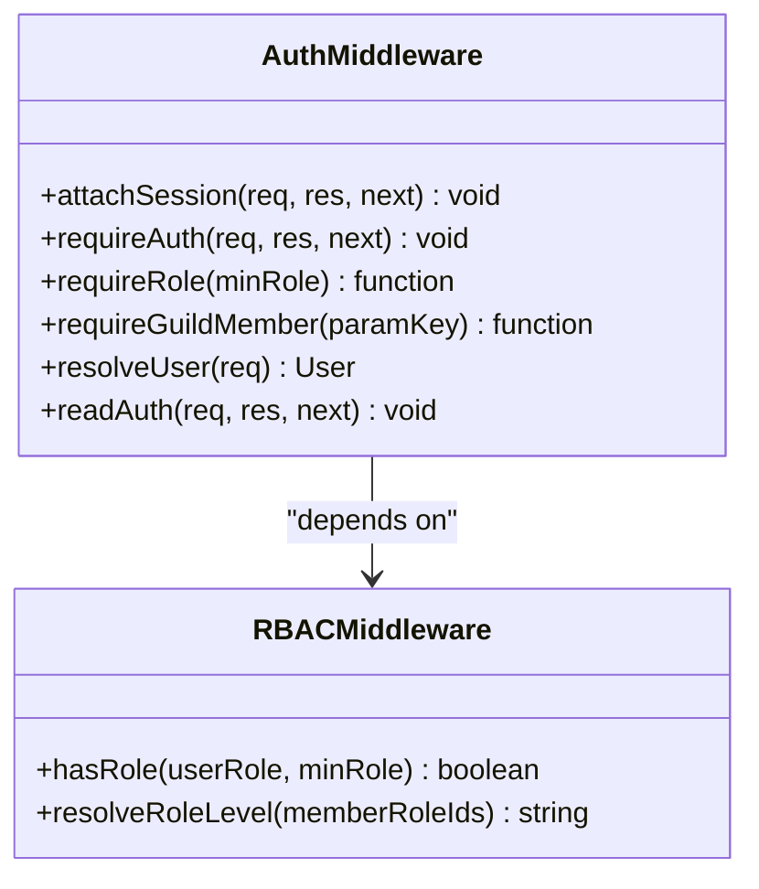

**Diagram sources**
- [auth.js](file://apps/admin-api/src/middleware/auth.js)
- [rbac.js](file://apps/admin-api/src/services/rbac.js)

### Next.js API Route Integration

The web application consumes the authentication system through Next.js API routes that proxy requests to the admin-api authentication endpoints. This pattern allows the web application to maintain its server-side rendering capabilities while leveraging the centralized authentication service.

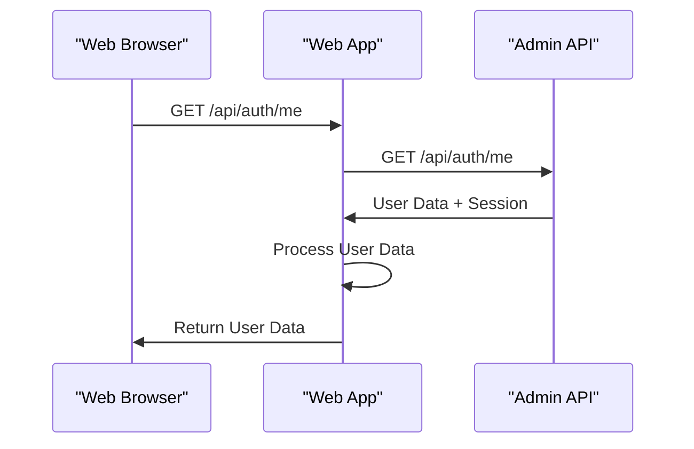

**Diagram sources**
- [route.ts](file://apps/web/app/api/auth/me/route.ts)
- [server.ts](file://apps/web/lib/auth/server.ts)

### Client-Side Integration

Both the web and admin-ui applications implement client-side authentication using React context providers that manage authentication state and provide utility functions for login, logout, and session refresh.

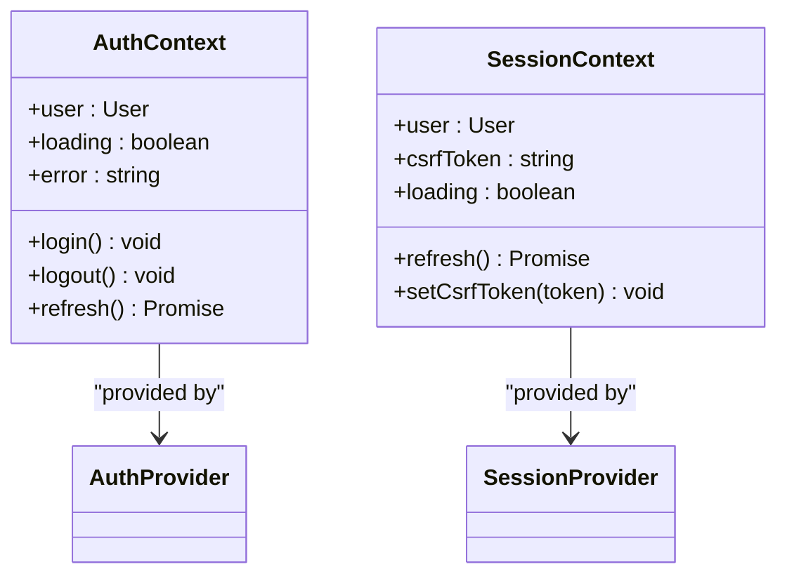

**Diagram sources**
- [context.tsx](file://apps/web/lib/auth/context.tsx)
- [session.js](file://apps/admin-ui/lib/session.js)

**Section sources**
- [context.tsx](file://apps/web/lib/auth/context.tsx)
- [session.js](file://apps/admin-ui/lib/session.js)
- [server.ts](file://apps/web/lib/auth/server.ts)

## Token Management

The token management system handles the creation, verification, and lifecycle of authentication tokens across the monorepo.

### Token Generation

Tokens are generated during the OAuth callback process and contain user information including ID, username, role, and guild memberships. The system creates both JWT tokens for session management and CSRF tokens for form protection.

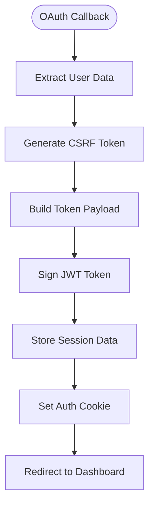

**Diagram sources**
- [auth.js](file://apps/admin-api/src/routes/auth.js)
- [token.js](file://apps/admin-api/src/services/token.js)

### Token Verification

Token verification occurs on every authenticated request, validating the JWT signature and extracting user information. The system supports both direct JWT verification and session store validation for enhanced security.

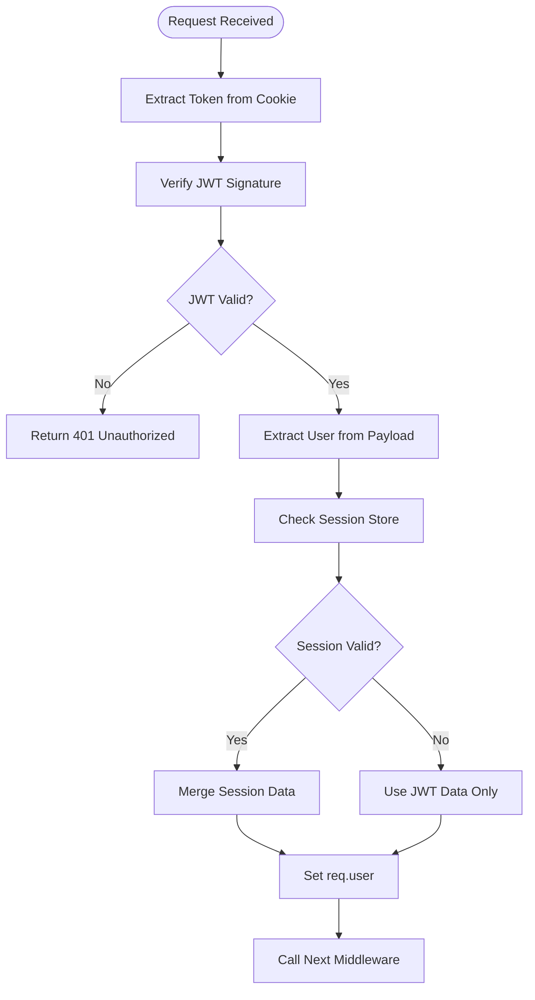

**Diagram sources**
- [auth.js](file://apps/admin-api/src/middleware/auth.js)
- [jwt.js](file://apps/admin-api/lib/jwt.js)

**Section sources**
- [jwt.js](file://apps/admin-api/lib/jwt.js)
- [token.js](file://apps/admin-api/src/services/token.js)

## Error Handling

The authentication system implements comprehensive error handling to ensure robust operation and provide meaningful feedback during authentication failures.

### Authentication Error Types

The system defines several error types that can occur during the authentication process:

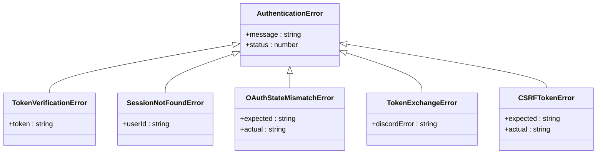

**Diagram sources**
- [auth.js](file://apps/admin-api/src/middleware/auth.js)
- [auth.js](file://apps/admin-api/src/routes/auth.js)

### Error Handling Flow

The error handling flow ensures that authentication failures are properly logged and appropriate responses are returned to clients:

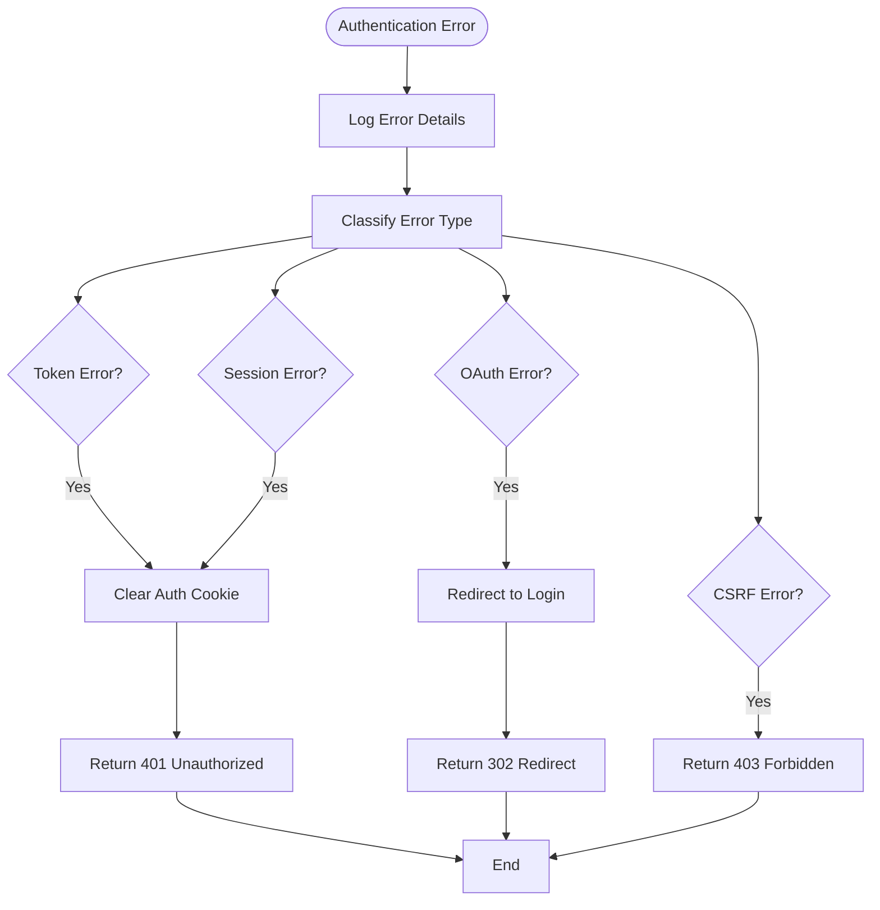

**Diagram sources**
- [auth.js](file://apps/admin-api/src/middleware/auth.js)
- [auth.js](file://apps/admin-api/src/routes/auth.js)

**Section sources**
- [auth.js](file://apps/admin-api/src/middleware/auth.js)
- [auth.js](file://apps/admin-api/src/routes/auth.js)

## Versioning and Compatibility

The shared-auth package follows semantic versioning principles to ensure backward compatibility and smooth upgrades across the monorepo.

### Versioning Strategy

The package uses semantic versioning (MAJOR.MINOR.PATCH) with the following guidelines:

- **MAJOR**: Breaking changes to the public API or authentication protocol
- **MINOR**: New features or enhancements that maintain backward compatibility
- **PATCH**: Bug fixes and security patches

### Backward Compatibility

The system maintains backward compatibility through several mechanisms:

1. **Cookie Name Fallback**: Support for multiple cookie names during transitions
2. **Graceful Token Expiration**: Gradual deprecation of old token formats
3. **Configuration Overrides**: Environment variables to control behavior during migrations

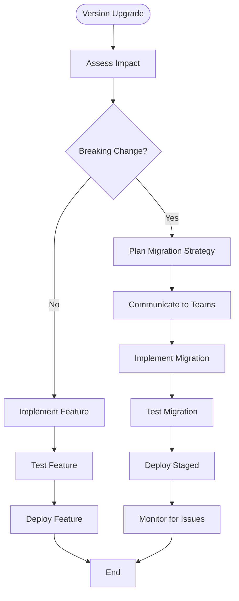

**Section sources**
- [package.json](file://packages/shared-auth/package.json)

## Testing Practices

The authentication system includes comprehensive testing practices to ensure reliability and security.

### Unit Testing

Unit tests focus on individual functions and utilities, ensuring they behave correctly in isolation:

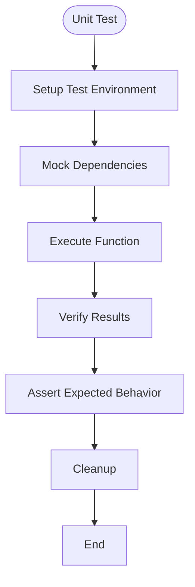

**Section sources**
- [auth.js](file://apps/admin-api/src/middleware/auth.js)
- [auth.test.js](file://apps/admin-api/src/middleware/auth.test.js)

### Integration Testing

Integration tests verify the complete authentication flow, from login to protected route access:

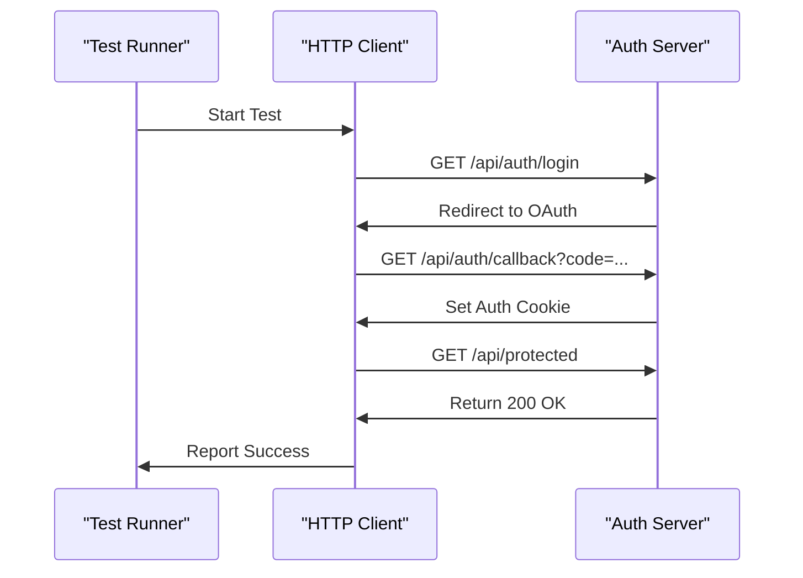

**Section sources**
- [auth-and-guilds.test.js](file://apps/admin-api/tests/auth-and-guilds.test.js)
- [auth-flow.test.js](file://apps/admin-api/tests/integration/auth-flow.test.js)

## Security Considerations

The authentication system implements several security measures to protect user data and prevent common vulnerabilities.

### Security Features

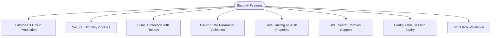

**Section sources**
- [jwt.js](file://apps/admin-api/lib/jwt.js)
- [auth.js](file://apps/admin-api/src/routes/auth.js)
- [token.js](file://apps/admin-api/src/services/token.js)

### Token Security

The token security implementation follows best practices for JWT usage:

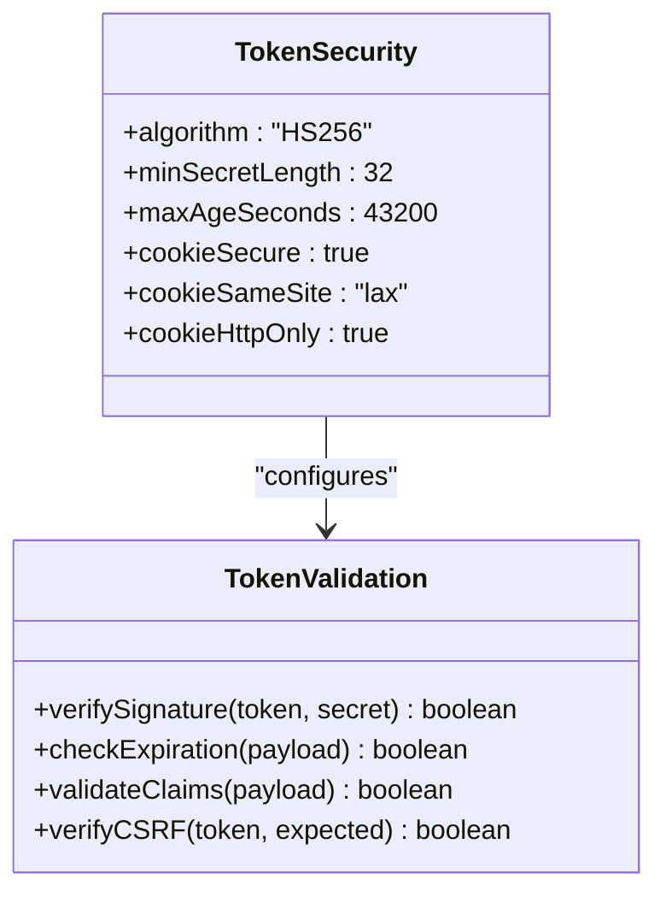

**Diagram sources**
- [jwt.js](file://apps/admin-api/lib/jwt.js)
- [token.js](file://apps/admin-api/src/services/token.js)

## Extensibility Guidelines

The shared-auth package is designed to be extensible, allowing for the addition of new authentication methods and features.

### Adding New Authentication Methods

To add a new authentication method, follow these steps:

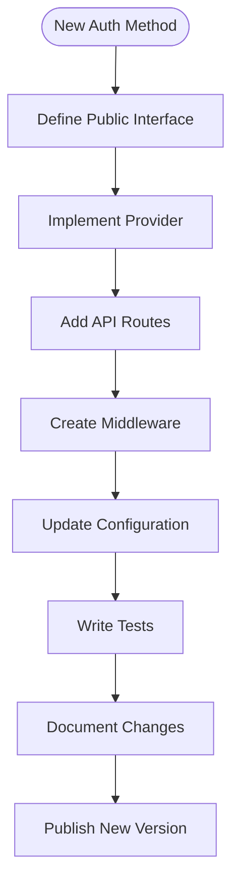

### Extension Points

The system provides several extension points for customization:

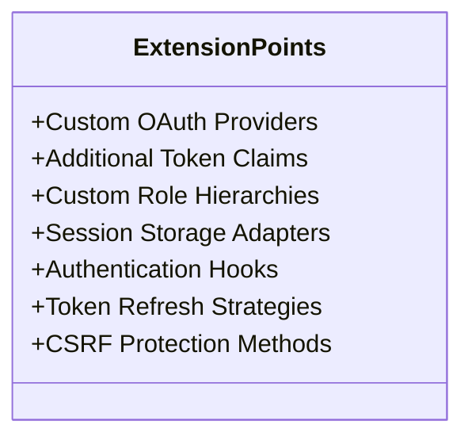

**Section sources**
- [package.json](file://packages/shared-auth/package.json)
- [auth.js](file://apps/admin-api/src/routes/auth.js)
- [oauth.js](file://apps/admin-api/src/services/oauth.js)