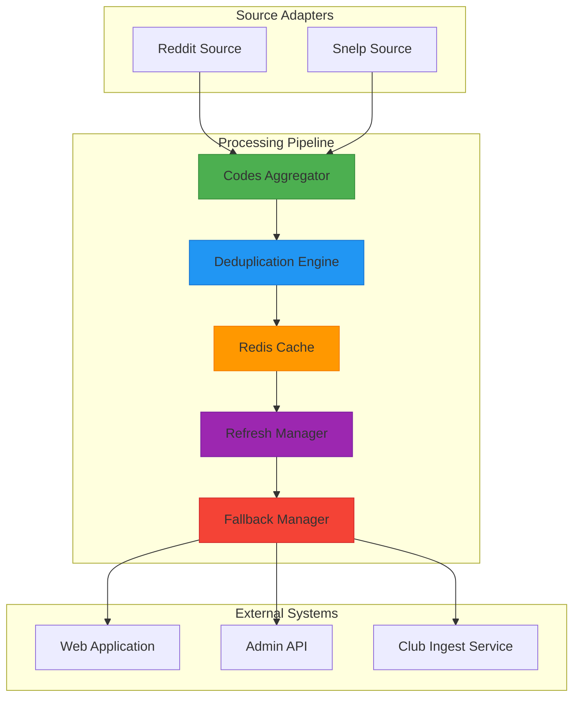
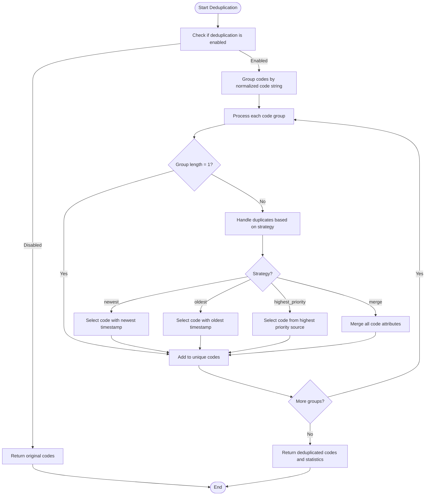
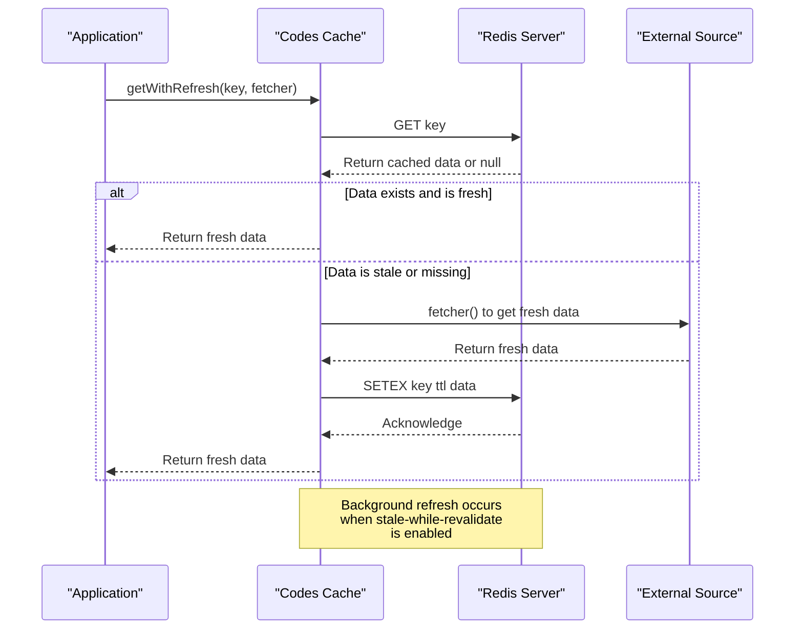
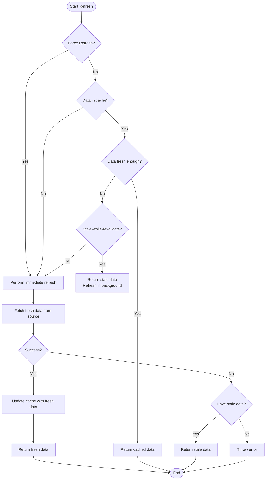
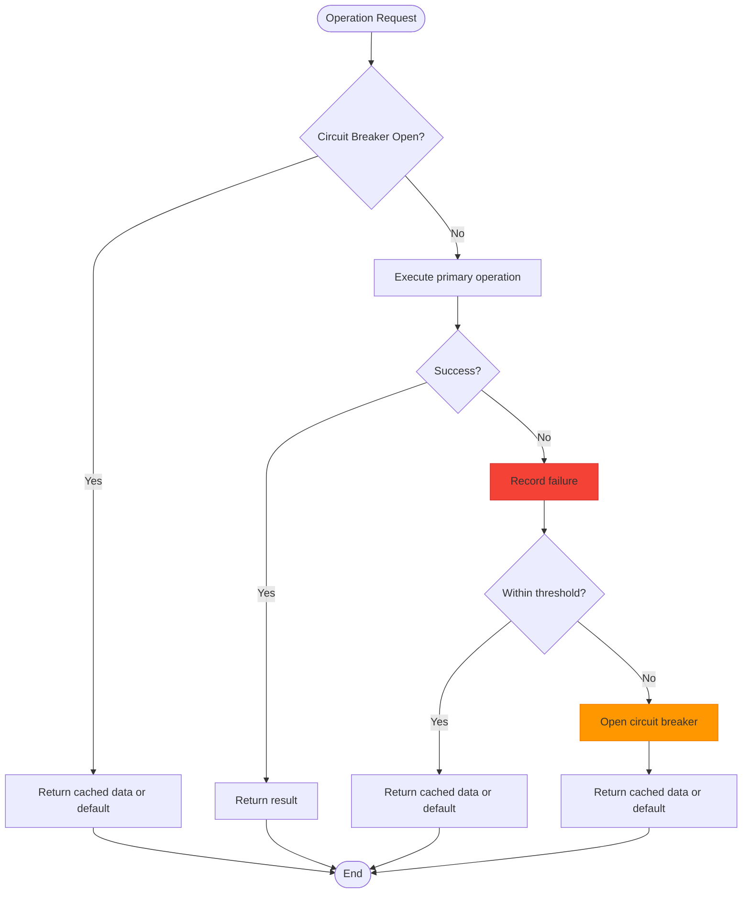
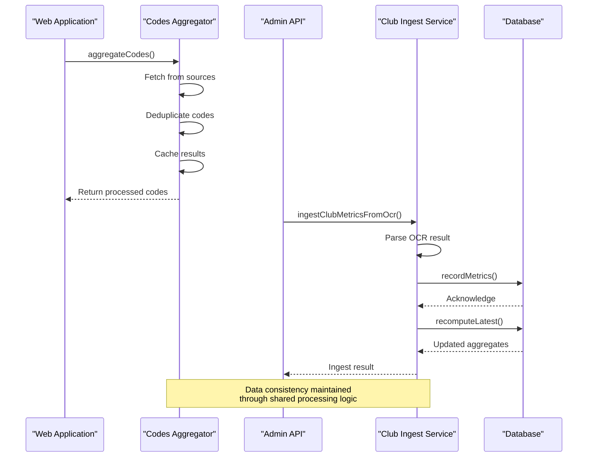

# Shared Codes Processing Package

<cite>
**Referenced Files in This Document**   
- [reddit.ts](file://apps/web/lib/codes/sources/reddit.ts)
- [snelp.ts](file://apps/web/lib/codes/sources/snelp.ts)
- [deduplication.ts](file://apps/web/lib/codes/deduplication.ts)
- [cache.ts](file://apps/web/lib/codes/cache.ts)
- [refresh.ts](file://apps/web/lib/codes/refresh.ts)
- [fallbacks.ts](file://apps/web/lib/codes/fallbacks.ts)
- [types.ts](file://apps/web/lib/codes/sources/types.ts)
- [codes-aggregator.ts](file://apps/web/lib/codes-aggregator.ts)
- [club-ingest.js](file://apps/admin-api/lib/club-ingest.js)
</cite>

## Table of Contents
1. [Introduction](#introduction)
2. [Core Architecture](#core-architecture)
3. [Source Adapters](#source-adapters)
4. [Deduplication Logic](#deduplication-logic)
5. [Cache Management](#cache-management)
6. [Refresh Workflows](#refresh-workflows)
7. [Fallback Mechanisms and Error Recovery](#fallback-mechanisms-and-error-recovery)
8. [Integration with External Systems](#integration-with-external-systems)
9. [Scalability and Data Consistency](#scalability-and-data-consistency)
10. [Configuration and Tuning](#configuration-and-tuning)
11. [Monitoring and Diagnostics](#monitoring-and-diagnostics)

## Introduction

The Shared Codes Processing Package is a comprehensive system designed to ingest, deduplicate, and analyze code submissions from multiple external sources for the Super Snail game ecosystem. This package serves as the central hub for collecting promotional codes from various platforms, ensuring data consistency, and providing reliable access to up-to-date code information across different services.

The system is built with resilience and scalability in mind, incorporating sophisticated caching strategies, fallback mechanisms, and error recovery processes. It integrates with both community-driven sources like Reddit and official sources like Snelp to provide a comprehensive view of available codes. The architecture follows a modular design with clear separation of concerns, allowing for easy extension to support additional code sources in the future.

This documentation provides a detailed overview of the package's core components, workflows, and integration points, with guidance on configuration, monitoring, and optimization for high-volume processing environments.

## Core Architecture

The Shared Codes Processing Package follows a modular architecture with distinct components responsible for different aspects of code processing. The system is designed around a central aggregator that coordinates data flow from multiple sources through deduplication, caching, and refresh mechanisms before delivering processed results to consumers.



**Diagram sources**
- [codes-aggregator.ts](file://apps/web/lib/codes-aggregator.ts#L95-L352)
- [deduplication.ts](file://apps/web/lib/codes/deduplication.ts#L49-L292)
- [cache.ts](file://apps/web/lib/codes/cache.ts#L42-L281)
- [refresh.ts](file://apps/web/lib/codes/refresh.ts#L41-L256)
- [fallbacks.ts](file://apps/web/lib/codes/fallbacks.ts#L47-L325)

**Section sources**
- [codes-aggregator.ts](file://apps/web/lib/codes-aggregator.ts#L1-L406)
- [types.ts](file://apps/web/lib/codes/sources/types.ts#L1-L104)

## Source Adapters

The source adapter system provides a standardized interface for ingesting code data from various external platforms. Each adapter implements the `CodeSource` interface, ensuring consistent behavior across different sources while allowing for source-specific configurations and error handling.

Currently, the system supports two primary source adapters: Reddit and Snelp. The Reddit adapter monitors the r/SuperSnailGame subreddit for community-submitted codes, while the Snelp adapter connects to the official Super Snail codes API. Both adapters implement robust error handling with retry logic, timeout protection, and health checking capabilities.

```mermaid
classDiagram
class CodeSource {
<<interface>>
+readonly name : string
+readonly config : SourceConfig
+fetch() : Promise~SourceResult~
+healthCheck() : Promise~{healthy : boolean; error? : string}~
+getMetadata() : {name : string; description : string; url? : string; rateLimit? : string; lastSuccessfulFetch? : string; totalFetches : number; successfulFetches : number; failedFetches : number}
}
class RedditSource {
+readonly name : string
+readonly config : SourceConfig
+fetch() : Promise~SourceResult~
+healthCheck() : Promise~{healthy : boolean; error? : string}~
+getMetadata() : {name : string; description : string; url? : string; rateLimit? : string; lastSuccessfulFetch? : string; totalFetches : number; successfulFetches : number; failedFetches : number}
-fetchWithRetry() : Promise~Code[]~
-fetchOnce() : Promise~Code[]~
-extractCodesFromPosts(posts : any[]) : Code[]
-validateAndCreateCode(match : string, postData : any) : Code | null
-isLikelyFalsePositive(code : string) : boolean
-createDescription(postData : any) : string
}
class SnelpSource {
+readonly name : string
+readonly config : SourceConfig
+fetch() : Promise~SourceResult~
+healthCheck() : Promise~{healthy : boolean; error? : string}~
+getMetadata() : {name : string; description : string; url? : string; rateLimit? : string; lastSuccessfulFetch? : string; totalFetches : number; successfulFetches : number; failedFetches : number}
-fetchWithRetry(url : string) : Promise~Code[]~
-fetchOnce(url : string) : Promise~Code[]~
-transformCodes(apiCodes : any[]) : Code[]
-resolveApiUrl(url : string) : string
}
class SourceConfig {
+timeout : number
+retries : number
+retryDelay : number
+cacheTtl : number
+enabled : boolean
}
class SourceResult {
+codes : Code[]
+success : boolean
+error? : string
+metadata : {source : string; fetchedAt : string; count : number; duration : number; status : "success" | "partial" | "failed" | "disabled"}
}
CodeSource <|-- RedditSource
CodeSource <|-- SnelpSource
RedditSource o-- SourceConfig
SnelpSource o-- SourceConfig
RedditSource o-- SourceResult
SnelpSource o-- SourceResult
```

**Diagram sources**
- [reddit.ts](file://apps/web/lib/codes/sources/reddit.ts#L18-L305)
- [snelp.ts](file://apps/web/lib/codes/sources/snelp.ts#L18-L305)
- [types.ts](file://apps/web/lib/codes/sources/types.ts#L33-L60)

**Section sources**
- [reddit.ts](file://apps/web/lib/codes/sources/reddit.ts#L1-L306)
- [snelp.ts](file://apps/web/lib/codes/sources/snelp.ts#L1-L305)
- [types.ts](file://apps/web/lib/codes/sources/types.ts#L1-L104)

## Deduplication Logic

The deduplication system is responsible for resolving conflicts when the same code appears from multiple sources. It implements a configurable strategy for selecting which code instance to retain, with options for prioritizing the newest, oldest, or highest-priority source. The system also supports a merge strategy that combines information from multiple instances of the same code.

The deduplication process begins by normalizing code strings (converting to uppercase and removing spaces) to ensure consistent comparison. Codes are then grouped by their normalized value, and duplicates are resolved according to the configured strategy. The system maintains detailed statistics on the deduplication process, including counts of total, unique, and duplicate codes.



**Diagram sources**
- [deduplication.ts](file://apps/web/lib/codes/deduplication.ts#L49-L292)

**Section sources**
- [deduplication.ts](file://apps/web/lib/codes/deduplication.ts#L1-L304)

## Cache Management

The cache management system uses Redis as a backend to store processed code data and intermediate results. This caching layer significantly improves performance by reducing the need to repeatedly fetch and process data from external sources. The system implements a stale-while-revalidate pattern, allowing it to serve potentially stale data while refreshing it in the background.

Cache configuration is highly customizable, with options to control TTL (time to live), retry behavior, and key prefixes. The system automatically handles Redis connection management, including reconnection logic for transient failures. Cache statistics are available for monitoring, including information about connected status, available keys, and operational health.



**Diagram sources**
- [cache.ts](file://apps/web/lib/codes/cache.ts#L42-L281)
- [refresh.ts](file://apps/web/lib/codes/refresh.ts#L41-L256)

**Section sources**
- [cache.ts](file://apps/web/lib/codes/cache.ts#L1-L302)

## Refresh Workflows

The refresh system implements automated workflows for keeping code data up to date without blocking application requests. It supports both scheduled auto-refresh and on-demand refresh operations, with configurable intervals and strategies. The system uses a stale-while-revalidate approach to ensure high availability even during refresh operations.

Refresh workflows are managed by the `RefreshManager` class, which tracks the state of refresh operations for each data key. The system prevents concurrent refreshes of the same data and implements circuit breaker patterns to avoid overwhelming external sources during periods of high failure rates. Refresh statistics are maintained for monitoring and troubleshooting purposes.



**Diagram sources**
- [refresh.ts](file://apps/web/lib/codes/refresh.ts#L41-L256)

**Section sources**
- [refresh.ts](file://apps/web/lib/codes/refresh.ts#L1-L298)

## Fallback Mechanisms and Error Recovery

The fallback system provides robust error recovery mechanisms to ensure service availability even when external sources are unreachable. It implements multiple layers of fallback strategies, including cached data usage, circuit breakers, and emergency fallback codes. This multi-layered approach maximizes system resilience and minimizes downtime.

The circuit breaker pattern prevents repeated attempts to access failing sources, allowing them time to recover while serving data from alternative sources. When a source failure is detected, the system automatically falls back to cached data if available and acceptable based on age thresholds. As a last resort, emergency fallback codes can be served to maintain basic functionality.



**Diagram sources**
- [fallbacks.ts](file://apps/web/lib/codes/fallbacks.ts#L47-L325)

**Section sources**
- [fallbacks.ts](file://apps/web/lib/codes/fallbacks.ts#L1-L326)
- [codes-aggregator.ts](file://apps/web/lib/codes-aggregator.ts#L1-L406)

## Integration with External Systems

The Shared Codes Processing Package integrates with several external systems to provide a comprehensive code management solution. The primary integration point is with the web application, which consumes processed code data through API routes. Additionally, the package integrates with the admin-api service for club data processing and ingestion workflows.

The integration with the admin-api's club-ingest.js module enables the processing of externally submitted code data, particularly from OCR'd screenshots and other user submissions. This integration allows club metrics to be updated based on verified code usage, creating a feedback loop between code availability and club performance tracking.



**Diagram sources**
- [codes-aggregator.ts](file://apps/web/lib/codes-aggregator.ts#L95-L352)
- [club-ingest.js](file://apps/admin-api/lib/club-ingest.js#L20-L84)

**Section sources**
- [codes-aggregator.ts](file://apps/web/lib/codes-aggregator.ts#L1-L406)
- [club-ingest.js](file://apps/admin-api/lib/club-ingest.js#L1-L124)

## Scalability and Data Consistency

The system is designed with scalability in mind, capable of handling high-volume code processing through several architectural patterns. The use of Redis for caching reduces load on external sources and improves response times. Parallel processing of source adapters allows for efficient data ingestion, while configurable refresh intervals prevent overwhelming downstream systems.

Data consistency is maintained through a combination of deduplication logic, source prioritization, and timestamp-based conflict resolution. The system ensures that the most recent and reliable information is presented to consumers, with transparent handling of conflicts between different sources. Cache invalidation strategies and refresh workflows help maintain data freshness across services.

For high-volume environments, the system can be scaled horizontally by deploying multiple instances behind a load balancer, with Redis serving as a shared cache layer. The modular design allows individual components to be scaled independently based on their resource requirements and usage patterns.

**Section sources**
- [codes-aggregator.ts](file://apps/web/lib/codes-aggregator.ts#L1-L406)
- [cache.ts](file://apps/web/lib/codes/cache.ts#L1-L302)
- [deduplication.ts](file://apps/web/lib/codes/deduplication.ts#L1-L304)

## Configuration and Tuning

The package provides extensive configuration options to tune its behavior for different environments and requirements. Key configuration parameters include deduplication thresholds, cache TTL values, refresh intervals, and source-specific settings like timeouts and retry counts.

Deduplication can be tuned by adjusting the strategy (newest, oldest, highest_priority, or merge), priority order of sources, and whether to merge tags and descriptions. Cache settings can be optimized based on data freshness requirements and Redis capacity. Refresh workflows can be configured with different intervals and stale-while-revalidate thresholds to balance performance and data freshness.

For new code sources, extension points are available through the `CodeSource` interface and factory functions. Adding a new source requires implementing the interface with appropriate fetch, health check, and metadata methods, then registering it with the aggregator configuration.

**Section sources**
- [deduplication.ts](file://apps/web/lib/codes/deduplication.ts#L1-L304)
- [cache.ts](file://apps/web/lib/codes/cache.ts#L1-L302)
- [refresh.ts](file://apps/web/lib/codes/refresh.ts#L1-L298)
- [types.ts](file://apps/web/lib/codes/sources/types.ts#L1-L104)

## Monitoring and Diagnostics

The system includes comprehensive monitoring and diagnostic capabilities to ensure reliable operation and facilitate troubleshooting. Health checks are available for all components, including source adapters, cache connectivity, and the overall aggregator status. These health checks return detailed information about the health of each subsystem, allowing for targeted diagnostics.

Refresh statistics track the frequency and success rate of data updates, while cache statistics provide insights into cache utilization and performance. The system logs key events and errors, with structured logging that includes contextual information for debugging. These monitoring capabilities enable proactive detection of issues and performance optimization.

**Section sources**
- [codes-aggregator.ts](file://apps/web/lib/codes-aggregator.ts#L1-L406)
- [cache.ts](file://apps/web/lib/codes/cache.ts#L1-L302)
- [refresh.ts](file://apps/web/lib/codes/refresh.ts#L1-L298)
- [fallbacks.ts](file://apps/web/lib/codes/fallbacks.ts#L1-L326)