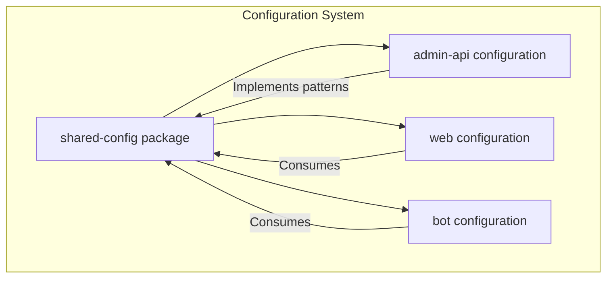
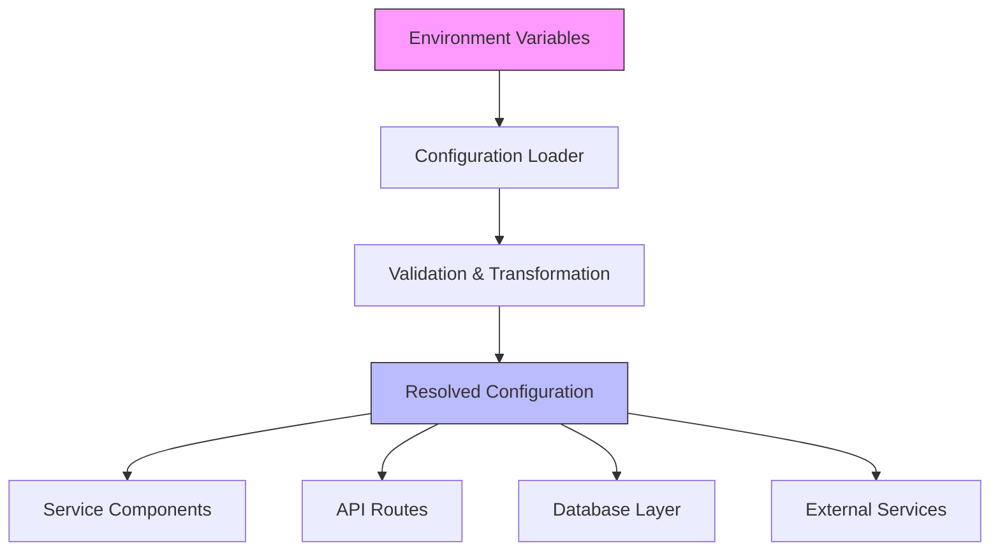
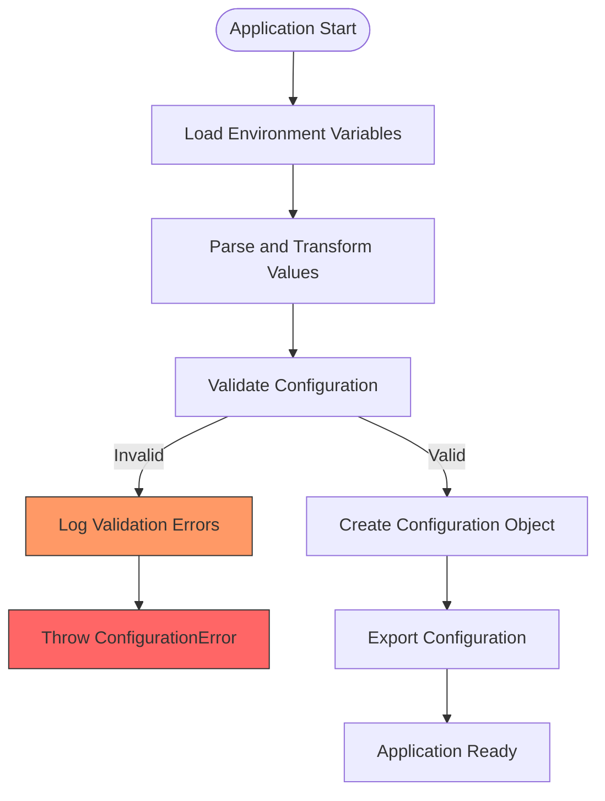
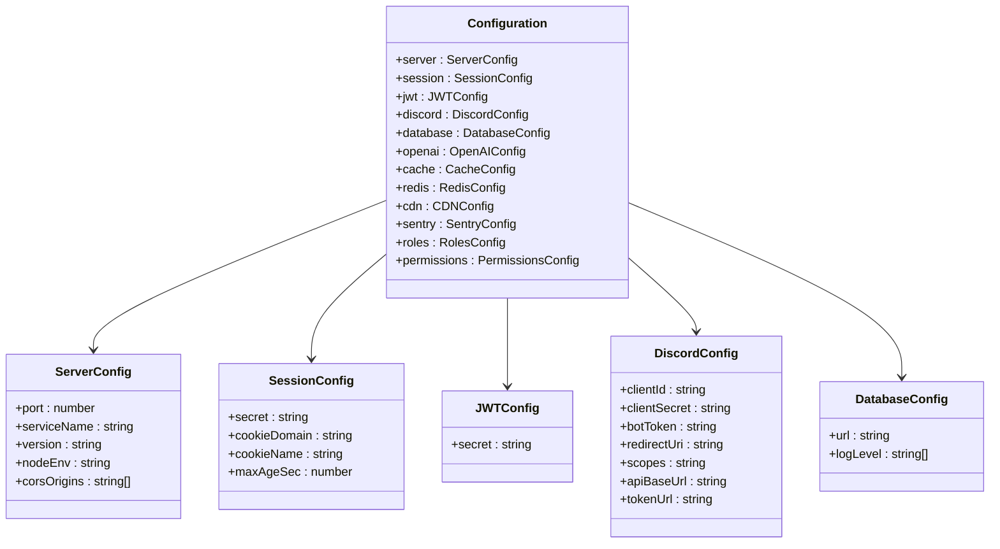
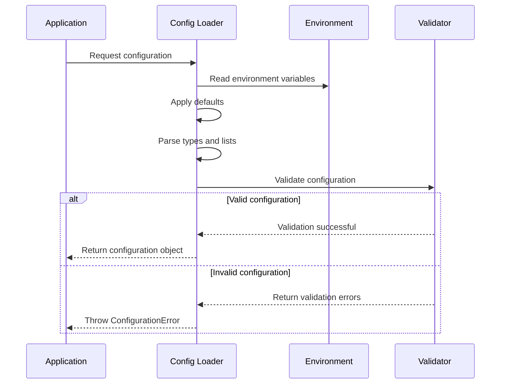
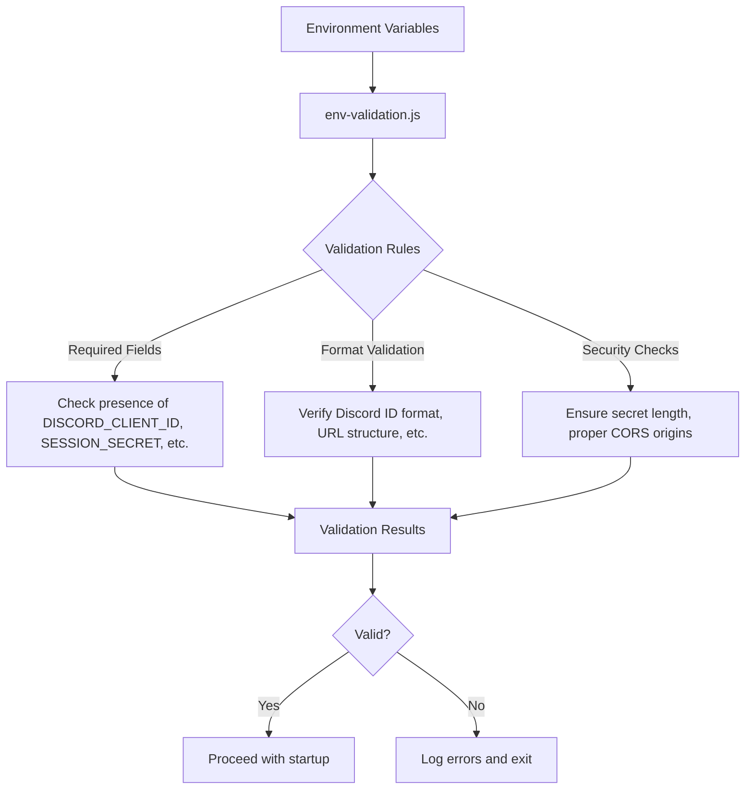
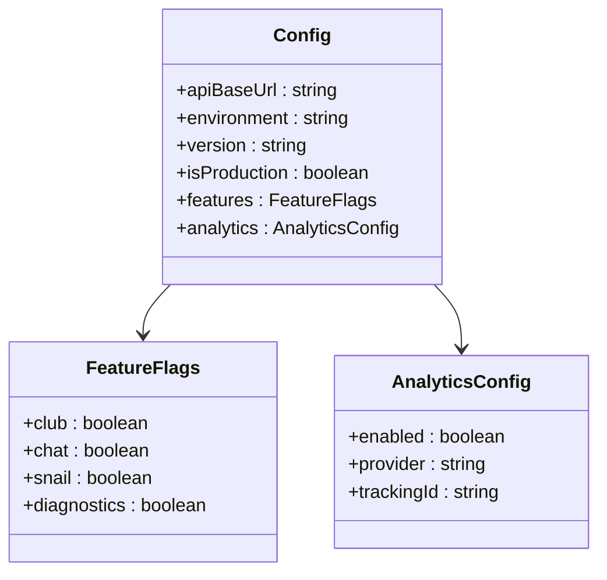
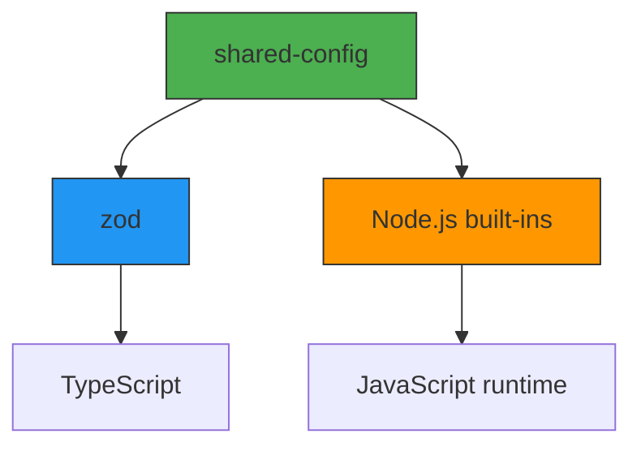

# Shared Configuration Package

<cite>
**Referenced Files in This Document**   
- [index.js](file://apps/admin-api/src/lib/config/index.js)
- [config.js](file://apps/admin-api/src/config.js)
- [env-validation.js](file://apps/admin-api/src/lib/config/env-validation.js)
- [config.ts](file://apps/web/lib/config.ts)
- [package.json](file://packages/shared-config/package.json)
</cite>

## Table of Contents
1. [Introduction](#introduction)
2. [Project Structure](#project-structure)
3. [Core Components](#core-components)
4. [Architecture Overview](#architecture-overview)
5. [Detailed Component Analysis](#detailed-component-analysis)
6. [Dependency Analysis](#dependency-analysis)
7. [Performance Considerations](#performance-considerations)
8. [Troubleshooting Guide](#troubleshooting-guide)
9. [Conclusion](#conclusion)

## Introduction
The shared-config package provides a centralized configuration management system for the Slimy monorepo, ensuring consistent environment-agnostic configuration handling across admin-api, web, and bot services. This documentation details the architecture, implementation, and best practices for using the configuration system that normalizes configuration loading, validation, and access patterns across services.

## Project Structure
The configuration system is implemented across multiple services in the monorepo, with the core logic centralized in the admin-api service and consumed by other applications. The shared-config package in the packages directory serves as the official shared configuration module, while individual services maintain their own configuration implementations that follow the same patterns.

**Diagram sources**
- [package.json](file://packages/shared-config/package.json)

**Section sources**
- [package.json](file://packages/shared-config/package.json)

## Core Components
The configuration system consists of several core components that work together to provide a robust, type-safe configuration management solution. The system normalizes configuration loading from environment variables, applies validation rules, sets default values, and provides a consistent API for accessing configuration values across services.

The implementation in admin-api serves as the reference implementation, with the shared-config package formalizing these patterns for cross-service use. Key aspects include schema definition, runtime configuration resolution, and integration with validation systems.

**Section sources**
- [index.js](file://apps/admin-api/src/lib/config/index.js)
- [config.js](file://apps/admin-api/src/config.js)

## Architecture Overview
The configuration architecture follows a layered approach with clear separation of concerns. Environment variables are loaded at startup, validated against defined schemas, and transformed into a structured configuration object with appropriate defaults. This resolved configuration is then made available to all components through a consistent interface.

The system ensures environment-agnostic behavior by abstracting environment-specific values behind consistent configuration keys, allowing services to run identically across development, staging, and production environments with only environment variable changes.

**Diagram sources**
- [index.js](file://apps/admin-api/src/lib/config/index.js)

## Detailed Component Analysis

### Configuration Loading and Validation
The configuration system implements a comprehensive loading and validation process that ensures all required environment variables are present and correctly formatted before the application starts. The validation process includes type checking, format validation, and security requirements for sensitive values like secrets and API keys.

**Diagram sources**
- [index.js](file://apps/admin-api/src/lib/config/index.js)

**Section sources**
- [index.js](file://apps/admin-api/src/lib/config/index.js)

### Schema Definition and Default Values
The configuration system uses explicit schema definitions to document expected environment variables and their relationships. Each configuration category (server, database, authentication, etc.) has defined properties with appropriate default values for development environments, while requiring explicit values for production-sensitive settings.

The system employs a hierarchical structure with nested objects that group related configuration options, making it easier to understand the relationships between different settings and their impact on system behavior.

**Diagram sources**
- [index.js](file://apps/admin-api/src/lib/config/index.js)

**Section sources**
- [index.js](file://apps/admin-api/src/lib/config/index.js)

### Runtime Configuration Resolution
The configuration system resolves values at runtime by combining environment variables with sensible defaults. This approach allows services to function in different environments without code changes, promoting consistency across the development, staging, and production environments.

The resolution process includes type coercion (converting string environment variables to appropriate types like numbers or booleans), list parsing (converting comma-separated strings to arrays), and fallback chains (using JWT_SECRET or falling back to SESSION_SECRET).

**Diagram sources**
- [index.js](file://apps/admin-api/src/lib/config/index.js)

**Section sources**
- [index.js](file://apps/admin-api/src/lib/config/index.js)

### Integration with Validation Systems
The configuration system integrates closely with the env-validation.js and config.js files in admin-api to ensure consistent environment variable handling. The validation system checks required fields, verifies format requirements, and provides meaningful error messages when configuration issues are detected.

This integration creates a comprehensive validation layer that catches configuration errors early in the application lifecycle, preventing runtime failures due to misconfiguration.

**Diagram sources**
- [index.js](file://apps/admin-api/src/lib/config/index.js)
- [config.js](file://apps/admin-api/src/config.js)

**Section sources**
- [index.js](file://apps/admin-api/src/lib/config/index.js)
- [config.js](file://apps/admin-api/src/config.js)

### Type Safety with TypeScript
The web service implements type safety for configuration through TypeScript, defining interfaces that describe the expected configuration structure. This approach provides compile-time checking of configuration usage, preventing runtime errors caused by accessing non-existent configuration properties.

The type definitions are kept in sync with the actual configuration implementation, ensuring that refactoring configuration keys or structures is reflected across the codebase.

**Diagram sources**
- [config.ts](file://apps/web/lib/config.ts)

**Section sources**
- [config.ts](file://apps/web/lib/config.ts)

## Dependency Analysis
The configuration system has minimal external dependencies, relying primarily on Node.js built-in modules and a few essential packages for validation and logging. This lightweight dependency profile reduces the attack surface and improves reliability.

The shared-config package is designed to be consumed by multiple services without introducing circular dependencies or version conflicts, following semantic versioning principles for backward compatibility.

**Diagram sources**
- [package.json](file://packages/shared-config/package.json)

**Section sources**
- [package.json](file://packages/shared-config/package.json)

## Performance Considerations
The configuration system is optimized for performance with caching of resolved configurations to avoid repeated parsing and validation. The initialization overhead is incurred only once at application startup, with subsequent access to configuration values being simple property lookups.

The validation process is designed to fail fast, detecting configuration issues early in the startup process rather than allowing the application to start with invalid configuration that could cause failures later.

**Section sources**
- [index.js](file://apps/admin-api/src/lib/config/index.js)

## Troubleshooting Guide
Common configuration issues include missing required environment variables, incorrectly formatted values, and type mismatches. The system provides detailed error messages that identify the specific configuration problem and suggest corrective actions.

When adding new configuration options, follow the established patterns: define the environment variable name, provide appropriate defaults, add validation rules, and document the purpose and acceptable values.

**Section sources**
- [index.js](file://apps/admin-api/src/lib/config/index.js)
- [config.js](file://apps/admin-api/src/config.js)

## Conclusion
The shared-config package and related configuration systems provide a robust foundation for environment-agnostic configuration management across the Slimy monorepo. By standardizing configuration loading, validation, and access patterns, the system ensures consistency, improves reliability, and simplifies deployment across environments.

The implementation balances flexibility with safety, allowing services to adapt to different environments while preventing common configuration errors through comprehensive validation and type safety.