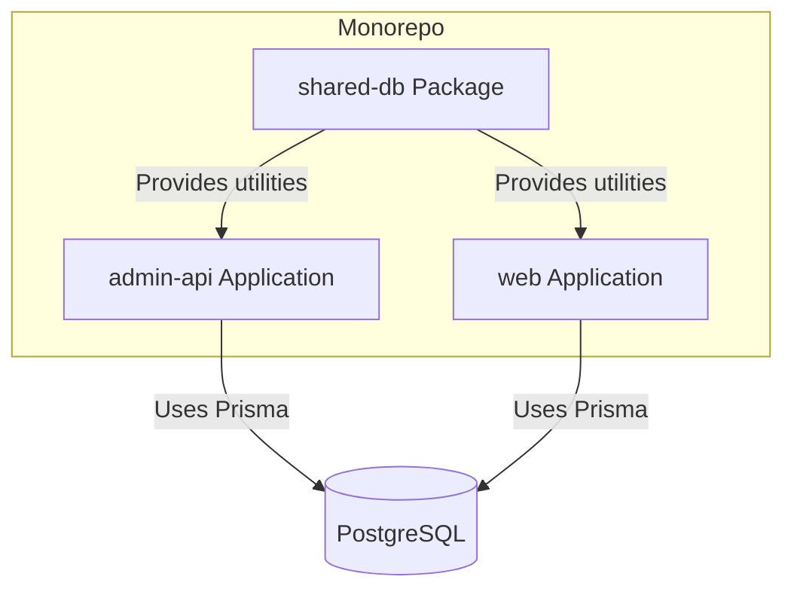
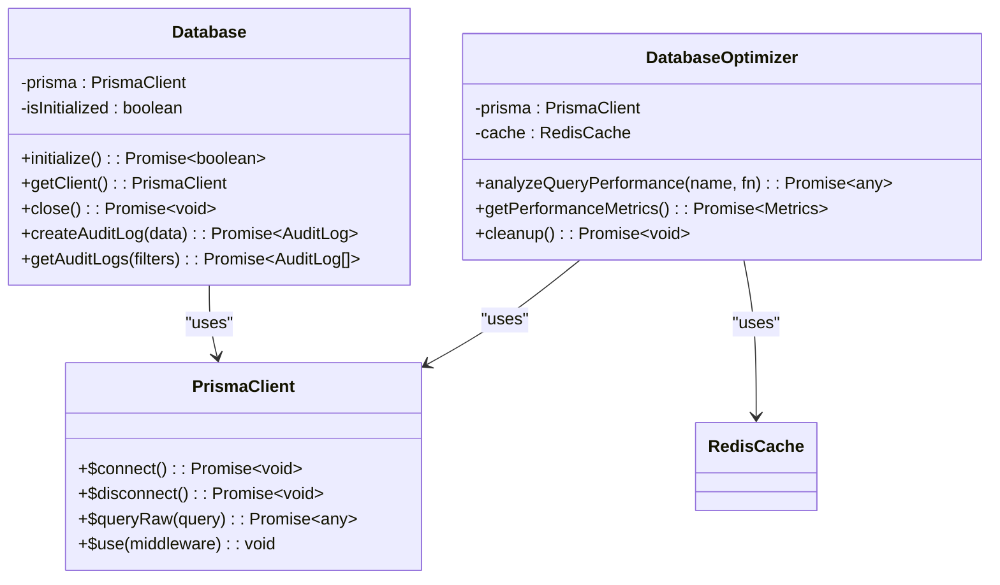
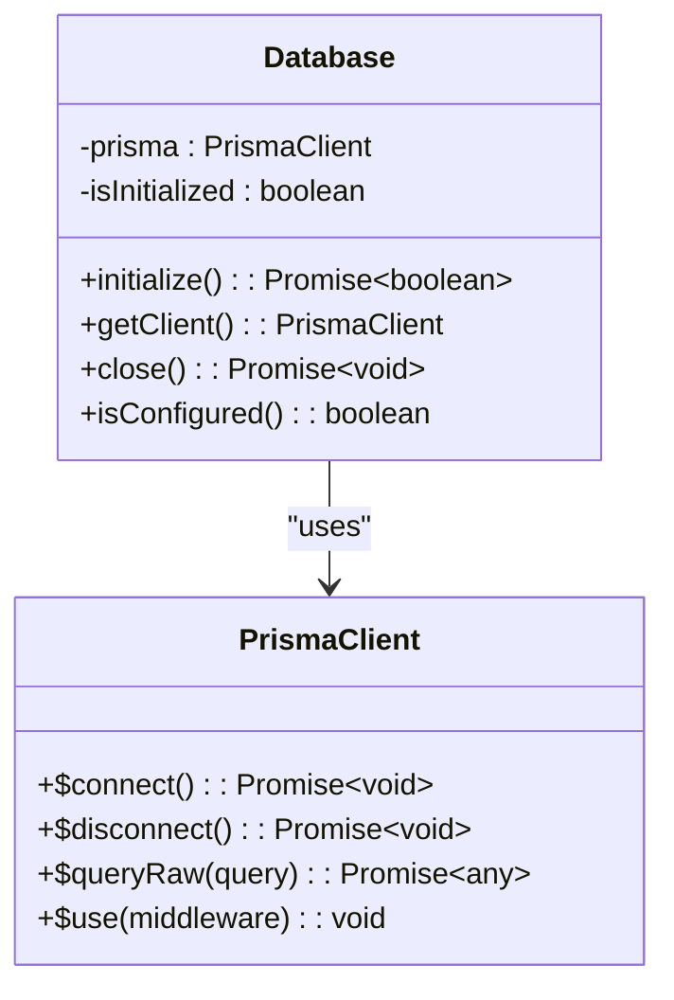
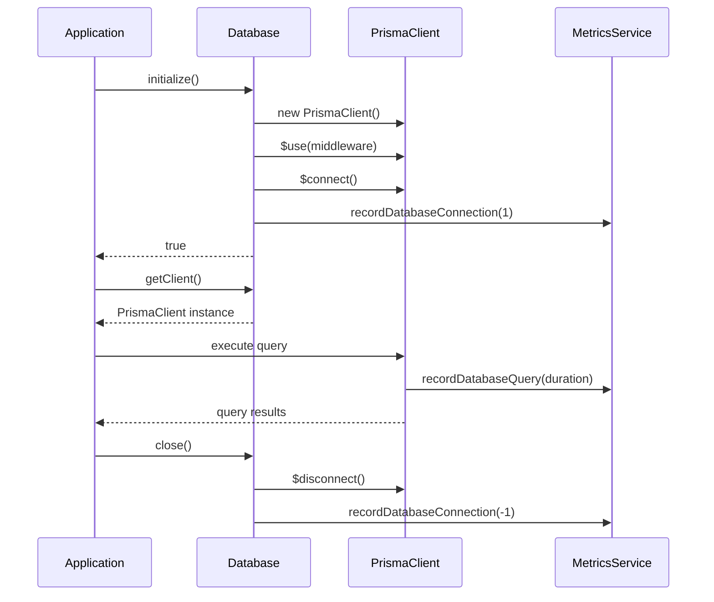
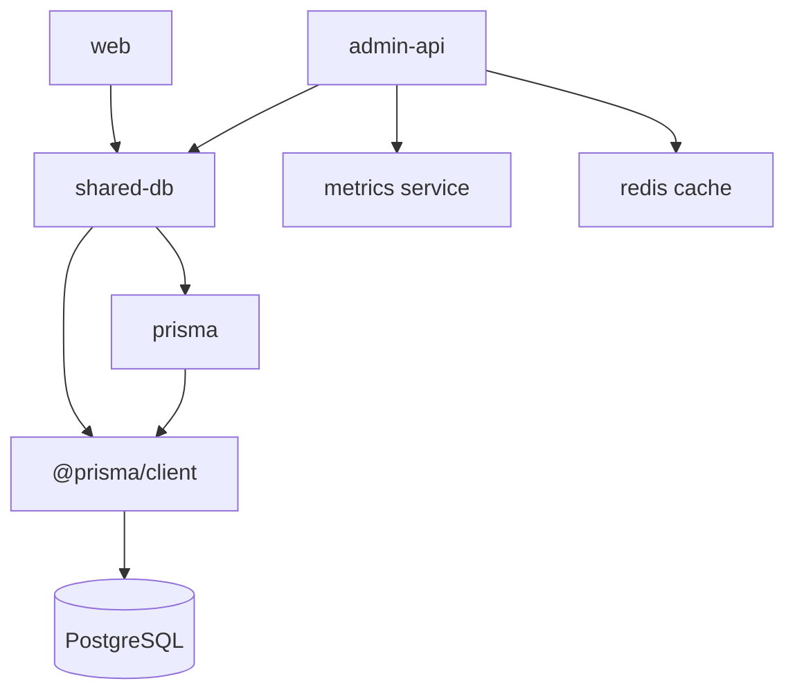

# Shared Database Utilities Package

<cite>
**Referenced Files in This Document**   
- [apps/admin-api/src/lib/database.js](file://apps/admin-api/src/lib/database.js)
- [apps/web/lib/db.ts](file://apps/web/lib/db.ts)
- [apps/admin-api/lib/database-optimization.js](file://apps/admin-api/lib/database-optimization.js)
- [apps/admin-api/prisma/migrations/20241106000000_init/migration.sql](file://apps/admin-api/prisma/migrations/20241106000000_init/migration.sql)
- [apps/admin-api/package.json](file://apps/admin-api/package.json)
</cite>

## Table of Contents
1. [Introduction](#introduction)
2. [Project Structure](#project-structure)
3. [Core Components](#core-components)
4. [Architecture Overview](#architecture-overview)
5. [Detailed Component Analysis](#detailed-component-analysis)
6. [Dependency Analysis](#dependency-analysis)
7. [Performance Considerations](#performance-considerations)
8. [Troubleshooting Guide](#troubleshooting-guide)
9. [Conclusion](#conclusion)

## Introduction
The shared-db package provides a unified database access layer across the monorepo, enabling consistent data operations for both the admin-api and web applications. This documentation details the Prisma ORM integration, connection management, transaction utilities, and optimization strategies implemented across the system. The package ensures reliable database connectivity, proper connection pooling, and consistent schema migrations while supporting both applications' data access patterns.

## Project Structure
The shared-db package is structured as a monorepo package that provides database utilities to multiple applications. The admin-api and web applications both implement their own database access layers that follow similar patterns but are tailored to their specific needs. The shared-db package exports Prisma client instances and utilities that are consumed by both applications, ensuring consistent database interactions across the codebase.

**Diagram sources**
- [packages/shared-db/package.json](file://packages/shared-db/package.json)
- [apps/admin-api/package.json](file://apps/admin-api/package.json)

**Section sources**
- [packages/shared-db/package.json](file://packages/shared-db/package.json)

## Core Components
The shared database utilities package provides a comprehensive set of components for database access, including Prisma client management, connection pooling, transaction handling, and performance optimization. Both the admin-api and web applications implement similar patterns for database access, with the admin-api providing a more feature-rich Database class with audit logging and metrics integration, while the web application provides a simpler singleton pattern for Prisma client access.

**Section sources**
- [apps/admin-api/src/lib/database.js](file://apps/admin-api/src/lib/database.js)
- [apps/web/lib/db.ts](file://apps/web/lib/db.ts)

## Architecture Overview
The database architecture follows a unified approach across the monorepo, with both applications using Prisma ORM for database access but implementing different patterns for client management. The admin-api uses a Database class that encapsulates the Prisma client with additional functionality like metrics collection and audit logging, while the web application uses a singleton pattern with global variable caching to prevent multiple instances during hot reload.

**Diagram sources**
- [apps/admin-api/src/lib/database.js](file://apps/admin-api/src/lib/database.js)
- [apps/admin-api/lib/database-optimization.js](file://apps/admin-api/lib/database-optimization.js)

## Detailed Component Analysis

### Database Client Implementation
Both applications implement Prisma client management with considerations for development and production environments. The admin-api uses a class-based approach with initialization and connection management, while the web application uses a singleton pattern with global variable caching.

#### For Object-Oriented Components:

**Diagram sources**
- [apps/admin-api/src/lib/database.js](file://apps/admin-api/src/lib/database.js)

#### For API/Service Components:

**Diagram sources**
- [apps/admin-api/src/lib/database.js](file://apps/admin-api/src/lib/database.js)

### Connection Pooling and Configuration
The database connection configuration is managed through environment variables and application configuration. The admin-api implements connection pooling through Prisma's built-in connection management, with metrics collection for monitoring connection usage and query performance.

**Section sources**
- [apps/admin-api/src/lib/database.js](file://apps/admin-api/src/lib/database.js)

### Transaction Management Utilities
Both applications leverage Prisma's transaction capabilities, with the admin-api providing additional transaction management through its Database class. The web application relies on Prisma's native transaction methods, while the admin-api wraps these in a more comprehensive transaction management system with error handling and metrics collection.

**Section sources**
- [apps/admin-api/src/lib/database.js](file://apps/admin-api/src/lib/database.js)
- [apps/web/lib/db.ts](file://apps/web/lib/db.ts)

## Dependency Analysis
The shared-db package has dependencies on Prisma ORM, with both applications using version 6.19.0 of @prisma/client and prisma. The admin-api additionally depends on monitoring and caching utilities for performance optimization and metrics collection. The web application has a simpler dependency structure focused on core database operations.

**Diagram sources**
- [apps/admin-api/package.json](file://apps/admin-api/package.json)

**Section sources**
- [apps/admin-api/package.json](file://apps/admin-api/package.json)

## Performance Considerations
The database implementation includes several performance optimization techniques, including connection pooling, query metrics collection, and slow query detection. The admin-api implements a DatabaseOptimizer class that analyzes query performance and provides optimization suggestions, while both applications use Prisma's built-in query optimization features.

The admin-api's Database class includes middleware that records query duration metrics, allowing for monitoring of database performance over time. The DatabaseOptimizer class provides additional performance analysis capabilities, including table size analysis and index usage monitoring.

**Section sources**
- [apps/admin-api/lib/database-optimization.js](file://apps/admin-api/lib/database-optimization.js)

## Troubleshooting Guide
When encountering database connectivity issues, first verify that the database URL is correctly configured in the environment variables. The admin-api provides health check endpoints that can be used to test database connectivity. For performance issues, check the query metrics and slow query logs to identify problematic queries.

Common issues include:
- Database connection timeouts: Ensure the database server is running and accessible
- Authentication failures: Verify database credentials in the connection URL
- Migration issues: Ensure schema migrations have been applied
- Performance degradation: Monitor query metrics and optimize slow queries

**Section sources**
- [apps/admin-api/src/lib/database.js](file://apps/admin-api/src/lib/database.js)
- [apps/web/lib/db.ts](file://apps/web/lib/db.ts)

## Conclusion
The shared-db package provides a robust and consistent database access layer across the monorepo, enabling both the admin-api and web applications to interact with the PostgreSQL database using Prisma ORM. The implementation includes comprehensive connection management, transaction handling, and performance optimization features that ensure reliable and efficient database operations. By following consistent patterns across applications, the shared-db package reduces code duplication and improves maintainability while supporting the specific needs of each application.