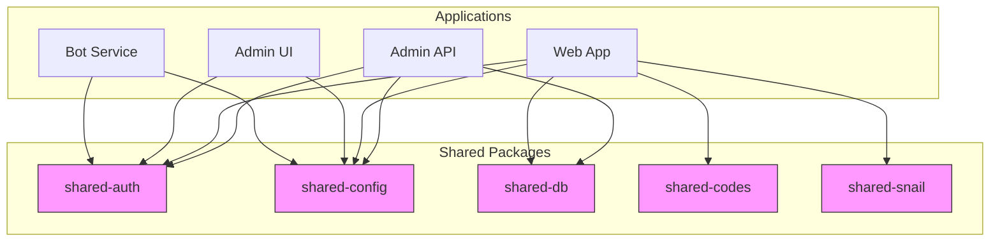
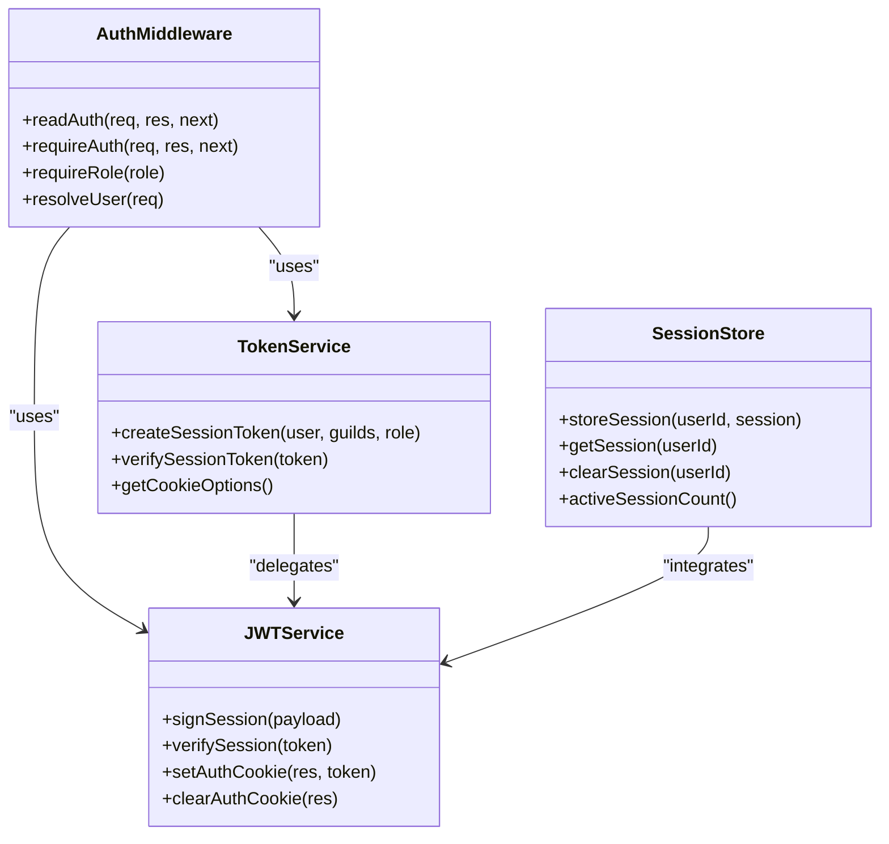
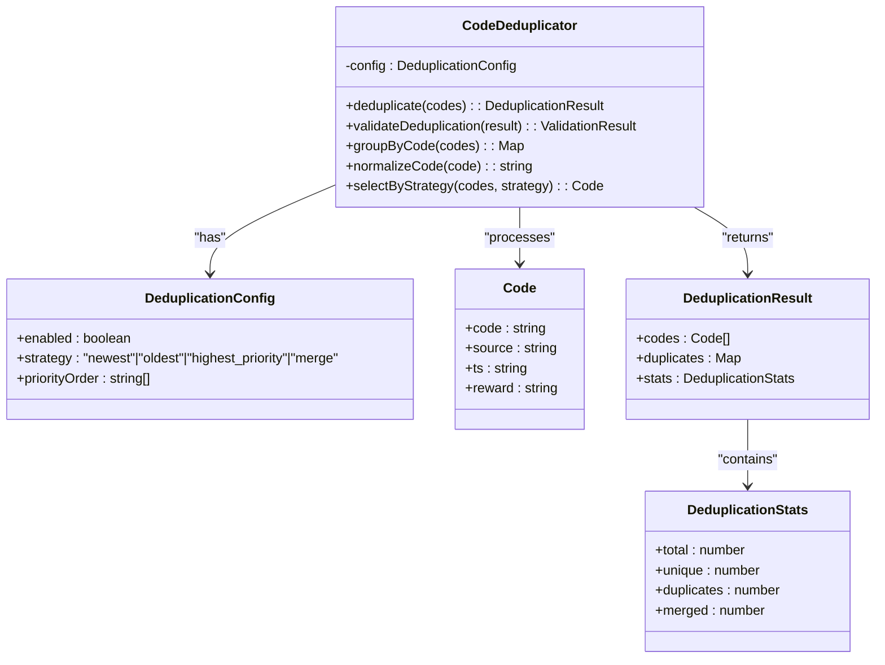
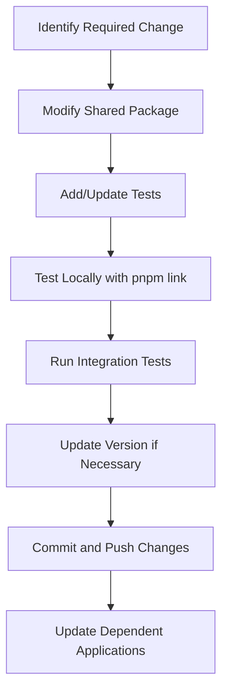

# Shared Packages

<cite>
**Referenced Files in This Document**   
- [auth.js](file://apps/admin-api/admin-api/src/middleware/auth.js)
- [jwt.js](file://apps/admin-api/lib/jwt.js)
- [token.js](file://apps/admin-api/src/services/token.js)
- [config.js](file://apps/admin-api/src/config.js)
- [database.js](file://apps/admin-api/lib/database.js)
- [deduplication.ts](file://apps/web/lib/codes/deduplication.ts)
- [session-store.js](file://apps/admin-api/lib/session-store.js)
- [shared-auth/package.json](file://packages/shared-auth/package.json)
- [shared-config/package.json](file://packages/shared-config/package.json)
- [shared-db/package.json](file://packages/shared-db/package.json)
- [shared-codes/package.json](file://packages/shared-codes/package.json)
- [shared-snail/package.json](file://packages/shared-snail/package.json)
</cite>

## Table of Contents
1. [Introduction](#introduction)
2. [Shared Packages Overview](#shared-packages-overview)
3. [Package Details](#package-details)
4. [Versioning Strategy](#versioning-strategy)
5. [Consumption Patterns](#consumption-patterns)
6. [Development Workflow](#development-workflow)
7. [Backward Compatibility](#backward-compatibility)
8. [Upgrade Procedures](#upgrade-procedures)
9. [Conclusion](#conclusion)

## Introduction
The Slimy Monorepo contains several shared packages designed to provide reusable components across multiple applications. This document details the architecture, usage, and maintenance of these shared packages: shared-auth for authentication logic, shared-config for configuration management, shared-db for database utilities, shared-codes for code processing functionality, and shared-snail for snail-related features. The documentation covers export interfaces, usage patterns, versioning strategy, and development workflows for modifying and testing these shared components.

## Shared Packages Overview

The monorepo's shared packages are organized in the `packages/` directory and follow a consistent naming convention with the `@slimy/` scope. These packages are designed to encapsulate cross-cutting concerns and provide standardized implementations across applications.



**Diagram sources**
- [shared-auth/package.json](file://packages/shared-auth/package.json)
- [shared-config/package.json](file://packages/shared-config/package.json)
- [shared-db/package.json](file://packages/shared-db/package.json)
- [shared-codes/package.json](file://packages/shared-codes/package.json)
- [shared-snail/package.json](file://packages/shared-snail/package.json)

**Section sources**
- [shared-auth/package.json](file://packages/shared-auth/package.json)
- [shared-config/package.json](file://packages/shared-config/package.json)
- [shared-db/package.json](file://packages/shared-db/package.json)
- [shared-codes/package.json](file://packages/shared-codes/package.json)
- [shared-snail/package.json](file://packages/shared-snail/package.json)

## Package Details

### shared-auth
The shared-auth package provides authentication and authorization functionality across the monorepo. It encapsulates JWT-based session management, cookie handling, and middleware for protecting routes.



**Diagram sources**
- [auth.js](file://apps/admin-api/admin-api/src/middleware/auth.js)
- [jwt.js](file://apps/admin-api/lib/jwt.js)
- [token.js](file://apps/admin-api/src/services/token.js)

**Section sources**
- [auth.js](file://apps/admin-api/admin-api/src/middleware/auth.js)
- [jwt.js](file://apps/admin-api/lib/jwt.js)
- [token.js](file://apps/admin-api/src/services/token.js)

### shared-config
The shared-config package manages configuration across applications, providing a consistent interface for accessing environment variables and application settings. It supports hierarchical configuration with defaults, environment-specific values, and runtime overrides.

**Section sources**
- [config.js](file://apps/admin-api/src/config.js)

### shared-db
The shared-db package provides database utilities and connection management. It abstracts database operations and provides a consistent interface for data access across applications. The package includes connection pooling, transaction management, and query optimization utilities.

**Section sources**
- [database.js](file://apps/admin-api/lib/database.js)

### shared-codes
The shared-codes package handles code processing functionality, particularly for the Super Snail game codes aggregation system. It provides deduplication, validation, and merging capabilities for code data from multiple sources.



**Diagram sources**
- [deduplication.ts](file://apps/web/lib/codes/deduplication.ts)

**Section sources**
- [deduplication.ts](file://apps/web/lib/codes/deduplication.ts)

### shared-snail
The shared-snail package provides snail-related features for the Super Snail game integration. It includes functionality for code tracking, screenshot analysis, stats monitoring, and tier calculation tools.

**Section sources**
- [app/snail/page.tsx](file://apps/web/app/snail/page.tsx)
- [pages/snail/index.js](file://apps/admin-ui/pages/snail/index.js)

## Versioning Strategy
The shared packages follow semantic versioning (semver) with the following guidelines:
- Major versions (X.0.0) for breaking changes that require modifications to consuming applications
- Minor versions (0.X.0) for backward-compatible feature additions
- Patch versions (0.0.X) for backward-compatible bug fixes

The monorepo uses a centralized version management approach through the pnpm workspace, ensuring consistent versioning across packages. All shared packages are initially versioned at 0.0.0, indicating they are in active development and may have breaking changes between releases.

**Section sources**
- [shared-auth/package.json](file://packages/shared-auth/package.json)
- [shared-config/package.json](file://packages/shared-config/package.json)
- [shared-db/package.json](file://packages/shared-db/package.json)
- [shared-codes/package.json](file://packages/shared-codes/package.json)
- [shared-snail/package.json](file://packages/shared-snail/package.json)

## Consumption Patterns
Applications consume shared packages through standard npm package dependencies managed by pnpm workspaces. The import patterns vary by package:

### Authentication Consumption
Applications use shared-auth through middleware integration:
```javascript
const { requireAuth, requireRole } = require('@slimy/shared-auth');
app.use('/protected', requireAuth, requireRole('admin'), handler);
```

### Configuration Consumption
Applications access configuration through a unified interface:
```javascript
const config = require('@slimy/shared-config');
const dbUrl = config.database.url;
const jwtSecret = config.jwt.secret;
```

### Database Consumption
Applications use shared-db for data access:
```javascript
const db = require('@slimy/shared-db');
const users = await db.query('SELECT * FROM users');
```

### Codes Consumption
Applications leverage shared-codes for code processing:
```javascript
const { getDeduplicator } = require('@slimy/shared-codes');
const deduplicator = getDeduplicator({ strategy: 'merge' });
const result = deduplicator.deduplicate(codes);
```

**Section sources**
- [auth.js](file://apps/admin-api/admin-api/src/middleware/auth.js)
- [config.js](file://apps/admin-api/src/config.js)
- [database.js](file://apps/admin-api/lib/database.js)
- [deduplication.ts](file://apps/web/lib/codes/deduplication.ts)

## Development Workflow
The development workflow for modifying shared packages follows these steps:

1. **Identify the shared package** that needs modification based on the required functionality change
2. **Implement changes** in the package's source directory with appropriate tests
3. **Test locally** using pnpm link or version bump to verify the changes work as expected
4. **Run integration tests** across dependent applications to ensure compatibility
5. **Commit and push** changes with appropriate version updates

When modifying shared packages, developers should:
- Update documentation for any interface changes
- Add or modify tests to cover new functionality
- Follow the existing code style and patterns
- Consider backward compatibility implications



**Diagram sources**
- [shared-auth/package.json](file://packages/shared-auth/package.json)
- [shared-config/package.json](file://packages/shared-config/package.json)
- [shared-db/package.json](file://packages/shared-db/package.json)
- [shared-codes/package.json](file://packages/shared-codes/package.json)
- [shared-snail/package.json](file://packages/shared-snail/package.json)

**Section sources**
- [shared-auth/package.json](file://packages/shared-auth/package.json)
- [shared-config/package.json](file://packages/shared-config/package.json)
- [shared-db/package.json](file://packages/shared-db/package.json)
- [shared-codes/package.json](file://packages/shared-codes/package.json)
- [shared-snail/package.json](file://packages/shared-snail/package.json)

## Backward Compatibility
Backward compatibility is maintained through several practices:

- **Deprecation cycle**: Mark features as deprecated before removal with clear migration paths
- **Feature flags**: Use configuration options to enable new behavior gradually
- **Interface stability**: Maintain stable public APIs and avoid breaking changes
- **Version pinning**: Allow applications to pin to specific versions during migration

For breaking changes, the following procedure is followed:
1. Announce the change in the team channel with timeline
2. Provide a migration guide with code examples
3. Maintain the old interface for one major version cycle
4. Remove deprecated functionality in the subsequent major version

**Section sources**
- [shared-auth/package.json](file://packages/shared-auth/package.json)
- [shared-config/package.json](file://packages/shared-config/package.json)
- [shared-db/package.json](file://packages/shared-db/package.json)
- [shared-codes/package.json](file://packages/shared-codes/package.json)
- [shared-snail/package.json](file://packages/shared-snail/package.json)

## Upgrade Procedures
Upgrading shared packages follows a standardized procedure:

1. **Check release notes** for breaking changes and migration requirements
2. **Update package version** in the application's package.json
3. **Run tests** to verify functionality
4. **Address deprecations** using the provided migration guide
5. **Deploy to staging** for integration testing
6. **Monitor logs** for any issues after deployment

For critical shared packages like shared-auth and shared-db, a phased rollout is recommended:
- Deploy to non-production environments first
- Monitor for 24-48 hours
- Deploy to production with rollback plan
- Verify all dependent services are functioning correctly

**Section sources**
- [shared-auth/package.json](file://packages/shared-auth/package.json)
- [shared-config/package.json](file://packages/shared-config/package.json)
- [shared-db/package.json](file://packages/shared-db/package.json)
- [shared-codes/package.json](file://packages/shared-codes/package.json)
- [shared-snail/package.json](file://packages/shared-snail/package.json)

## Conclusion
The shared packages in the Slimy Monorepo provide essential reusable components that promote consistency and reduce duplication across applications. By following the documented versioning strategy, consumption patterns, and development workflows, teams can effectively maintain and evolve these shared components while ensuring backward compatibility and smooth upgrades. The modular design allows for independent development and testing of shared functionality, enabling faster iteration and more reliable deployments across the monorepo ecosystem.