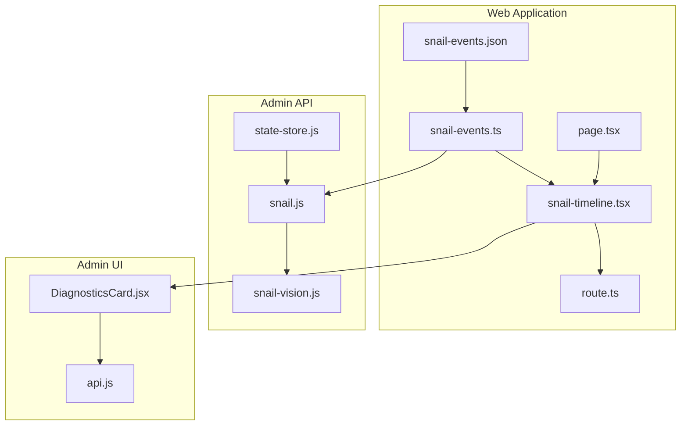
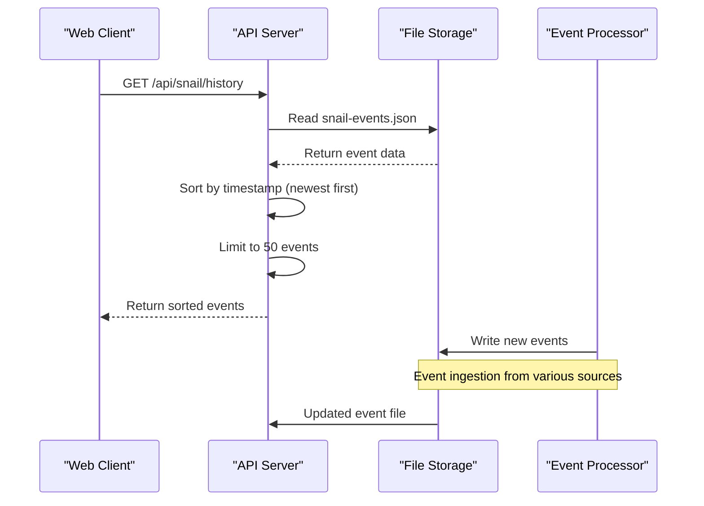
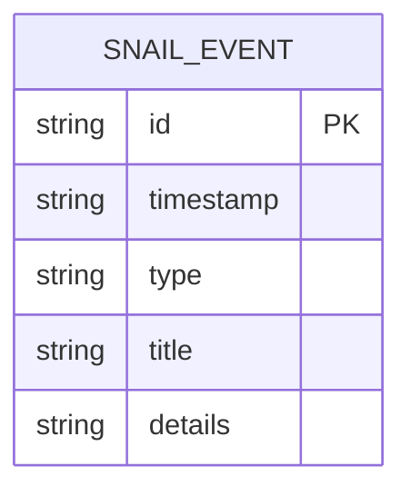
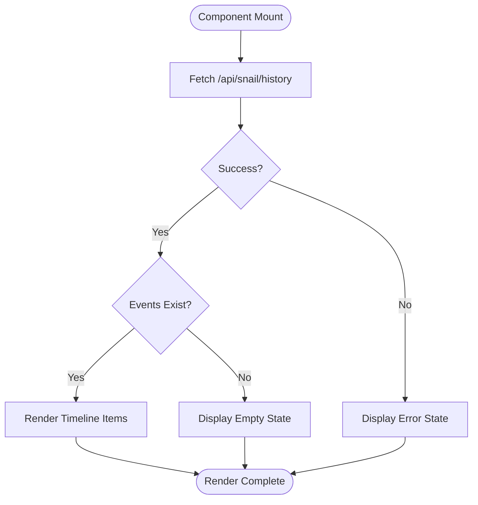
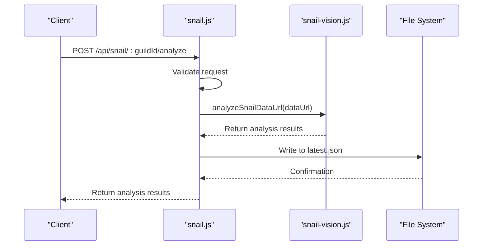
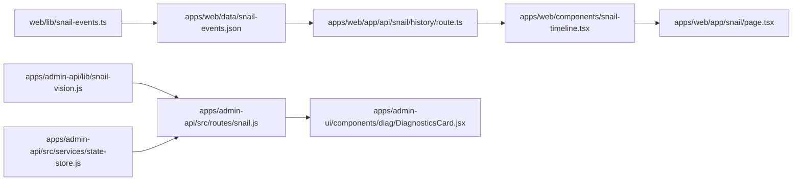

# Shared Snail Feature Package

<cite>
**Referenced Files in This Document**   
- [snail-events.ts](file://apps/web/lib/snail-events.ts)
- [snail-timeline.tsx](file://apps/web/components/snail-timeline.tsx)
- [DiagnosticsCard.jsx](file://apps/admin-ui/components/diag/DiagnosticsCard.jsx)
- [snail.js](file://apps/admin-api/src/routes/snail.js)
- [snail-vision.js](file://apps/admin-api/lib/snail-vision.js)
- [route.ts](file://apps/web/app/api/snail/history/route.ts)
- [state-store.js](file://apps/admin-api/src/services/state-store.js)
- [A4-snail-timeline.md](file://apps/web/docs/pr-plans/A4-snail-timeline.md)
- [page.tsx](file://apps/web/app/snail/page.tsx)
- [snail-events.json](file://apps/web/data/snail-events.json)
</cite>

## Table of Contents
1. [Introduction](#introduction)
2. [Project Structure](#project-structure)
3. [Core Components](#core-components)
4. [Architecture Overview](#architecture-overview)
5. [Detailed Component Analysis](#detailed-component-analysis)
6. [Dependency Analysis](#dependency-analysis)
7. [Performance Considerations](#performance-considerations)
8. [Troubleshooting Guide](#troubleshooting-guide)
9. [Conclusion](#conclusion)

## Introduction
The shared-snail package provides a unified system for managing snail-related data models, event processing, and timeline visualization across web and admin-ui applications. This documentation details the architecture, integration points, and usage patterns for the snail feature set, focusing on event schema definitions, history utilities, state management interfaces, and frontend display components. The system enables consistent tracking and visualization of snail game events, diagnostics, and user interactions across multiple application contexts.

## Project Structure
The shared-snail functionality is distributed across multiple applications within the monorepo, with core utilities in the web application and diagnostic capabilities in the admin-ui. The feature leverages file-backed storage for event data, API routes for data access, and reusable components for visualization.



**Diagram sources**
- [snail-events.ts](file://apps/web/lib/snail-events.ts)
- [snail-timeline.tsx](file://apps/web/components/snail-timeline.tsx)
- [route.ts](file://apps/web/app/api/snail/history/route.ts)
- [snail.js](file://apps/admin-api/src/routes/snail.js)
- [snail-vision.js](file://apps/admin-api/lib/snail-vision.js)
- [state-store.js](file://apps/admin-api/src/services/state-store.js)
- [DiagnosticsCard.jsx](file://apps/admin-ui/components/diag/DiagnosticsCard.jsx)

**Section sources**
- [snail-events.ts](file://apps/web/lib/snail-events.ts)
- [snail-timeline.tsx](file://apps/web/components/snail-timeline.tsx)
- [DiagnosticsCard.jsx](file://apps/admin-ui/components/diag/DiagnosticsCard.jsx)

## Core Components
The shared-snail package consists of several core components that work together to provide event tracking, visualization, and state management capabilities. The system is built around a file-backed event store that powers timeline displays in both web and admin interfaces. Key components include the SnailEvent interface definition, timeline rendering component, event ingestion from snail-vision.js, and state synchronization patterns that ensure consistency across applications.

**Section sources**
- [snail-events.ts](file://apps/web/lib/snail-events.ts#L9-L15)
- [snail-timeline.tsx](file://apps/web/components/snail-timeline.tsx#L8)
- [snail-vision.js](file://apps/admin-api/lib/snail-vision.js#L1-L4)

## Architecture Overview
The shared-snail architecture follows a client-server pattern with file-based persistence. Event data is structured using a consistent schema and stored in JSON format, accessible via API endpoints. Frontend components consume this data to render timelines and diagnostic information, while backend services process and generate events through various ingestion mechanisms.



**Diagram sources**
- [route.ts](file://apps/web/app/api/snail/history/route.ts)
- [snail-events.ts](file://apps/web/lib/snail-events.ts)
- [snail-events.json](file://apps/web/data/snail-events.json)

## Detailed Component Analysis

### Snail Event Schema and Data Model
The shared-snail package defines a consistent event schema used across applications for tracking snail-related activities. The SnailEvent interface specifies the structure of each event with required fields including id, timestamp, type, title, and details.



**Diagram sources**
- [snail-events.ts](file://apps/web/lib/snail-events.ts#L9-L15)
- [snail-events.json](file://apps/web/data/snail-events.json)

**Section sources**
- [snail-events.ts](file://apps/web/lib/snail-events.ts#L9-L15)
- [snail-events.json](file://apps/web/data/snail-events.json)

### Timeline Rendering Component
The SnailTimeline component provides a visual representation of snail events in chronological order. It fetches data from the history API and renders a timeline with proper styling and error handling for various states including loading, empty, and error conditions.



**Diagram sources**
- [snail-timeline.tsx](file://apps/web/components/snail-timeline.tsx)
- [route.ts](file://apps/web/app/api/snail/history/route.ts)

**Section sources**
- [snail-timeline.tsx](file://apps/web/components/snail-timeline.tsx)
- [page.tsx](file://apps/web/app/snail/page.tsx#L67-L71)

### Event Ingestion and Processing
The snail-vision.js module handles event ingestion through image analysis, processing screenshots to extract relevant data and generate corresponding events. This process integrates with the admin API routes to store and manage the extracted information.



**Diagram sources**
- [snail.js](file://apps/admin-api/src/routes/snail.js)
- [snail-vision.js](file://apps/admin-api/lib/snail-vision.js)

**Section sources**
- [snail.js](file://apps/admin-api/src/routes/snail.js)
- [snail-vision.js](file://apps/admin-api/lib/snail-vision.js)

### State Management and Synchronization
The state-store.js implementation provides a simple in-memory state management system with TTL-based expiration. This mechanism supports temporary state storage for various operations within the snail feature set, ensuring proper cleanup of transient data.

```mermaid
classDiagram
class StateStore {
+Map stateStore
+number STATE_TTL_MS
+prune()
+createState(metadata)
+consumeState(state)
}
StateStore : -prune() : void
StateStore : +createState(metadata : object) : string
StateStore : +consumeState(state : string) : object or null
```

**Diagram sources**
- [state-store.js](file://apps/admin-api/src/services/state-store.js)

**Section sources**
- [state-store.js](file://apps/admin-api/src/services/state-store.js)

## Dependency Analysis
The shared-snail package has dependencies across multiple applications and services within the monorepo. The web application depends on the admin-api for event data and processing, while the admin-ui consumes diagnostic information from the same backend services.



**Diagram sources**
- [snail-events.ts](file://apps/web/lib/snail-events.ts)
- [snail-events.json](file://apps/web/data/snail-events.json)
- [route.ts](file://apps/web/app/api/snail/history/route.ts)
- [snail-timeline.tsx](file://apps/web/components/snail-timeline.tsx)
- [page.tsx](file://apps/web/app/snail/page.tsx)
- [snail-vision.js](file://apps/admin-api/lib/snail-vision.js)
- [snail.js](file://apps/admin-api/src/routes/snail.js)
- [DiagnosticsCard.jsx](file://apps/admin-ui/components/diag/DiagnosticsCard.jsx)
- [state-store.js](file://apps/admin-api/src/services/state-store.js)

**Section sources**
- [snail-events.ts](file://apps/web/lib/snail-events.ts)
- [snail.js](file://apps/admin-api/src/routes/snail.js)
- [state-store.js](file://apps/admin-api/src/services/state-store.js)

## Performance Considerations
The shared-snail implementation uses file-based storage with caching mechanisms to balance simplicity and performance. The system limits event retrieval to 50 items and implements API response caching with a 60-second revalidation period. For large timelines, the current implementation may benefit from pagination or database-backed storage in future iterations. The file reading operations are synchronous but limited to a small dataset, minimizing performance impact.

**Section sources**
- [snail-events.ts](file://apps/web/lib/snail-events.ts#L18)
- [route.ts](file://apps/web/app/api/snail/history/route.ts#L5)

## Troubleshooting Guide
Common issues with the shared-snail package typically involve event data not appearing in the timeline or diagnostic components failing to load. Ensure the snail-events.json file exists and contains valid JSON data. Verify that the API routes are properly configured and accessible. Check file permissions for the data directory and ensure the server has read/write access. For state-related issues, confirm that the state-store is properly initialized and not exceeding its TTL limits.

**Section sources**
- [snail-events.ts](file://apps/web/lib/snail-events.ts#L33-L36)
- [route.ts](file://apps/web/app/api/snail/history/route.ts#L20-L29)
- [DiagnosticsCard.jsx](file://apps/admin-ui/components/diag/DiagnosticsCard.jsx#L10-L13)

## Conclusion
The shared-snail package provides a comprehensive solution for managing snail-related data models, event processing, and timeline visualization across the application ecosystem. By standardizing on a consistent event schema and providing reusable components for display and processing, the system ensures a cohesive user experience. The architecture balances simplicity with functionality, using file-based storage for ease of implementation while providing extensible interfaces for future enhancements. Integration with both web and admin-ui applications demonstrates the package's versatility in serving different user needs and contexts.