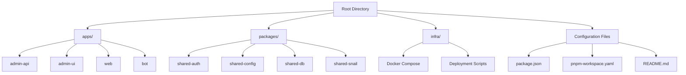
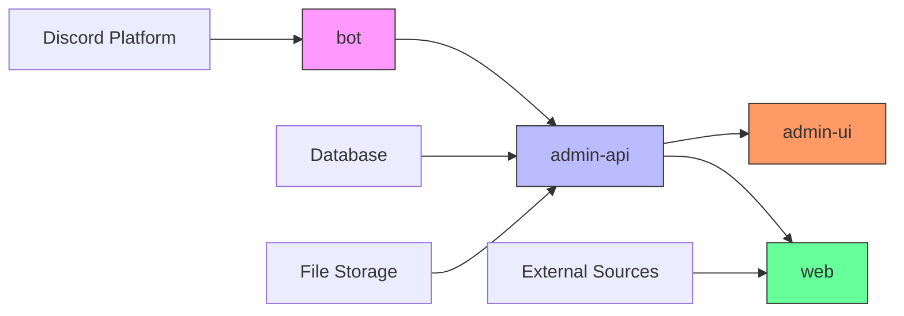
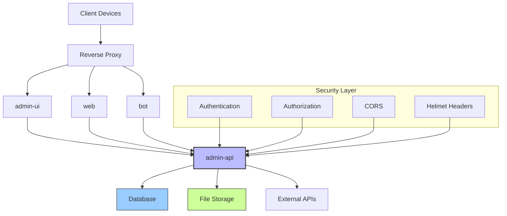
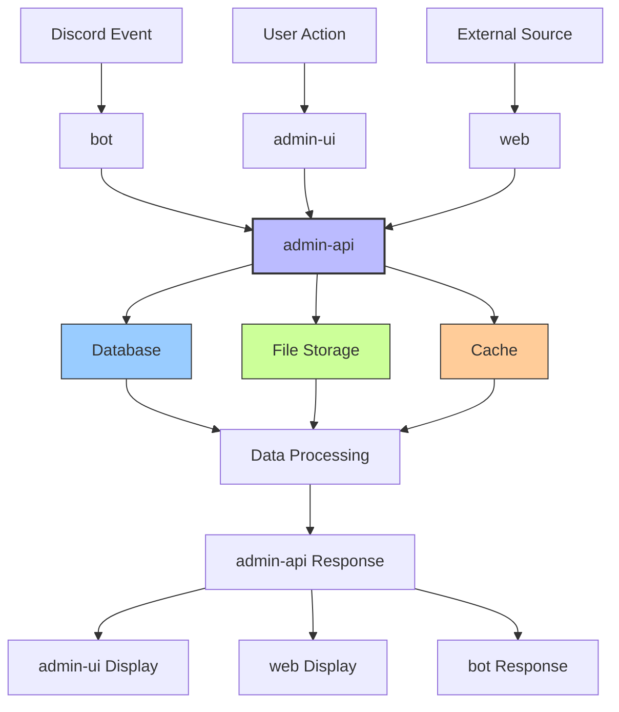
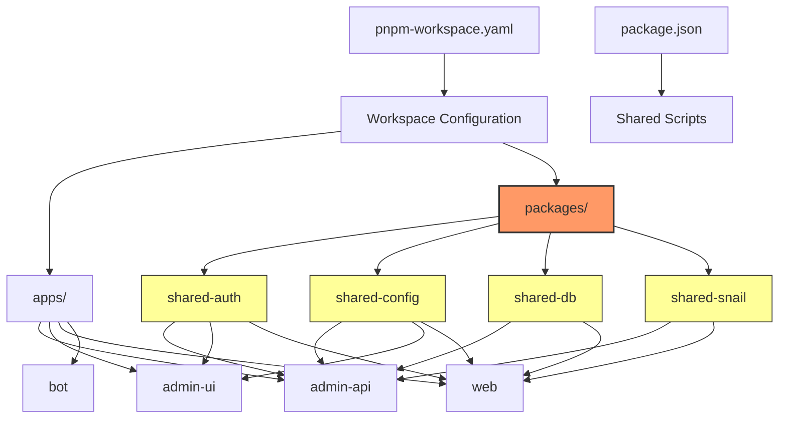
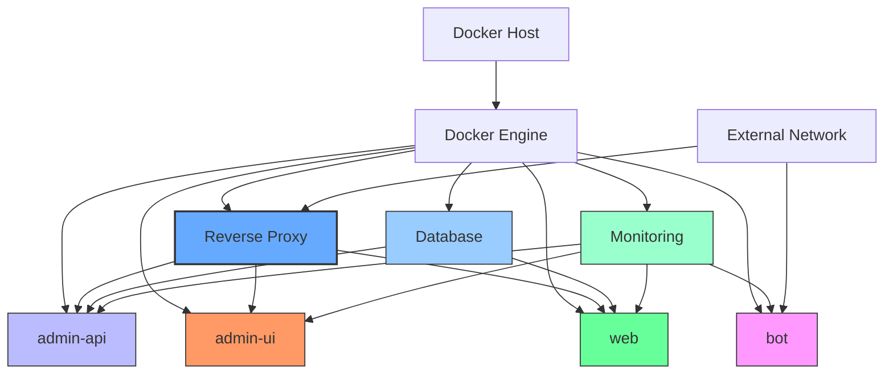

# System Overview

<cite>
**Referenced Files in This Document**   
- [README.md](file://README.md)
- [package.json](file://package.json)
- [pnpm-workspace.yaml](file://pnpm-workspace.yaml)
- [apps/admin-api/README.md](file://apps/admin-api/README.md)
- [apps/admin-ui/README.md](file://apps/admin-ui/README.md)
- [apps/web/README.md](file://apps/web/README.md)
- [apps/bot/README.md](file://apps/bot/README.md)
- [apps/admin-api/src/app.js](file://apps/admin-api/src/app.js)
- [apps/admin-api/server.js](file://apps/admin-api/server.js)
- [apps/admin-ui/pages/_app.js](file://apps/admin-ui/pages/_app.js)
- [apps/web/next.config.js](file://apps/web/next.config.js)
- [apps/admin-api/src/routes/auth.js](file://apps/admin-api/src/routes/auth.js)
- [apps/admin-api/src/routes/guilds.js](file://apps/admin-api/src/routes/guilds.js)
- [apps/admin-ui/lib/api.js](file://apps/admin-ui/lib/api.js)
- [apps/web/lib/api-client.ts](file://apps/web/lib/api-client.ts)
- [infra/docker/docker-compose.slimy-nuc1.yml](file://infra/docker/docker-compose.slimy-nuc1.yml)
- [docker-compose.yml](file://docker-compose.yml)
</cite>

## Table of Contents
1. [Introduction](#introduction)
2. [Project Structure](#project-structure)
3. [Core Components](#core-components)
4. [Architecture Overview](#architecture-overview)
5. [Data Flow](#data-flow)
6. [Monorepo Structure and Shared Packages](#monorepo-structure-and-shared-packages)
7. [Deployment Topology](#deployment-topology)
8. [Key Design Decisions](#key-design-decisions)
9. [Conclusion](#conclusion)

## Introduction

The Slimy Monorepo platform is a full-stack Discord bot ecosystem designed to provide administrative interfaces, data processing pipelines, and public web services for the Slimy.ai bot. The system enables Discord server administrators to configure and monitor bot behavior, analyze club performance metrics, and manage user interactions through a comprehensive suite of tools. The architecture is built around a monorepo structure using pnpm workspaces, which facilitates code sharing and consistent development workflows across multiple applications.

The platform consists of four primary applications: admin-api (backend service), admin-ui (administrative dashboard), web (public-facing website), and bot (Discord integration). These components work together to process Discord events, store and analyze data, and present information through both administrative and public interfaces. The system is designed with separation of concerns, security, and scalability in mind, using modern web technologies and deployment practices.

**Section sources**
- [README.md](file://README.md)
- [apps/admin-api/README.md](file://apps/admin-api/README.md)
- [apps/admin-ui/README.md](file://apps/admin-ui/README.md)
- [apps/web/README.md](file://apps/web/README.md)
- [apps/bot/README.md](file://apps/bot/README.md)

## Project Structure

The Slimy Monorepo follows a well-organized directory structure that separates applications, shared packages, and infrastructure components. The root directory contains configuration files for the monorepo workspace, while the main components are organized into three top-level directories: apps, packages, and infra.

The `apps/` directory contains four distinct applications:
- `admin-api`: Express.js backend service for administrative functions
- `admin-ui`: Next.js dashboard for bot management
- `web`: Public-facing website with documentation and tools
- `bot`: Discord bot implementation

The `packages/` directory hosts shared libraries that can be consumed across multiple applications, promoting code reuse and consistency. The `infra/` directory contains Docker configuration and deployment scripts for containerized deployment.

**Diagram sources**
- [README.md](file://README.md)
- [package.json](file://package.json)
- [pnpm-workspace.yaml](file://pnpm-workspace.yaml)

**Section sources**
- [README.md](file://README.md)
- [package.json](file://package.json)
- [pnpm-workspace.yaml](file://pnpm-workspace.yaml)

## Core Components

The Slimy Monorepo platform consists of four core applications that work together to provide a comprehensive Discord bot ecosystem. Each component has a specific role and responsibility within the system architecture.

The **admin-api** is an Express.js REST API that serves as the backend service for administrative functions. It handles authentication, session management, and provides endpoints for managing guild settings, club analytics, and file uploads. The API uses JWT tokens in httpOnly cookies for authentication and maintains server-side session storage to avoid cookie size limitations.

The **admin-ui** is a Next.js 14 application that provides an administrative dashboard for managing the Discord bot. It communicates with the admin-api to display guild information, manage settings, and view diagnostics. The UI includes features like a multi-file uploader, Google Sheet integration, and real-time diagnostics.

The **web** application is the public-facing website for Slimy.ai, built with Next.js 16, TypeScript, and Tailwind CSS. It serves as the primary interface for users, providing documentation, code aggregation from multiple sources, and role-based access to different features.

The **bot** component is the Discord integration that listens to events and interacts with users. Currently in scaffold form, it will be migrated from existing services to handle club analytics, user interactions, and command processing.

**Diagram sources**
- [apps/admin-api/README.md](file://apps/admin-api/README.md)
- [apps/admin-ui/README.md](file://apps/admin-ui/README.md)
- [apps/web/README.md](file://apps/web/README.md)
- [apps/bot/README.md](file://apps/bot/README.md)

**Section sources**
- [apps/admin-api/README.md](file://apps/admin-api/README.md)
- [apps/admin-ui/README.md](file://apps/admin-ui/README.md)
- [apps/web/README.md](file://apps/web/README.md)
- [apps/bot/README.md](file://apps/bot/README.md)

## Architecture Overview

The Slimy Monorepo platform follows a microservices-inspired architecture with clear separation of concerns between components. The system is designed around an API Gateway pattern, where the admin-api serves as the central backend service that handles authentication, data processing, and integration with external systems.

The architecture consists of three main layers: presentation, application, and data. The presentation layer includes the admin-ui and web applications, which provide user interfaces for administrators and public users. The application layer is centered around the admin-api, which exposes REST endpoints for all functionality. The data layer includes database storage and file storage systems.

Communication between components follows a client-server pattern, with the frontend applications making HTTP requests to the admin-api. The admin-api validates requests, processes business logic, and interacts with the database and file storage systems. The Discord bot will eventually communicate with the admin-api to receive configuration and send processed data.

Security is implemented at multiple levels, including JWT authentication with httpOnly cookies, CORS restrictions, and Helmet.js security headers. The system uses server-side session storage to maintain user sessions while keeping JWT tokens small and within browser size limits.

**Diagram sources**
- [apps/admin-api/src/app.js](file://apps/admin-api/src/app.js)
- [apps/admin-api/server.js](file://apps/admin-api/server.js)
- [apps/admin-api/README.md](file://apps/admin-api/README.md)

**Section sources**
- [apps/admin-api/README.md](file://apps/admin-api/README.md)
- [apps/admin-api/src/app.js](file://apps/admin-api/src/app.js)
- [apps/admin-api/server.js](file://apps/admin-api/server.js)

## Data Flow

The data flow in the Slimy Monorepo platform follows a structured path from user interaction through processing to storage and presentation. The system is designed to handle Discord events, user inputs, and external data sources, processing them through well-defined pipelines.

When a user interacts with the Discord bot, events are captured and processed by the bot component. The bot validates the input and forwards relevant data to the admin-api for storage and further processing. For administrative actions, users interact with the admin-ui, which sends authenticated requests to the admin-api.

The admin-api processes incoming requests through a middleware pipeline that includes authentication, logging, and validation. Authenticated requests are routed to appropriate handlers that interact with the database or perform business logic operations. For file uploads, the admin-api processes images and stores them in the designated upload directory.

Data from external sources, such as Reddit and Snelp API, is aggregated by the web application's codes aggregator. This data is deduplicated, cached, and made available through API endpoints. Club analytics data is processed from uploaded screenshots and stored in the database for later retrieval.

The final presentation layer retrieves data from the admin-api through server-side proxies or direct API calls, formatting it for display in the admin-ui or public web interface. Caching is implemented at multiple levels to improve performance and reduce load on backend services.

**Diagram sources**
- [apps/admin-api/src/app.js](file://apps/admin-api/src/app.js)
- [apps/admin-api/src/routes/auth.js](file://apps/admin-api/src/routes/auth.js)
- [apps/admin-api/src/routes/guilds.js](file://apps/admin-api/src/routes/guilds.js)
- [apps/admin-ui/lib/api.js](file://apps/admin-ui/lib/api.js)
- [apps/web/lib/api-client.ts](file://apps/web/lib/api-client.ts)

**Section sources**
- [apps/admin-api/README.md](file://apps/admin-api/README.md)
- [apps/admin-ui/README.md](file://apps/admin-ui/README.md)
- [apps/web/README.md](file://apps/web/README.md)

## Monorepo Structure and Shared Packages

The Slimy Monorepo utilizes pnpm workspaces to manage multiple applications and shared packages within a single repository. This structure enables efficient code sharing, consistent dependency management, and streamlined development workflows across the entire platform.

The monorepo is configured through the `pnpm-workspace.yaml` file, which defines the workspace patterns to include all applications and packages. The root `package.json` contains shared scripts that can operate on specific workspaces using pnpm filters, allowing developers to run commands like `pnpm dev:web` or `pnpm test:admin-api` to target individual applications.

The `packages/` directory contains shared libraries that can be imported by any application in the monorepo. These include:
- `shared-auth`: Authentication utilities and types
- `shared-config`: Configuration management and environment variables
- `shared-db`: Database connection and query utilities
- `shared-snail`: Domain-specific logic for snail game analytics

This shared package architecture promotes code reuse and ensures consistency across applications. For example, authentication logic can be implemented once in `shared-auth` and used by both the admin-api and web applications. Similarly, database utilities in `shared-db` provide a consistent interface for data access across the platform.

The monorepo structure also facilitates coordinated versioning and deployment of related components. When changes are made to a shared package, all dependent applications can be tested and deployed together, reducing the risk of compatibility issues.

**Diagram sources**
- [package.json](file://package.json)
- [pnpm-workspace.yaml](file://pnpm-workspace.yaml)
- [packages/shared-auth/package.json](file://packages/shared-auth/package.json)
- [packages/shared-config/package.json](file://packages/shared-config/package.json)
- [packages/shared-db/package.json](file://packages/shared-db/package.json)
- [packages/shared-snail/package.json](file://packages/shared-snail/package.json)

**Section sources**
- [package.json](file://package.json)
- [pnpm-workspace.yaml](file://pnpm-workspace.yaml)
- [README.md](file://README.md)

## Deployment Topology

The Slimy Monorepo platform is designed for containerized deployment using Docker and Docker Compose. The system can be deployed in various configurations depending on the environment, with separate compose files for monitoring, production, and testing scenarios.

The primary deployment configuration is defined in `docker-compose.yml`, which orchestrates the core services. Additional specialized configurations are available in the `infra/docker/` directory, including `docker-compose.slimy-nuc1.yml` and `docker-compose.slimy-nuc2.yml` for specific hardware deployments.

Each application is containerized with its own Dockerfile, allowing for independent scaling and deployment. The admin-api, admin-ui, and web applications are exposed through a reverse proxy (Caddy) that handles SSL termination and routing. The bot component runs as a separate service that connects to the Discord API.

The deployment topology includes monitoring services such as Prometheus and Grafana, configured through dedicated compose files like `docker-compose.monitoring.yml`. These services collect metrics from the applications and provide dashboards for system observability.

Database services and persistent storage are configured as separate containers with volume mounts to ensure data persistence across container restarts. The system is designed to run on Linux servers with systemd services for process management and automatic restarts.

**Diagram sources**
- [docker-compose.yml](file://docker-compose.yml)
- [infra/docker/docker-compose.slimy-nuc1.yml](file://infra/docker/docker-compose.slimy-nuc1.yml)
- [apps/admin-api/Dockerfile](file://apps/admin-api/Dockerfile)
- [apps/admin-ui/Dockerfile](file://apps/admin-ui/Dockerfile)
- [apps/web/Dockerfile](file://apps/web/Dockerfile)

**Section sources**
- [docker-compose.yml](file://docker-compose.yml)
- [infra/docker/docker-compose.slimy-nuc1.yml](file://infra/docker/docker-compose.slimy-nuc1.yml)
- [DOCKER_DEPLOYMENT.md](file://DOCKER_DEPLOYMENT.md)

## Key Design Decisions

The Slimy Monorepo platform incorporates several key design decisions that shape its architecture and functionality. These decisions reflect careful consideration of security, performance, maintainability, and user experience requirements.

The **API Gateway pattern** is implemented through the admin-api, which serves as the single entry point for all backend functionality. This centralized approach simplifies authentication, logging, and rate limiting while providing a consistent interface for frontend applications. The admin-api handles all data validation, business logic, and integration with external services, ensuring that frontend applications remain focused on presentation.

**Separation of concerns** is enforced through the distinct roles of each application. The admin-api handles backend logic, the admin-ui provides administrative functions, the web application serves public content, and the bot manages Discord interactions. This separation allows each component to be developed, tested, and deployed independently while maintaining clear interfaces between them.

**Security by design** is implemented through multiple layers of protection. Authentication uses JWT tokens in httpOnly cookies with secure flags, preventing XSS attacks. The system recently addressed a cookie size issue by moving guild data to server-side session storage, reducing JWT size from 18KB to 307 bytes. CORS restrictions, Helmet.js security headers, and input validation further enhance the security posture.

**Performance optimization** is achieved through caching at multiple levels. The codes aggregator implements 60-second server-side caching, while static file serving includes 7-day cache headers. Database queries are optimized, and guild loading was improved by changing from sequential to parallel processing, reducing load times from 10-20 seconds to 1-2 seconds.

**Monorepo benefits** are leveraged through pnpm workspaces and shared packages, enabling code reuse and consistent development practices. This structure facilitates coordinated updates to related components and simplifies dependency management across the platform.

```mermaid
graph TD
A[Key Design Decisions] --> B[API Gateway Pattern]
A --> C[Separation of Concerns]
A --> D[Security by Design]
A --> E[Performance Optimization]
A --> F[Monorepo Benefits]
B --> B1[Single Entry Point]
B --> B2[Consistent Interface]
B --> B3[Centralized Auth]
C --> C1[Independent Components]
C --> C2[Clear Interfaces]
C --> C3[Separate Deployment]
D --> D1[JWT in httpOnly Cookies]
D --> D2[Server-side Sessions]
D --> D3[CORS Restrictions]
D --> D4[Helmet Security Headers]
E --> E1[Multi-level Caching]
E --> E2[Parallel Processing]
E --> E3[Database Optimization]
F --> F1[Code Reuse]
F --> F2[Consistent Practices]
F --> F3[Coordinated Updates]
style B fill:#f96,stroke:#333
style C fill:#f96,stroke:#333
style D fill:#f96,stroke:#333
style E fill:#f96,stroke:#333
style F fill:#f96,stroke:#333
```

**Diagram sources**
- [apps/admin-api/README.md](file://apps/admin-api/README.md)
- [apps/admin-api/src/app.js](file://apps/admin-api/src/app.js)
- [apps/admin-api/src/middleware/auth.js](file://apps/admin-api/src/middleware/auth.js)
- [apps/web/lib/codes-aggregator.ts](file://apps/web/lib/codes-aggregator.ts)

**Section sources**
- [apps/admin-api/README.md](file://apps/admin-api/README.md)
- [apps/admin-api/src/app.js](file://apps/admin-api/src/app.js)
- [apps/admin-api/src/middleware/auth.js](file://apps/admin-api/src/middleware/auth.js)

## Conclusion

The Slimy Monorepo platform represents a comprehensive full-stack Discord bot ecosystem with well-defined architecture and thoughtful design decisions. By leveraging a monorepo structure with pnpm workspaces, the system enables efficient code sharing and consistent development practices across multiple applications.

The architecture follows a clear separation of concerns, with specialized components for backend services (admin-api), administrative interfaces (admin-ui), public web content (web), and Discord integration (bot). The API Gateway pattern implemented through the admin-api provides a centralized entry point for all functionality, simplifying security, logging, and maintenance.

Key technical decisions, such as the use of server-side session storage to address cookie size limitations and the implementation of parallel processing for improved performance, demonstrate attention to both user experience and system efficiency. The containerized deployment model using Docker and Docker Compose ensures consistent environments across development, testing, and production.

For developers, the platform offers a well-organized codebase with shared packages that promote code reuse and consistency. The comprehensive documentation and defined development workflows make it accessible for new contributors while providing the flexibility needed for ongoing enhancement and scaling.

The Slimy Monorepo platform is positioned for continued growth and evolution, with a solid foundation that supports the addition of new features, integration with additional services, and expansion to support more Discord communities.

**Section sources**
- [README.md](file://README.md)
- [apps/admin-api/README.md](file://apps/admin-api/README.md)
- [apps/admin-ui/README.md](file://apps/admin-ui/README.md)
- [apps/web/README.md](file://apps/web/README.md)