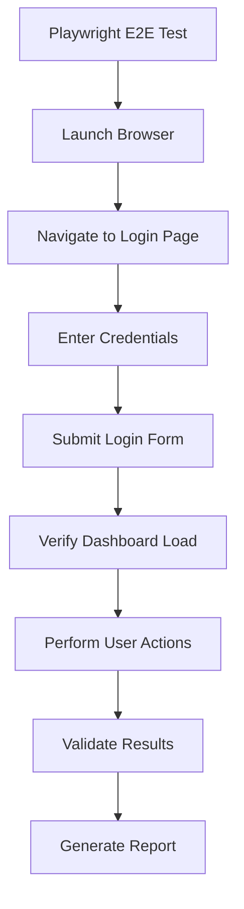
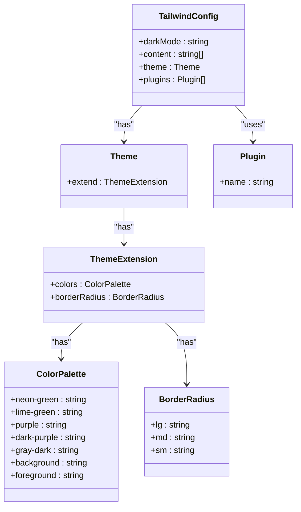

# Technology Stack

<cite>
**Referenced Files in This Document**   
- [apps/web/package.json](file://apps/web/package.json)
- [apps/admin-api/package.json](file://apps/admin-api/package.json)
- [apps/bot/package.json](file://apps/bot/package.json)
- [package.json](file://package.json)
- [pnpm-workspace.yaml](file://pnpm-workspace.yaml)
- [apps/web/tsconfig.json](file://apps/web/tsconfig.json)
- [apps/bot/tsconfig.json](file://apps/bot/tsconfig.json)
- [apps/web/eslint.config.mjs](file://apps/web/eslint.config.mjs)
- [apps/web/tailwind.config.ts](file://apps/web/tailwind.config.ts)
- [apps/admin-api/prometheus.yml](file://apps/admin-api/prometheus.yml)
- [apps/web/docker-compose.yml](file://apps/web/docker-compose.yml)
- [apps/web/Dockerfile](file://apps/web/Dockerfile)
- [apps/admin-api/Dockerfile](file://apps/admin-api/Dockerfile)
- [apps/web/playwright.config.ts](file://apps/web/playwright.config.ts)
- [apps/web/vitest.config.ts](file://apps/web/vitest.config.ts)
- [apps/admin-api/jest.config.js](file://apps/admin-api/jest.config.js)
</cite>

## Table of Contents
1. [Introduction](#introduction)
2. [Core Application Technologies](#core-application-technologies)
3. [TypeScript and JavaScript Usage](#typescript-and-javascript-usage)
4. [Testing Stack](#testing-stack)
5. [Infrastructure and Deployment](#infrastructure-and-deployment)
6. [Monitoring and Observability](#monitoring-and-observability)
7. [Build and Development Tools](#build-and-development-tools)
8. [Version Compatibility and Rationale](#version-compatibility-and-rationale)
9. [Conclusion](#conclusion)

## Introduction

The Slimy Monorepo represents a modern full-stack application architecture with specialized services for different domains. This document details the comprehensive technology stack powering the platform, including web applications, API services, bot functionality, and supporting infrastructure. The architecture leverages a monorepo approach with pnpm workspaces to manage dependencies across multiple applications while maintaining service isolation and independent deployment capabilities.

**Section sources**
- [package.json](file://package.json)
- [pnpm-workspace.yaml](file://pnpm-workspace.yaml)

## Core Application Technologies

The Slimy Monorepo implements a service-oriented architecture with three primary applications, each utilizing specialized technologies for their respective domains.

### Next.js 16 for Web Application

The primary web application is built using Next.js 16, leveraging the latest React 19 features for enhanced performance and developer experience. The application follows the App Router pattern with Server Components, enabling efficient data fetching and rendering strategies. Key features include:

- **Turbopack Development**: The dev script uses Turbopack (`next dev --turbopack`) for significantly faster compilation and hot module replacement during development.
- **Static Site Generation (SSG) and Server-Side Rendering (SSR)**: Implemented through the App Router for optimal performance and SEO.
- **API Routes**: The `app/api` directory contains route handlers for various endpoints, including authentication, chat functionality, club operations, and analytics.
- **MDX Support**: Integrated via `@next/mdx` for rich content rendering in documentation and marketing pages.

The web application serves as the primary user interface, providing dashboard functionality, chat interfaces, club management tools, and analytics visualization.

**Section sources**
- [apps/web/package.json](file://apps/web/package.json)
- [apps/web/next.config.js](file://apps/web/next.config.js)

### Express.js for Admin-API

The admin-api service is built on Express.js, providing a robust RESTful API for administrative operations and backend services. This service acts as the middleware layer between the frontend applications and various data sources, handling business logic, authentication, and integration with external services.

Key characteristics of the Express.js implementation:
- **Middleware Architecture**: Extensive use of Express middleware for authentication, rate limiting, error handling, and security.
- **RESTful Design**: Organized routes for authentication, guild management, chat operations, club data processing, and system diagnostics.
- **Production-Ready Configuration**: Uses compression, helmet for security headers, and morgan for request logging.
- **Direct Execution**: The service runs directly from source without a build step, as indicated by the build script message.

The admin-api serves as the central coordination point for administrative functionality, exposing endpoints used by both the web and admin-ui applications.

**Section sources**
- [apps/admin-api/package.json](file://apps/admin-api/package.json)
- [apps/admin-api/server.js](file://apps/admin-api/server.js)

### discord.js for Bot Service

The bot service is implemented using discord.js, a powerful library for creating Discord bots. This service handles interactions with Discord servers, processing events, commands, and messages according to the application's requirements.

Key aspects of the discord.js implementation:
- **Modern TypeScript Support**: The bot is written in TypeScript with a dedicated tsconfig.json configuration.
- **Event-Driven Architecture**: Handles Discord events and commands through the discord.js event system.
- **Modular Design**: Organized with separate directories for commands, utilities, and core functionality.
- **Development Workflow**: Uses tsx for development with file watching, enabling hot reloading during development.

The bot service extends the platform's functionality within Discord, enabling real-time interactions, automated responses, and community management features.

**Section sources**
- [apps/bot/package.json](file://apps/bot/package.json)
- [apps/bot/src/index.ts](file://apps/bot/src/index.ts)

### Prisma ORM for Database Operations

Prisma ORM is used across multiple services for database operations, providing a type-safe and efficient interface for data access. The implementation is consistent across both the web application and admin-api service.

Key features of the Prisma implementation:
- **Type Safety**: Generates TypeScript types from the database schema, ensuring compile-time type checking for database operations.
- **Migration Management**: Uses Prisma Migrate for schema evolution with version-controlled migration files.
- **Client Generation**: The `prisma:generate` script generates the Prisma Client based on the schema definition.
- **Cross-Service Usage**: Both the web application and admin-api service use Prisma, indicating a shared database strategy.

The Prisma schema and migrations are located in the respective service directories, with the web application containing the primary schema definition and migration history.

**Section sources**
- [apps/web/package.json](file://apps/web/package.json#L21-L22)
- [apps/admin-api/package.json](file://apps/admin-api/package.json#L20)
- [apps/web/prisma/schema.prisma](file://apps/web/prisma/schema.prisma)

## TypeScript and JavaScript Usage

The technology stack employs a hybrid approach to language usage, leveraging TypeScript for new development while maintaining compatibility with existing JavaScript modules.

### TypeScript Implementation

TypeScript is the primary language for new development across the monorepo, with specific configurations tailored to each service:

- **Web Application**: Uses TypeScript with Next.js integration, configured in `tsconfig.json` with Next.js plugins and appropriate paths for module resolution.
- **Bot Service**: Implements modern TypeScript with ES2022 target and ESNext modules, configured for compilation to a `dist` directory.
- **Type Safety**: Both services enforce strict type checking with `"strict": true` in their TypeScript configurations.

The type system is further enhanced by:
- **Zod for Runtime Validation**: Used in both web and admin-api services for schema validation.
- **Generated Types**: Prisma generates TypeScript types from the database schema, ensuring type safety across the application stack.

**Section sources**
- [apps/web/tsconfig.json](file://apps/web/tsconfig.json)
- [apps/bot/tsconfig.json](file://apps/bot/tsconfig.json)

### JavaScript in Legacy Modules

JavaScript is used in legacy modules and specific components where TypeScript adoption has not yet occurred. This includes:
- **Admin-API Middleware**: Many middleware components in the admin-api service are written in JavaScript.
- **Utility Libraries**: Various utility functions and libraries across the monorepo remain in JavaScript.
- **Configuration Files**: Some configuration files use JavaScript syntax.

The coexistence of TypeScript and JavaScript is facilitated by:
- **allowJs Configuration**: The web application's tsconfig.json includes `"allowJs": true`, enabling the use of JavaScript files in a TypeScript project.
- **Gradual Migration**: The architecture supports a gradual migration from JavaScript to TypeScript without requiring a complete rewrite.

This hybrid approach allows the team to leverage TypeScript's benefits for new development while maintaining existing functionality.

**Section sources**
- [apps/admin-api/src/middleware](file://apps/admin-api/src/middleware)
- [apps/admin-api/lib](file://apps/admin-api/lib)

## Testing Stack

The testing strategy employs a comprehensive suite of tools for different testing levels, ensuring code quality and reliability across the monorepo.

### Jest for Admin-API Testing

The admin-api service uses Jest as its primary testing framework, configured for unit and integration testing of Express.js routes and middleware.

Key aspects of the Jest configuration:
- **Test Coverage**: The `test:coverage` script generates coverage reports to measure test effectiveness.
- **Watch Mode**: The `test:watch` script enables interactive development with automatic test re-running.
- **Integration Testing**: Tests include integration tests for API routes, authentication flows, and error handling.
- **Mocking**: Uses Jest's built-in mocking capabilities to isolate components during testing.

The test suite is located in the `tests` directory of the admin-api service, with a clear organization separating unit tests, integration tests, and API route tests.

**Section sources**
- [apps/admin-api/package.json](file://apps/admin-api/package.json#L12-L14)
- [apps/admin-api/jest.config.js](file://apps/admin-api/jest.config.js)

### Vitest for Web Application Testing

The web application uses Vitest as its primary testing framework, leveraging its speed and Vite integration for efficient testing of React components and utilities.

Key features of the Vitest implementation:
- **Fast Execution**: Built on Vite, providing rapid test startup and execution.
- **Coverage Reporting**: The `test:coverage` script generates detailed coverage reports.
- **Module Mocking**: Integrated with Vite's module resolution for effective mocking of dependencies.
- **TypeScript Support**: Native TypeScript support without additional configuration.

Vitest is particularly well-suited for testing React components, hooks, and client-side utilities in the Next.js application.

**Section sources**
- [apps/web/package.json](file://apps/web/package.json#L14-L15)
- [apps/web/vitest.config.ts](file://apps/web/vitest.config.ts)

### Playwright for E2E Testing

Playwright is used for end-to-end testing across the web application, providing reliable browser automation for critical user flows.

Key aspects of the Playwright implementation:
- **Comprehensive Coverage**: Tests include authentication flows, chat functionality, club analytics, and navigation.
- **Multiple Browsers**: Configured to run tests across different browser engines for cross-browser compatibility.
- **Visual Testing**: Capable of screenshot comparison and visual regression testing.
- **API Testing**: Can test both UI interactions and API endpoints in a single test flow.

The E2E tests are organized in the `tests/e2e` directory of the web application, with descriptive filenames indicating the user flows being tested.



**Diagram sources**
- [apps/web/package.json](file://apps/web/package.json#L16-L17)
- [apps/web/playwright.config.ts](file://apps/web/playwright.config.ts)
- [apps/web/tests/e2e](file://apps/web/tests/e2e)

## Infrastructure and Deployment

The deployment infrastructure is designed for reliability, scalability, and ease of maintenance, leveraging modern containerization and process management technologies.

### Docker and Docker Compose

Docker is used for containerization across all services, with service-specific Dockerfiles and a comprehensive Docker Compose configuration for development and production environments.

Key aspects of the Docker implementation:
- **Multi-Stage Builds**: The web application uses a multi-stage Dockerfile with separate stages for dependency installation, building, and runtime.
- **Slim Base Images**: Uses `node:22-slim` as the base image to minimize container size and attack surface.
- **User Isolation**: Creates a dedicated non-root user (`nextjs`) for running the application in production.
- **Monorepo-Aware Builds**: The Docker build process accounts for the monorepo structure, copying only necessary files and dependencies.

The Docker Compose configuration uses the `include` directive to modularize service definitions, allowing for flexible composition of development, testing, and production environments.

**Section sources**
- [apps/web/Dockerfile](file://apps/web/Dockerfile)
- [apps/admin-api/Dockerfile](file://apps/admin-api/Dockerfile)
- [apps/web/docker-compose.yml](file://apps/web/docker-compose.yml)

### systemd for Process Management

systemd is used for process management in production environments, ensuring reliable service startup, restart, and monitoring.

Key benefits of using systemd:
- **Automatic Restart**: Services are automatically restarted if they crash or the system reboots.
- **Logging Integration**: System logs are integrated with the system's journal for centralized monitoring.
- **Dependency Management**: Can manage service dependencies and startup order.
- **Resource Limits**: Allows configuration of memory, CPU, and other resource limits.

The use of systemd indicates a production deployment strategy focused on reliability and operational simplicity.

**Section sources**
- [infra/docker](file://infra/docker)

## Monitoring and Observability

The monitoring stack provides comprehensive visibility into application performance, errors, and system health, enabling proactive issue detection and resolution.

### Sentry for Error Tracking

Sentry is integrated into the admin-api service for comprehensive error tracking and monitoring.

Key features of the Sentry implementation:
- **Error Capture**: Automatically captures unhandled exceptions and promise rejections.
- **Contextual Information**: Includes request data, user information, and custom breadcrumbs for debugging.
- **Performance Monitoring**: Tracks transaction durations and identifies performance bottlenecks.
- **Source Maps**: Supports source map upload for accurate stack trace reporting from minified code.

The integration is configured in the admin-api service, with the `@sentry/node` package providing the necessary instrumentation.

**Section sources**
- [apps/admin-api/package.json](file://apps/admin-api/package.json#L21)
- [apps/admin-api/src/lib/monitoring/sentry.js](file://apps/admin-api/src/lib/monitoring/sentry.js)

### Prometheus and Grafana for Metrics

Prometheus is used for metrics collection, with Grafana providing visualization dashboards for monitoring system health and performance.

Key aspects of the monitoring implementation:
- **Metrics Collection**: The admin-api service exposes metrics at the `/api/metrics` endpoint for Prometheus scraping.
- **Scrape Configuration**: The `prometheus.yml` file defines scrape jobs for the admin-api service and Docker container metrics.
- **Dashboard Provisioning**: Grafana dashboards are provisioned through configuration files in the web application's grafana directory.
- **Alerting Foundation**: The configuration includes commented alert rules for high error rates, indicating an intent to implement proactive alerting.

The monitoring stack provides visibility into key metrics such as request rates, error rates, response times, and system resource usage.

```mermaid
graph TD
A[Application] --> |Exposes metrics| B[/api/metrics]
B --> C[Prometheus]
C --> |Stores time-series data| D[Time-Series Database]
D --> E[Grafana]
E --> F[Dashboards]
C --> G[Alertmanager]
G --> H[Alerts]
```

**Diagram sources**
- [apps/admin-api/prometheus.yml](file://apps/admin-api/prometheus.yml)
- [apps/web/grafana/provisioning](file://apps/web/grafana/provisioning)
- [apps/admin-api/MONITORING_README.md](file://apps/admin-api/MONITORING_README.md)

### Alertmanager for Alerts

Alertmanager is configured as part of the monitoring stack to handle alerts from Prometheus and route them to appropriate notification channels.

Key features of the Alertmanager configuration:
- **Alert Routing**: Routes alerts to different notification endpoints based on severity and type.
- **Deduplication**: Prevents notification storms by deduplicating similar alerts.
- **Silencing**: Allows temporary silencing of alerts during maintenance or known issues.
- **Inhibition**: Can inhibit certain alerts when more critical alerts are firing.

The configuration is defined in `monitoring/alertmanager.yml`, with integration to the Prometheus configuration for alert delivery.

**Section sources**
- [apps/web/monitoring/alertmanager.yml](file://apps/web/monitoring/alertmanager.yml)

## Build and Development Tools

The development workflow is supported by a comprehensive set of tools that ensure code quality, consistency, and efficiency.

### pnpm for Dependency Management

pnpm is used as the package manager across the monorepo, leveraging its workspace features for efficient dependency management.

Key benefits of pnpm:
- **Disk Space Efficiency**: Uses hard links to avoid duplicating dependencies across packages.
- **Workspace Support**: The `pnpm-workspace.yaml` file defines the workspace structure, enabling shared dependencies and scripts.
- **Faster Installation**: Generally faster than npm and yarn for large monorepos.
- **Strictness**: Enforces stricter dependency resolution, reducing the risk of version conflicts.

The root `package.json` includes workspace-specific scripts that use pnpm filters to target specific services, enabling efficient development workflows.

**Section sources**
- [package.json](file://package.json)
- [pnpm-workspace.yaml](file://pnpm-workspace.yaml)
- [pnpm-lock.yaml](file://pnpm-lock.yaml)

### ESLint for Code Quality

ESLint is used for static code analysis and linting, ensuring code quality and consistency across the codebase.

Key aspects of the ESLint configuration:
- **Next.js Integration**: Uses `eslint-config-next` with core web vitals and TypeScript support.
- **Custom Rules**: Overrides default rules to accommodate project-specific patterns, such as allowing `any` types in certain contexts.
- **Configuration Files**: Uses `eslint.config.mjs` in the web application, indicating a modern ESM configuration.
- **Script Integration**: The `lint` script runs ESLint across the codebase as part of the development workflow.

The linting configuration helps maintain code quality, catch potential bugs, and enforce coding standards.

**Section sources**
- [apps/web/eslint.config.mjs](file://apps/web/eslint.config.mjs)
- [apps/web/package.json](file://apps/web/package.json#L11)

### Tailwind CSS for Styling

Tailwind CSS is used for styling the web application, providing a utility-first approach to CSS that enables rapid UI development.

Key features of the Tailwind implementation:
- **Custom Theme**: Configured with the brand colors from the Slimy.ai logo, including neon green, lime green, purple, and dark purple.
- **Dark Mode**: Supports dark mode through the `class` strategy, allowing users to toggle between light and dark themes.
- **Design System**: Uses CSS variables for consistent theming across components.
- **Animation Support**: Integrates with `tailwindcss-animate` for common animations and transitions.

The configuration is defined in `tailwind.config.ts`, with extensive theme customization to match the brand identity.



**Diagram sources**
- [apps/web/tailwind.config.ts](file://apps/web/tailwind.config.ts)

## Version Compatibility and Rationale

The technology choices in the Slimy Monorepo reflect a balance between innovation, stability, and ecosystem maturity.

### Version Selection Rationale

The selected versions represent a careful balance between leveraging new features and maintaining stability:

- **Node.js 22**: Used in Dockerfiles, indicating a modern Node.js version with the latest performance improvements and features.
- **Next.js 16**: Represents the latest stable version of Next.js, providing access to the newest React features and optimizations.
- **React 19**: The web application uses React 19, taking advantage of new compiler and performance features.
- **TypeScript 5**: Both web and bot services use TypeScript 5, benefiting from improved type checking and new language features.
- **Prisma 6.19.0**: A recent stable version of Prisma with mature TypeScript support and reliable migration capabilities.

The version choices indicate a strategy of staying current with major frameworks while avoiding bleeding-edge releases that may introduce instability.

### Technology Selection Justification

The technology stack reflects thoughtful consideration of the project's requirements:

- **Monorepo with pnpm**: Chosen for efficient dependency management and code sharing across related services.
- **Next.js for Web**: Selected for its excellent developer experience, built-in optimizations, and strong TypeScript support.
- **Express.js for API**: Chosen for its simplicity, extensive middleware ecosystem, and proven reliability for API services.
- **discord.js for Bot**: The most mature and feature-complete library for Discord bot development.
- **Prisma ORM**: Selected for its type safety, migration capabilities, and excellent TypeScript integration.
- **Vitest over Jest**: Chosen for the web application due to its speed and Vite integration, while Jest remains for the admin-api where it's already established.
- **Playwright for E2E**: Selected over alternatives like Cypress for its cross-browser capabilities and reliability.

The stack demonstrates a pragmatic approach, selecting well-established tools with strong community support while embracing modern development practices.

**Section sources**
- [apps/web/package.json](file://apps/web/package.json)
- [apps/admin-api/package.json](file://apps/admin-api/package.json)
- [apps/bot/package.json](file://apps/bot/package.json)

## Conclusion

The Slimy Monorepo employs a sophisticated technology stack that balances modern development practices with production reliability. The architecture leverages a monorepo approach with pnpm workspaces to manage dependencies efficiently across multiple services. Next.js 16 powers the web application with cutting-edge React features, while Express.js provides a robust foundation for the admin-api service. The discord.js library enables rich Discord bot functionality, and Prisma ORM ensures type-safe database operations across the stack.

The development workflow is supported by a comprehensive suite of tools, including TypeScript for type safety, ESLint for code quality, and Tailwind CSS for efficient styling. Testing is comprehensive, with Jest for the admin-api, Vitest for the web application, and Playwright for end-to-end testing. Infrastructure is containerized with Docker and orchestrated with Docker Compose, while systemd ensures reliable service management in production.

Monitoring is robust, with Sentry for error tracking, Prometheus for metrics collection, Grafana for visualization, and Alertmanager for alert routing. The version selection reflects a balance between innovation and stability, with modern versions of key dependencies that provide access to the latest features while maintaining reliability.

This technology stack enables the team to deliver a high-quality, maintainable, and scalable application that meets the needs of its users while providing an excellent development experience for the engineering team.