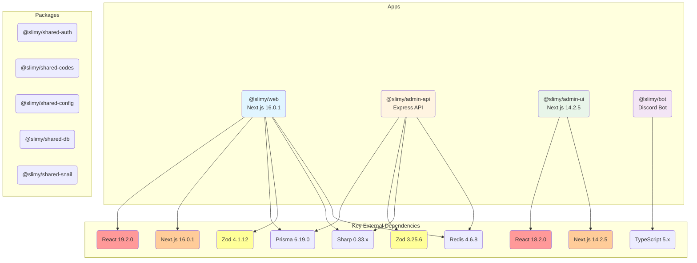

# Slimy Monorepo Dependency Graph

## Key Findings

### Version Inconsistencies

1. **React Versions:**
   - `@slimy/web`: React 19.2.0
   - `@slimy/admin-ui`: React 18.2.0

2. **Next.js Versions:**
   - `@slimy/web`: Next.js 16.0.1
   - `@slimy/admin-ui`: Next.js 14.2.5

3. **Zod Versions:**
   - `@slimy/web`: Zod 4.1.12
   - `@slimy/admin-api`: Zod 3.25.6

4. **Sharp Versions:**
   - `@slimy/web`: Sharp 0.33.5
   - `@slimy/admin-api`: Sharp 0.33.4

5. **TypeScript Versions:**
   - `@slimy/web`: TypeScript 5.x (devDep)
   - `@slimy/bot`: TypeScript 5.3.3 (devDep)

### Package Status

All five shared packages (`shared-auth`, `shared-codes`, `shared-config`, `shared-db`, `shared-snail`) appear to be **placeholder packages** with no dependencies or exports defined. They contain only TODO build and test scripts.
